# 🔭 Custom OpenTelemetry Collector

> **"不只是收集数据，还能远程看病、AI 问诊，甚至帮你反编译 Java 代码。"**

一个在 [OpenTelemetry Collector](https://opentelemetry.io/docs/collector/) 之上长出「控制面大脑」的定制化 Collector —— 集 **可观测数据收集** + **Java Agent 全生命周期管理** + **Arthas 远程诊断** + **AI 驱动运维 (MCP)** 于一体的统一平台。

---

## 🤔 这玩意儿解决了什么问题？

你是否经历过：

- 🔥 线上 Java 应用 CPU 飙了，想 `arthas trace` 一下，但得先 SSH 到机器、找容器、attach... 黄花菜都凉了
- 📊 Traces、Metrics、Logs 分散在不同收集器里，每个都要单独配一遍
- 🤖 想让 AI 帮你排查问题，但 AI 只能"纸上谈兵"，碰不到你的线上环境
- 🎛️ 几百个 Agent 分散在各处，配置更新得一台台去改

**这个项目就是来治这些"病"的。** 一个 Collector 搞定所有事。

---

## 🏗️ 整体架构

> 看一张图，秒懂全貌。

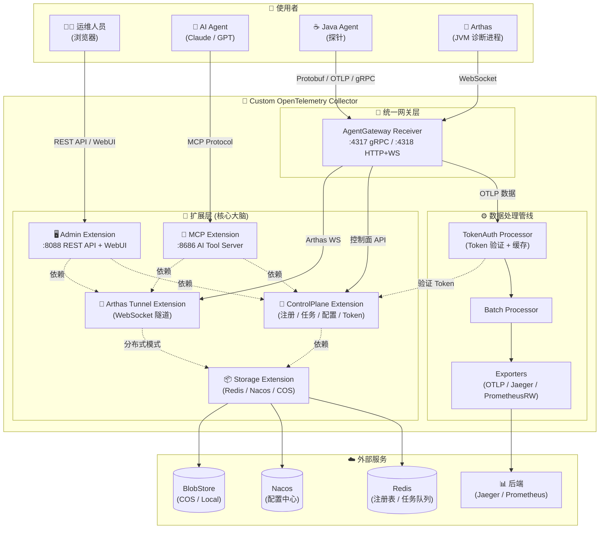

**一句话总结**：Java Agent 通过统一网关连进来，控制面管理它们的生死（注册/心跳/配置/任务），Arthas Tunnel 让你能远程"把脉"，MCP 让 AI 也能亲自上手"问诊"。

---

## 🧩 Extension 依赖关系 — 谁先启动，谁依赖谁

> Extensions 是整个系统的"大脑"，它们之间有严格的依赖与启动顺序。

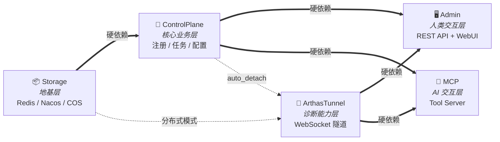

**启动顺序**：`Storage` → `ControlPlane` → `ArthasTunnel` → `Admin` / `MCP`

每一层都像搭积木一样，下层不起来，上层就起不了。

---

## 🔌 七大组件详解

### 1. 📦 Storage Extension — 存储界的"万能插座"

> **角色**：最底层的基础设施，给所有组件提供外部存储连接。别人都得喊它一声"大哥"。

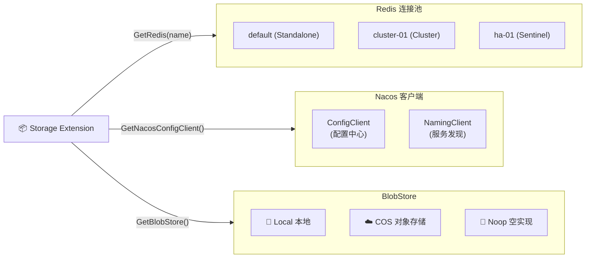

| 能力 | 说明 |
|------|------|
| **Redis** | 支持 Standalone / Cluster / Sentinel 三种模式，按名称获取（如 `GetRedis("default")`） |
| **Nacos** | 配置中心 + 服务发现客户端 |
| **BlobStore** | 大文件存储（Profiling 数据等），支持 Local / COS / Noop |

---

### 2. 🧠 ControlPlane Extension — 整个系统的"大脑"

> **角色**：核心业务中枢。Agent 的生老病死、任务的分发调度、配置的下发管理，全归它管。

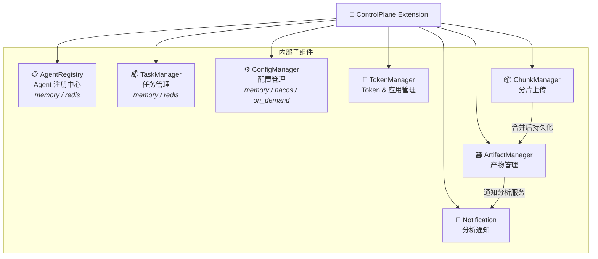

| 子组件 | 功能 | 存储后端 |
|--------|------|---------|
| **AgentRegistry** | Agent 注册/心跳/在线状态检测/层级索引 (App→Service→Instance) | memory / redis |
| **TaskManager** | 任务生命周期 (PENDING→RUNNING→SUCCESS/FAILED/TIMEOUT)，含 StaleTaskReaper | memory / redis |
| **ConfigManager** | 配置存储与下发，on_demand 模式按需从 Nacos 加载 | memory / nacos / on_demand |
| **TokenManager** | App 创建、Token 生成与验证 | memory / redis |
| **ChunkManager** | 大文件分片上传后合并 | - |
| **ArtifactManager** | 性能剖析数据等产物的持久化与查询 | BlobStore |
| **Notification** | 任务完成后通知外部分析服务（如 perf-analysis） | - |

---

### 3. 🔧 Arthas Tunnel Extension — Java 诊断的"远程手臂"

> **角色**：实现 Arthas Tunnel Server 协议，让你坐在办公室就能远程"把脉"线上 JVM。

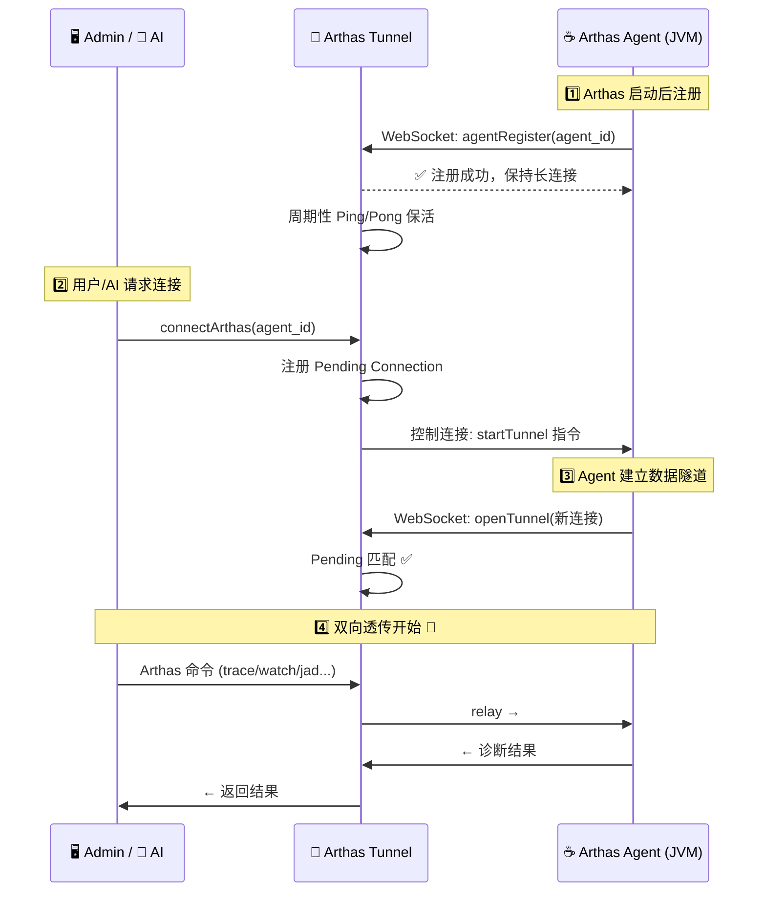

**分布式模式**（多 Collector 副本）：

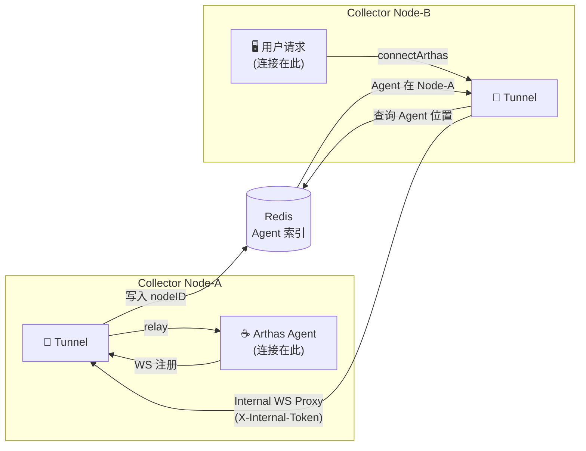

> Agent 在 Node-A，用户连到 Node-B？没关系。Redis 索引 + 内部代理自动搞定。

---

### 4. 🖥️ Admin Extension — 给人类的"仪表盘"

> **角色**：REST API + 嵌入式 WebUI。运维人员通过浏览器就能管理一切。

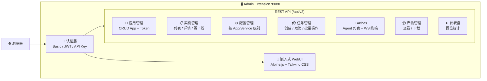

**核心 API 一览：**

| 资源 | 端点 | 能力 |
|------|------|------|
| **应用** | `/api/v2/apps` | CRUD 应用、生成/重置 Token |
| **实例** | `/api/v2/instances` | 列表（支持排序/过滤）、详情、踢下线、统计 |
| **服务** | `/api/v2/services` | 全局服务视图 |
| **配置** | `/api/v2/apps/{id}/config/services/{name}` | 按服务级别读写配置 |
| **任务** | `/api/v2/tasks` | 创建/查看/取消/批量操作、下载产物 |
| **Arthas** | `/api/v2/arthas/agents` | 已连接 Agent 列表 |
| **Arthas WS** | `/api/v2/arthas/ws` | 浏览器 WebSocket 终端（需 WS Token） |
| **通知** | `/api/v2/notifications` | 分析通知记录、重试 |
| **仪表盘** | `/api/v2/dashboard/overview` | 总览统计 |

---

### 5. 🤖 MCP Extension — 给 AI 的"操作手柄"

> **角色**：让 AI Agent 拥有"双手"——通过 [MCP 协议](https://modelcontextprotocol.io/) 直接操作 Arthas，不再纸上谈兵。

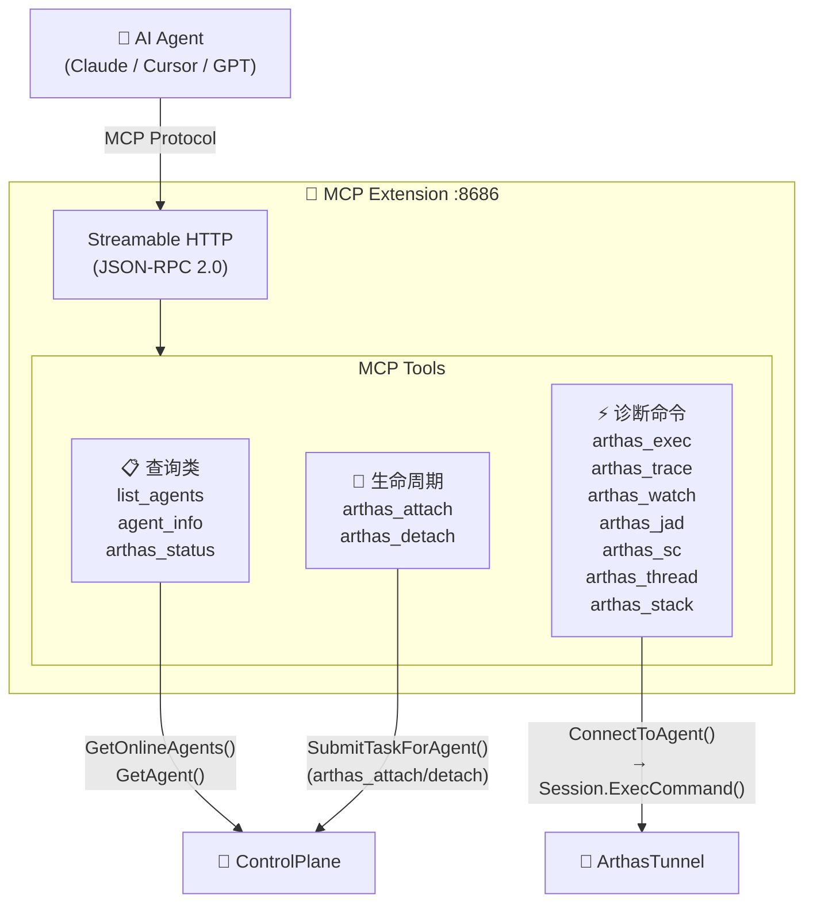

**AI 排查问题的真实流程：**

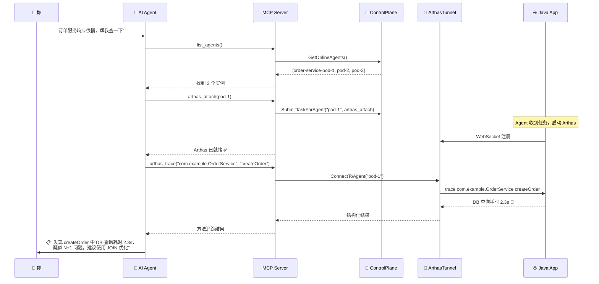

**已支持的 MCP Tools：**

| 工具 | 类型 | 功能 | AI 怎么用 |
|------|------|------|----------|
| `list_agents` | 📋 查询 | 列出所有在线 Agent | "有哪些服务在线？" |
| `agent_info` | 📋 查询 | Agent 详细信息 | "这个实例的 JVM 参数？" |
| `arthas_status` | 📋 查询 | Arthas 连接状态 | "Arthas 连上了吗？" |
| `arthas_attach` | 🔄 生命周期 | 启动 Arthas | "帮我连上这个实例" |
| `arthas_detach` | 🔄 生命周期 | 停止 Arthas | "诊断完了，断开吧" |
| `arthas_exec` | ⚡ 命令 | 通用命令执行 | "执行 dashboard 命令" |
| `arthas_trace` | ⚡ 命令 | 方法调用追踪 | "trace createOrder 方法" |
| `arthas_watch` | ⚡ 命令 | 方法监控 | "watch 入参和返回值" |
| `arthas_jad` | ⚡ 命令 | 反编译 | "看看这个类的源码" |
| `arthas_sc` | ⚡ 命令 | 搜索已加载类 | "这个类加载了吗？" |
| `arthas_thread` | ⚡ 命令 | 线程分析 | "有没有死锁？" |
| `arthas_stack` | ⚡ 命令 | 调用栈 | "谁调用了这个方法？" |

---

### 6. 🚪 AgentGateway Receiver — 统一的"大门"

> **角色**：一个 Receiver 扛起三份工作——OTLP 数据收集、控制面 API、Arthas WebSocket。Java Agent 只需要知道一个地址。

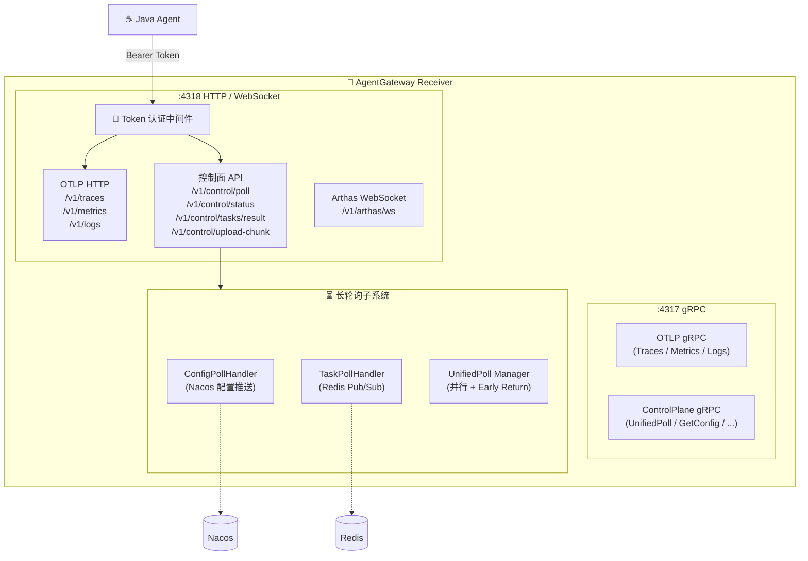

**统一长轮询（UnifiedPoll）**—— 一次请求，同时等配置和任务：

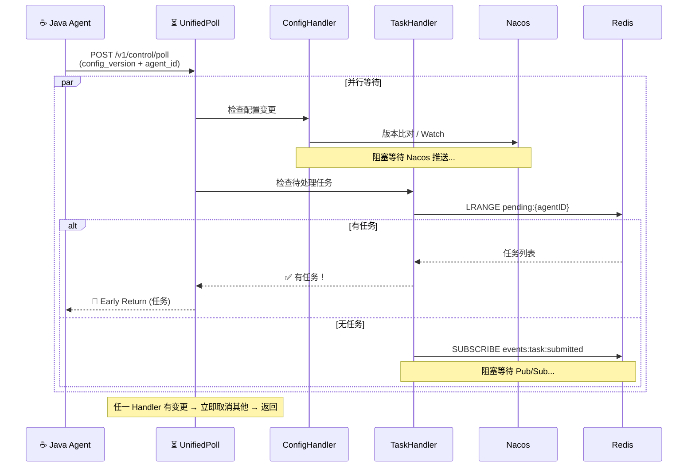

---

### 7. 🔐 TokenAuth Processor — Pipeline 里的"安检员"

> **角色**：在 OTel Pipeline 中验证数据合法性。Token 不对？整批数据直接扔掉。

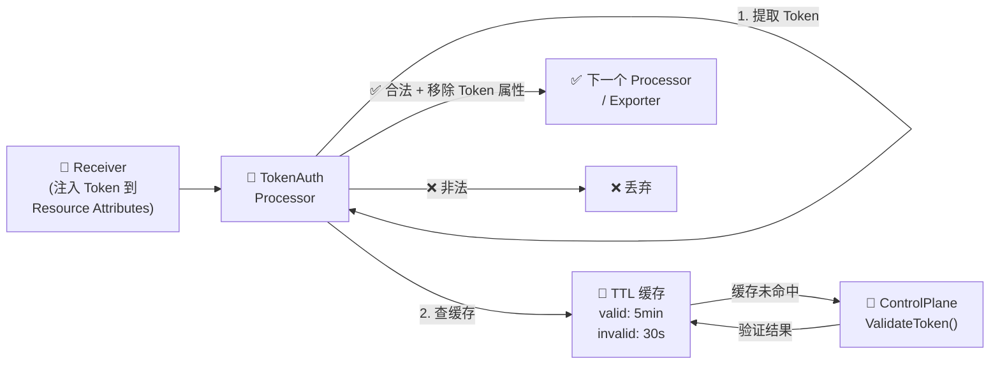

---

## 🔄 Java Agent 完整生命周期

> 一个 Java Agent 从出生到干活，经历了什么？

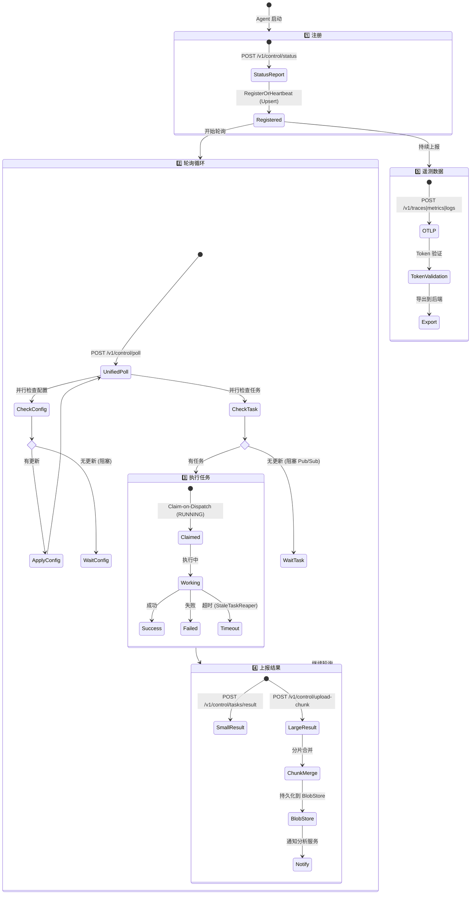

---

## 📂 项目结构

```
custom-opentelemetry-collector/
│
├── 🚀 cmd/customcol/              # 启动入口
│   ├── main.go                    #   OTel Collector 标准启动流程
│   └── components.go              #   注册所有自定义 + 官方组件
│
├── ⚙️ config/template/            # 配置模板
│   └── config.yaml                #   完整的 Collector 配置示例 (600+ 行)
│
├── 🧠 controlplane/               # 控制面领域层
│   ├── model/                     #   统一领域模型 (AgentConfig/Task/TaskResult)
│   └── conv/probeconv/            #   Proto ↔ Model 转换器
│
├── 🆔 identity/                   # 节点身份解析
│   └── resolver.go                #   POD_NAME → hostname → "unknown"
│
├── 📡 proto/controlplane/v1/      # Protobuf 定义 (Agent ↔ Collector 通信协议)
│   ├── service.proto              #   gRPC 服务 (UnifiedPoll/GetConfig/ReportStatus...)
│   ├── config.proto               #   AgentConfig / SamplerConfig / BatchConfig
│   ├── task.proto                 #   Task / TaskResult / ChunkedTaskResult
│   ├── poll.proto                 #   长轮询请求/响应
│   ├── status.proto               #   状态上报
│   └── common.proto               #   TaskStatus / CompressionType 等枚举
│
├── 🔌 extension/                  # ★ 核心扩展模块 (170+ 文件)
│   ├── storageext/                #   📦 存储抽象层
│   ├── controlplaneext/           #   🧠 控制面核心
│   │   ├── agentregistry/         #     Agent 注册中心 (memory/redis)
│   │   ├── taskmanager/           #     任务管理 (调度/超时/StaleTaskReaper)
│   │   ├── configmanager/         #     配置管理 (memory/nacos/on_demand)
│   │   ├── tokenmanager/          #     Token & 应用管理
│   │   ├── chunk_manager/         #     分片上传管理
│   │   ├── artifact_manager/      #     产物管理
│   │   └── notification/          #     分析通知
│   ├── arthastunnelext/           #   🔧 Arthas WebSocket Tunnel
│   ├── adminext/                  #   🖥️ Admin API + 嵌入式 WebUI
│   └── mcpext/                    #   🤖 MCP Server (AI 接口)
│
├── 📥 receiver/
│   └── agentgatewayreceiver/      #   🚪 统一网关 (OTLP + 控制面 + Arthas WS)
│       └── longpoll/              #     ⏳ 长轮询 (ConfigHandler + TaskHandler)
│
├── 🔐 processor/
│   └── tokenauthprocessor/        #   Token 认证 + TTL 缓存
│
└── 📚 docs/                       # 设计文档 (6 篇)
```

---

## 🔌 端口一览

| 端口 | 协议 | 用途 | 面向 |
|------|------|------|------|
| `4317` | gRPC | OTLP + ControlPlane gRPC | ☕ Java Agent |
| `4318` | HTTP/WS | OTLP + 控制面 REST + Arthas WS | ☕ Java Agent / 🔧 Arthas |
| `8088` | HTTP/WS | Admin API + WebUI + Arthas 浏览器终端 | 🧑‍💻 运维人员 |
| `8686` | HTTP | MCP Server (Streamable HTTP, JSON-RPC 2.0) | 🤖 AI Agent |
| `6831` | UDP | Jaeger Agent 兼容 | Legacy 客户端 |
| `8888` | HTTP | Prometheus 自身 Metrics | 📊 监控系统 |
| `55679` | HTTP | zPages 调试页面 | 🛠️ 开发者 |

---

## 🚀 快速开始

### 构建

```bash
# 编译（静态链接，适合容器部署）
CGO_ENABLED=0 go build -ldflags="-s -w" -o bin/custom-otlp-collector ./cmd/customcol

# 或使用 Makefile
make build
```

### 运行

```bash
# 使用配置模板启动
./bin/custom-otlp-collector --config config/template/config.yaml
```

### Docker Compose

```bash
# 一键启动（含 Redis 等依赖）
docker compose up -d
```

### K8s 部署

```bash
# 通过 Makefile 一键部署
make cicd-deploy
```

---

## 🛠️ 技术栈

| 组件 | 技术选型 |
|------|---------|
| 语言 | Go 1.23 |
| 核心框架 | OpenTelemetry Collector v0.120.0 |
| gRPC | google.golang.org/grpc v1.70.0 |
| HTTP Router | go-chi/chi/v5 v5.2.3 |
| WebSocket | gorilla/websocket v1.5.3 |
| 缓存/存储 | go-redis/v9 v9.17.2 |
| 服务发现/配置 | nacos-sdk-go/v2 v2.3.5 |
| AI 协议 | MCP (mark3labs/mcp-go v0.45.0) |
| 对象存储 | 腾讯云 COS |
| 前端 | Alpine.js + Tailwind CSS (嵌入式 SPA) |
| 容器化 | Docker + Kubernetes |

---

## 🎯 设计亮点

### 1. 🎭 多后端策略 — 开发生产无缝切换

几乎每个核心组件都支持 **memory**（开发/测试）和 **redis**（生产）两种存储后端，零配置起步，一行改配置切生产：

```yaml
# 开发环境：轻量起步，零外部依赖
agent_registry:
  storage_mode: memory

# 生产环境：分布式、高可用
agent_registry:
  storage_mode: redis
```

### 2. 🏥 Claim-on-Dispatch — 任务不会被"抢"

任务分发采用"认领即锁定"模式：Agent 拿到任务的瞬间就标记为 RUNNING，配合 `StaleTaskReaper` 清理卡死的任务，杜绝重复下发。

### 3. 🚪 统一网关 — 一个 Receiver 统治它们

`AgentGatewayReceiver` 一个端口同时搞定 OTLP 数据上报 + 控制面 API + Arthas WebSocket，Java Agent 只需要记一个地址。

### 4. ⏳ 统一长轮询 — 一次请求等两样

UnifiedPoll 并行等待配置变更和新任务，任一有更新就 Early Return，既省带宽又降延迟。

### 5. 🤖 AI-Native 设计 — 不是"锦上添花"，是"原生能力"

MCP Extension 对 Arthas 输出做结构化解析，AI 能真正"理解"诊断结果，而不是面对一堆文本"一脸懵"。

---

## 📚 相关文档

| 文档 | 说明 |
|------|------|
| [MCP Extension 设计](docs/mcp-extension-design.md) | AI 诊断能力的完整设计方案 (Phase 1-3) |
| [数据模型重构](docs/refeactor.md) | 从 Legacy JSON 到统一 Model 的重构之路 |
| [任务重复下发修复](docs/fix-task-duplicate-dispatch.md) | Claim-on-Dispatch + StaleTaskReaper |
| [实例页面重设计](docs/instances-page-redesign.md) | WebUI 树形导航 + 卡片列表 |
| [动态增强任务表单](docs/dynamic-instrumentation-task-form.md) | WebUI 任务表单优化 |
| [可搜索下拉框组件](docs/searchable-select-component.md) | WebUI 组件设计 |

---

## 🗺️ Roadmap

- [x] ✅ Phase 1 — 基础 MCP Tools (list_agents / agent_info / arthas_status)
- [x] ✅ Phase 2 — Arthas 诊断工具 (trace / watch / jad / thread / stack / sc)
- [ ] 🚧 Phase 3 — 性能剖析工具 + 异步任务进度通知 + MCP Resources/Prompts
- [ ] 📋 WebUI 持续优化

---

## 📜 License

Internal Project — 仅限内部使用。

---

<p align="center">
  <em>"能收数据的 Collector 很多，能远程诊断 + AI 问诊的，这是独一份。"</em>
  <br/>
  <strong>Built with ❤️ and way too much ☕</strong>
</p>
