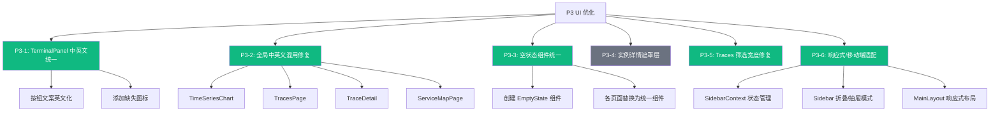
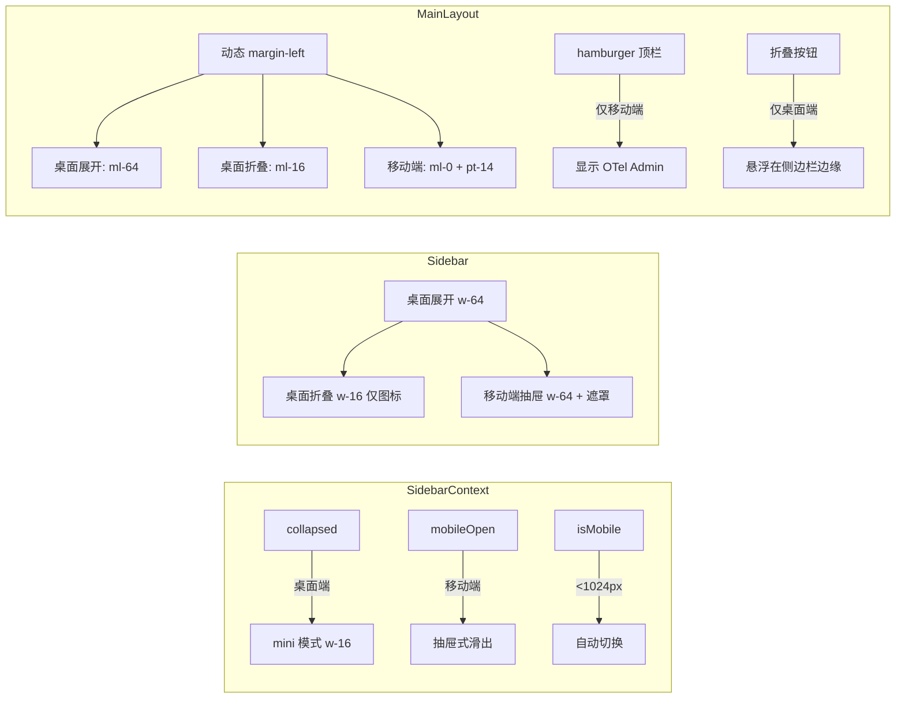

# P3 UI/UX 优化实施文档

> **需求来源**: UI/UX 评审后 P3 及以下优化项  
> **前置依赖**: P0-P2 优化已完成（见 `react-migration-and-observability.md` UI-Enhance-001）  
> **实施日期**: 2026-03-19

---

## 📋 需求概述

在完成 P0（Font Awesome 图标引入）、P1（Sidebar 分组 + Dashboard 增强）、P2（Metrics 时间按钮）后，继续实施 P3 级别的 UI/UX 优化，涵盖：文本国际化、空状态组件统一、Traces 筛选布局修复、响应式移动端适配等。

---

## 🗺️ 任务总览

---

## ✅ 任务详情

### P3-1: TerminalPanel 中英文混用统一 ✅

**问题**: 终端面板中按钮文案使用中文（"清屏"、"搜索"、"关闭"等），与整体英文 UI 不一致。部分按钮缺少图标。

**修改文件**: `src/components/Terminal/TerminalPanel.tsx`

| 原文本 | 替换为 | 说明 |
|--------|--------|------|
| 清屏 | Clear | 添加 `fa-eraser` 图标 |
| 搜索 | Search | 已有 `fa-search` 图标 |
| 关闭 | Close | 添加 `fa-times` 图标 |
| 有匹配 | Match found | 搜索状态 |
| 无匹配 | No match | 搜索状态 |
| 搜索... | Search... | placeholder |
| 上一个 | Previous | title 属性 |
| 下一个 | Next | title 属性 |
| 区分大小写 | Case Sensitive | title 属性 |
| 正则表达式 | Regular Expression | title 属性 |
| 关闭 (Esc) | Close (Esc) | title 属性 |

---

### P3-2: 全局中英文混用统一排查与修复 ✅

**问题**: 多个页面存在中文 UI 文本，与整体英文风格不统一。

**修改文件与变更**:

| 文件 | 原文本 | 替换为 |
|------|--------|--------|
| `src/components/TimeSeriesChart.tsx` | `加载中...` | `Loading...` |
| `src/pages/TracesPage.tsx` | `搜索和查看分布式链路追踪数据` | `Search and explore distributed tracing data` |
| `src/pages/TracesPage.tsx` | `请在 Collector 配置中设置...以启用 Trace 查询功能。` | `Please configure...to enable Trace querying.` |
| `src/components/TraceDetail.tsx` | `title="查看该 Service 的 RED 指标"` | `title="View RED metrics for this Service"` |
| `src/components/TraceDetail.tsx` | `title="搜索该 Service 的更多 Trace"` | `title="Search more Traces for this Service"` |
| `src/pages/ServiceMapPage.tsx` | `基于 Trace 数据的服务依赖拓扑图` | `Service dependency topology based on Trace data` |
| `src/pages/ServiceMapPage.tsx` | `请在 Collector 配置中设置...以启用 Service Map 功能。` | `Please configure...to enable Service Map.` |

---

### P3-3: 空状态组件统一 ✅

**问题**: 各页面空状态样式不统一，有的有图标没描述，有的只有文字，风格零散。

**新增文件**: `src/components/EmptyState.tsx`

**EmptyState 组件 Props**:

| Prop | 类型 | 说明 |
|------|------|------|
| `icon` | string | Font Awesome 图标类名 |
| `title` | string | 主标题 |
| `description` | string (可选) | 副标题/描述 |
| `action` | ReactNode (可选) | 操作按钮 |
| `variant` | `'default' \| 'warning' \| 'error'` | 样式变体 |
| `compact` | boolean | 紧凑模式（减小内边距） |

**应用页面**: `TimeSeriesChart.tsx` 等使用了空状态的组件替换为统一的 `EmptyState` 组件。

---

### P3-4: 实例详情面板遮罩层 ⏭️ 已存在

**结论**: 检查 `src/components/DetailDrawer.tsx` 后确认已有遮罩层实现（`bg-gray-900/40 backdrop-blur-[2px]`），无需额外修改。

---

### P3-5: Traces 页面筛选条件宽度不一致 ✅

**问题**: Traces 页面搜索面板中，第一行 4 列（Service/Operation/Lookback/Limit）和第二行 3 列（Tags/MinDuration/MaxDuration）网格不对齐。

**修改文件**: `src/pages/TracesPage.tsx`

**方案**: 将第二行 `grid-cols-3` 改为 `grid-cols-4`，与第一行对齐，Tags 输入框跨 2 列（`col-span-2`），视觉上保持宽度一致。

---

### P3-6: 响应式/移动端适配 ✅

**问题**: 侧边栏固定 `w-64`，在小屏幕上内容区被严重压缩；无法在移动端使用。

**方案架构**:

**新增文件**:

| 文件 | 说明 |
|------|------|
| `src/contexts/SidebarContext.tsx` | 侧边栏状态管理 Context（collapsed / mobileOpen / isMobile） |

**修改文件**:

| 文件 | 修改内容 |
|------|---------|
| `src/layouts/Sidebar.tsx` | 重写：支持桌面折叠 mini 模式（仅图标）+ 移动端抽屉式滑出 + 遮罩层 |
| `src/layouts/MainLayout.tsx` | 重写：动态 margin-left + 移动端 hamburger 顶栏 + 桌面端折叠按钮 |

**响应式断点**:

| 屏幕宽度 | 行为 |
|----------|------|
| ≥1024px (桌面) | 固定侧边栏，支持折叠为 64px mini 模式（仅图标 + tooltip） |
| <1024px (移动) | 侧边栏隐藏，顶部 hamburger 导航栏，点击后抽屉式滑出 + 半透明遮罩 |

---

## 📁 修改文件汇总

| 文件 | 任务 | 操作 |
|------|------|------|
| `src/components/Terminal/TerminalPanel.tsx` | P3-1 | 修改 |
| `src/components/TimeSeriesChart.tsx` | P3-2, P3-3 | 修改 |
| `src/components/TraceDetail.tsx` | P3-2 | 修改 |
| `src/components/EmptyState.tsx` | P3-3 | **新增** |
| `src/pages/TracesPage.tsx` | P3-2, P3-5 | 修改 |
| `src/pages/ServiceMapPage.tsx` | P3-2 | 修改 |
| `src/contexts/SidebarContext.tsx` | P3-6 | **新增** |
| `src/layouts/Sidebar.tsx` | P3-6 | 修改 |
| `src/layouts/MainLayout.tsx` | P3-6 | 修改 |

---

## ✅ 验证结果

- ✅ TypeScript 编译通过（`tsc -b`）
- ✅ Vite 生产构建通过（`vite build`）
- ✅ TerminalPanel 按钮全英文 + 图标完整
- ✅ 全站无中文 UI 文本残留
- ✅ 空状态组件样式统一
- ✅ Traces 筛选面板两行网格对齐
- ✅ 桌面端侧边栏折叠/展开平滑过渡
- ✅ 移动端 hamburger + 抽屉式侧边栏正常工作

---

## 📝 遗留问题

- [ ] 各页面表格/列表在小屏幕上的横向滚动适配
- [ ] TerminalPanel 在移动端的触控体验优化（虚拟键盘遮挡）
- [ ] Configs 页面左侧树在折叠侧边栏时的空白处理
- [ ] 深色模式支持（当前仅 Sidebar 为深色，内容区为浅色）
- [ ] 自定义 Dashboard 面板保存功能
