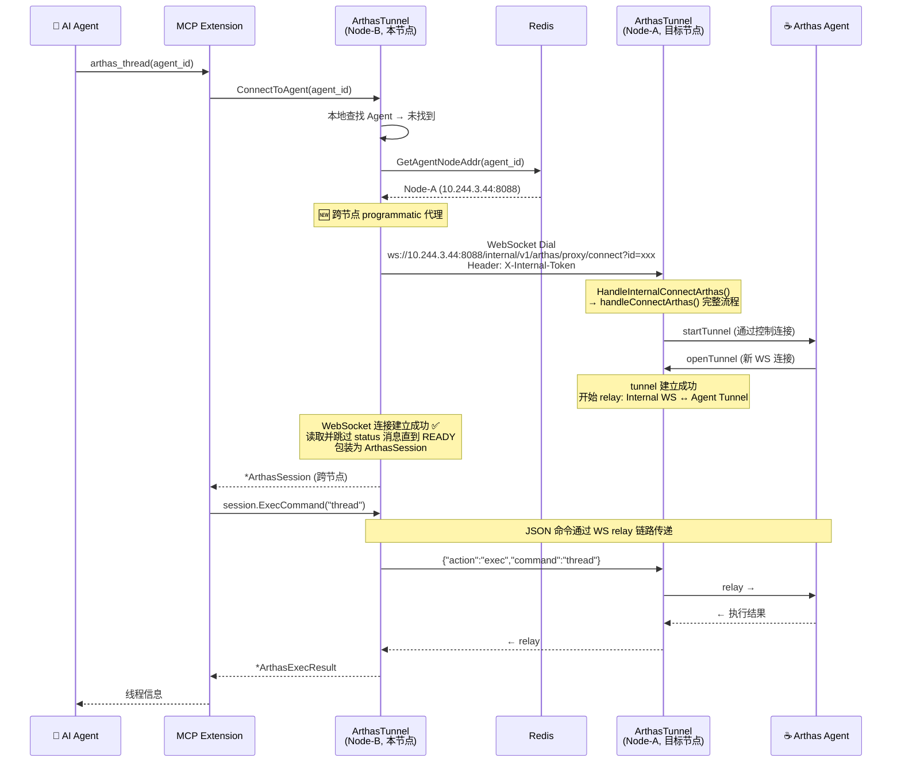

# MCP Extension 跨节点 Programmatic Arthas 连接

## 需求背景

在分布式部署（多 Collector 副本）场景下，MCP Extension 调用 `ConnectToAgent()` 时，如果目标 Agent 不在当前节点上，会报错：

```
agent 'xxx' is on another node (10.244.3.44:8088); programmatic cross-node connection is not yet supported
```

浏览器 WebSocket 路径（`handleConnectArthas`）已经通过 `proxyConnectArthas()` → `WSProxy.ProxyConnectArthas()` 实现了跨节点代理，但 MCP 的 programmatic 路径缺少这一层代理。

## 方案设计

### 方案 B：复用现有 Internal WS Proxy

在 `connectToAgentProgrammatic` 中增加跨节点支持：当 Agent 在远程节点时，通过 Internal WS Proxy 连接到目标节点，在目标节点上执行完整的 `handleConnectArthas` 流程，然后将获得的 WebSocket 连接包装为 `ArthasSession` 返回给 MCP。

### 架构图



### 关键设计点

1. **复用现有 Internal Proxy 基础设施**：使用与 `WSProxy.ProxyConnectArthas` 相同的 URL 构建和认证机制
2. **WebSocket Dial 到目标节点**：`ws://<targetNode>/internal/v1/arthas/proxy/connect?id=<agentID>`，携带 `X-Internal-Token` 认证头
3. **目标节点处理**：目标节点的 `HandleInternalConnectArthas` 已经实现了完整的 `connectArthas` 流程，无需修改
4. **Status 消息处理**：目标节点会发送 ANSI 终端格式的 status 消息，`connectToAgentCrossNode` 读取并跳过这些消息，直到收到 READY（`[+]`）
5. **包装为 ArthasSession**：将建立好的 WebSocket 连接包装为 `ArthasSession` 返回

## 实施进展

### ✅ 已完成

| 任务 | 文件 | 说明 |
|------|------|------|
| 新增 `connectToAgentCrossNode` 方法 | `extension/arthastunnelext/arthasuri_compat.go` | 跨节点 programmatic 连接的核心实现 |
| 新增 `stripANSI` 辅助函数 | `extension/arthastunnelext/arthasuri_compat.go` | 去除 ANSI 转义序列，提取错误消息 |
| 修改 `connectToAgentProgrammatic` | `extension/arthastunnelext/arthasuri_compat.go` | 跨节点分支改为调用 `connectToAgentCrossNode` |
| 公开 `BuildInternalURL` 方法 | `extension/arthastunnelext/proxy/ws_proxy.go` | 从 `buildInternalURL` 改为 `BuildInternalURL` |
| 新增 `Config()` 方法 | `extension/arthastunnelext/proxy/ws_proxy.go` | 暴露 ProxyConfig 供外部使用 |
| 编译验证 | - | `go build ./...` 通过 |

### 改动文件清单

1. **`extension/arthastunnelext/arthasuri_compat.go`**
   - 修改 `connectToAgentProgrammatic`：跨节点分支调用 `connectToAgentCrossNode`
   - 新增 `connectToAgentCrossNode`：~90 行，跨节点 programmatic 连接实现
   - 新增 `stripANSI`：ANSI 转义序列清理工具函数

2. **`extension/arthastunnelext/proxy/ws_proxy.go`**
   - `buildInternalURL` → `BuildInternalURL`（公开化）
   - 新增 `Config()` 方法
   - 更新内部调用点

## 遗留问题

1. **端到端测试**：需要在实际分布式环境中测试跨节点 MCP Arthas 命令执行
2. **连接超时优化**：当前使用 `connectTimeout`（默认 20s）作为跨节点连接超时，可能需要考虑网络延迟额外增加缓冲
3. **Session 限制**：当前 `connectToAgentCrossNode` 未计入 `WSProxy.activeSessions` 计数，因为它不通过 WSProxy 管理。如需限制，可后续添加
4. **错误消息国际化**：跨节点错误消息中混合了 ANSI 终端格式，`stripANSI` 做了基本清理，但可能需要更完善的处理
