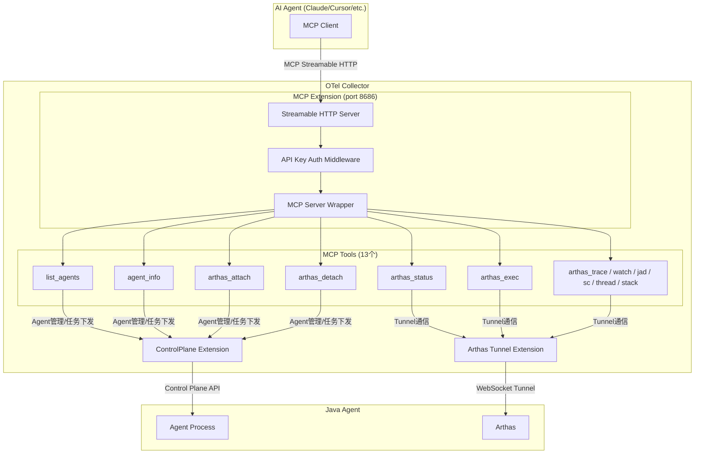

# MCP Extension 配置补充

## 需求描述

为 `config/template/config.yaml` 补充 `mcpext`（MCP Extension）的相关配置，使 AI Agent 能够通过 MCP Streamable HTTP 协议与 Collector 交互，执行 Java 应用诊断操作。

## 架构图

## 配置字段说明

| 字段 | mapstructure key | 类型 | 默认值 | 说明 |
|------|-----------------|------|--------|------|
| `endpoint` | `endpoint` | `string` | `0.0.0.0:8686` | MCP Streamable HTTP 监听地址 |
| `auth.type` | `auth.type` | `string` | `api_key` | 认证类型：`api_key` / `none` |
| `auth.api_keys` | `auth.api_keys` | `[]string` | - | API Key 列表（`api_key` 模式必填） |
| `controlplane_extension` | `controlplane_extension` | `string` | `controlplane` | 依赖的 ControlPlane 扩展名 |
| `arthas_tunnel_extension` | `arthas_tunnel_extension` | `string` | `arthas_tunnel` | 依赖的 ArthasTunnel 扩展名 |
| `max_concurrent_sessions` | `max_concurrent_sessions` | `int` | `10` | 最大并发 MCP 会话数 |
| `tool_timeout` | `tool_timeout` | `int` | `30` (秒) | 工具执行默认超时 |

## MCP Tools 列表

| 分类 | 工具名 | 功能 |
|------|--------|------|
| Agent 管理 | `list_agents` | 列出所有在线 Java Agent |
| Agent 管理 | `agent_info` | 获取 Agent 详细信息（JVM、OS、应用信息） |
| Agent 管理 | `arthas_status` | 检查 Arthas Tunnel 连接状态 |
| Arthas 生命周期 | `arthas_attach` | 启动 Arthas 并连接 Tunnel |
| Arthas 生命周期 | `arthas_detach` | 停止 Arthas 释放资源 |
| Arthas 命令 | `arthas_exec` | 执行任意 Arthas 命令 |
| Arthas 命令 | `arthas_trace` | 方法调用路径追踪（含耗时） |
| Arthas 命令 | `arthas_watch` | 监控方法入参/返回值/异常 |
| Arthas 命令 | `arthas_jad` | 反编译类查看运行时源码 |
| Arthas 命令 | `arthas_sc` | 搜索已加载的类 |
| Arthas 命令 | `arthas_thread` | 查看 JVM 线程信息/死锁检测 |
| Arthas 命令 | `arthas_stack` | 输出方法调用栈 |

## 实施进展

- [x] 分析 `mcpext` 代码结构和配置字段
- [x] 在 `config/template/config.yaml` 的 `extensions` 部分添加 `mcp` 配置
- [x] 在 `service.extensions` 列表中添加 `mcp`（位于 `admin` 之后）
- [x] 创建需求文档
- [ ] 执行编译验证

## 修改的文件

| 文件 | 修改内容 |
|------|---------|
| `config/template/config.yaml` | 添加 `mcp` extension 配置块；更新 `service.extensions` 列表 |

## 遗留问题

1. **API Key 安全性**：当前配置中 `api_keys` 使用明文占位符 `your-mcp-api-key-1`，生产环境需替换为实际密钥或使用模板变量（如 `[[ .Service.mcp.api_key ]]`）
2. **端口冲突**：MCP 默认端口 `8686` 需确认不与其他服务冲突
3. **config.yaml 为模板文件**：使用了 `[[ ]]` 模板语法，MCP 配置中的敏感信息后续可能需要模板化
