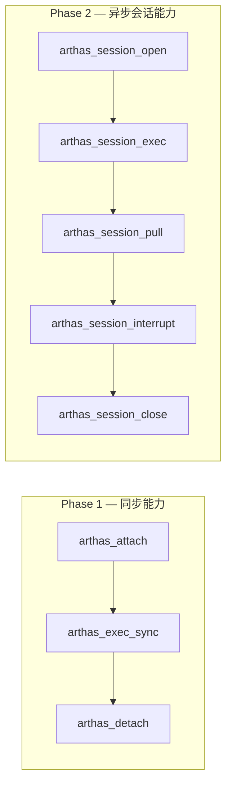
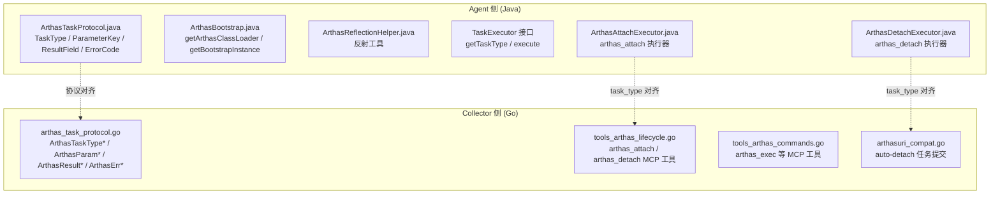
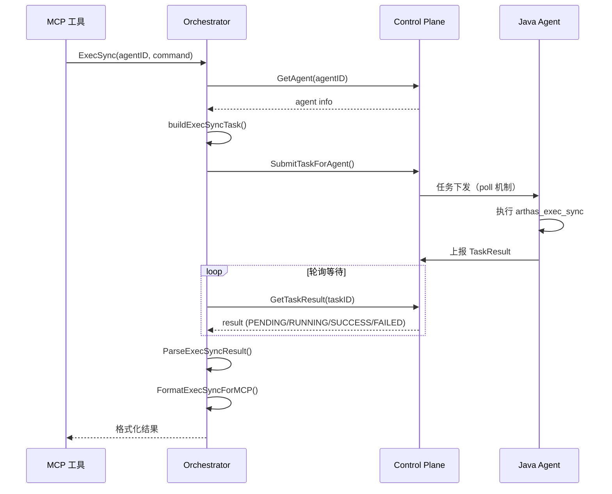

## Phase 0：协议冻结 — 实施记录

## 1. 背景

基于 [Arthas Collector / Agent 双端实施 Roadmap](../../../IdeaProjects/github/opentelemetry-java/sdk-extensions/controlplane/docs/arthas-collector-agent-roadmap.md) 的 Phase 0 要求，本阶段的目标是**锁死协议边界**，避免后续 Collector 和 Agent 两边同时返工。

Phase 0 不追求快速写代码，而是先把边界锁死。

## 2. 实施范围

### 2.1 Agent 侧（Java）

Agent 侧已在之前完成协议常量定义：

- **文件**：`ArthasTaskProtocol.java`
- **路径**：`io.opentelemetry.sdk.extension.controlplane.arthas.ArthasTaskProtocol`
- **状态**：✅ 已完成

### 2.2 Collector 侧（Go）

Collector 侧在本次实施中完成协议常量定义：

- **文件**：`arthas_task_protocol.go`
- **路径**：`controlplane/model/arthas_task_protocol.go`
- **状态**：✅ 已完成

## 3. 冻结的协议内容

### 3.1 冻结的 task_type



| task_type | 用途 | 是否会话化 | 推荐阶段 |
|---|---|:---:|---|
| `arthas_attach` | 启动 / 接入 Arthas | 否 | Phase 1 |
| `arthas_detach` | 停止 / 断开 Arthas | 否 | Phase 1 |
| `arthas_exec_sync` | 执行同步查询命令 | 否 | Phase 1 |
| `arthas_session_open` | 创建异步会话 | 是 | Phase 2 |
| `arthas_session_exec` | 在指定 session 中启动异步命令 | 是 | Phase 2 |
| `arthas_session_pull` | 拉取异步结果增量 | 是 | Phase 2 |
| `arthas_session_interrupt` | 中断异步任务 | 是 | Phase 2 |
| `arthas_session_close` | 关闭会话并回收资源 | 是 | Phase 2 |

### 3.2 冻结的 parameters_json 公共字段

| 字段 | 类型 | 说明 |
|---|---|---|
| `request_id` | string | 幂等键，用于重试去重 |
| `trace_id` | string | 便于跨端日志关联 |
| `user_id` | string | 操作者身份 |
| `command` | string | Arthas 命令字符串 |
| `session_id` | string | 会话标识 |
| `consumer_id` | string | 消费者标识（用于 pull） |
| `timeout_ms` | number | 命令执行超时（毫秒） |
| `auto_attach` | boolean | 未启动 Arthas 时是否自动 attach |
| `require_tunnel_ready` | boolean | 是否要求 tunnel 已就绪 |
| `result_limit_bytes` | number | 单次结果大小限制 |

### 3.3 冻结的 result_json 统一 envelope

```json
{
  "success": true,
  "taskType": "arthas_exec_sync",
  "command": "thread -n 5",
  "sessionId": null,
  "timeout": false,
  "errorCode": "",
  "errorMessage": "",
  "payload": {},
  "rawJson": "{...}",
  "meta": {}
}
```

### 3.4 冻结的错误码

| 分类 | 错误码 | 说明 |
|---|---|---|
| 参数 | `INVALID_PARAMETERS` | 参数错误 |
| 初始化 | `ARTHAS_NOT_CONFIGURED` | Arthas 未配置 |
| 初始化 | `ARTHAS_NOT_RUNNING` | Arthas 未运行 |
| 初始化 | `ARTHAS_NOT_READY` | Arthas 未就绪 |
| 初始化 | `TUNNEL_NOT_READY` | tunnel 未注册 |
| 初始化 | `ARTHAS_CLASSLOADER_UNAVAILABLE` | ClassLoader 不存在 |
| 初始化 | `ARTHAS_BOOTSTRAP_UNAVAILABLE` | Bootstrap 实例不存在 |
| 初始化 | `SESSION_MANAGER_UNAVAILABLE` | SessionManager 获取失败 |
| 初始化 | `COMMAND_EXECUTOR_INIT_FAILED` | CommandExecutorImpl 初始化失败 |
| 执行 | `COMMAND_EXECUTION_FAILED` | 命令执行失败 |
| 执行 | `COMMAND_TIMEOUT` | 命令执行超时 |
| 执行 | `SESSION_NOT_FOUND` | session 不存在 |
| 执行 | `SESSION_ALREADY_CLOSED` | session 已关闭 |
| 执行 | `SESSION_NOT_IDLE` | session 不可执行新命令 |
| 执行 | `ASYNC_JOB_INTERRUPTED` | 异步任务已中断 |
| 执行 | `PULL_RESULT_FAILED` | 拉取结果失败 |
| 执行 | `RESULT_TOO_LARGE` | 结果超过大小限制 |
| 状态 | `SESSION_EXPIRED` | session 已过期 |
| 状态 | `SESSION_TTL_EXCEEDED` | session 总存活时间超限 |
| 状态 | `SESSION_IDLE_TIMEOUT` | session 空闲超时 |
| 序列化 | `RESULT_JSON_SERIALIZATION_FAILED` | JSON 序列化失败 |
| 序列化 | `RESULT_JSON_PARSE_FAILED` | JSON 解析失败 |
| Attach | `ARTHAS_START_FAILED` | Arthas 启动失败 |
| Attach | `ARTHAS_ATTACH_ERROR` | Arthas attach 异常 |
| Detach | `ARTHAS_DETACH_ERROR` | Arthas detach 异常 |

### 3.5 冻结的超时语义

| 超时类型 | 适用场景 | 语义 |
|---|---|---|
| attach 超时 | `arthas_attach` | Arthas 启动或 tunnel 注册未在预期时间内完成 |
| command 超时 | `arthas_exec_sync` | executeSync 未在 timeout_ms 内完成 |
| pull 等待超时 | `arthas_session_pull` | **不视为失败**，返回空结果 |
| session TTL 超时 | 整个异步会话 | 从 session_open 起累计生命周期超限 |
| idle timeout | 会话空闲回收 | 长时间未 pull / 未 exec / 未访问 |

### 3.6 冻结的重试语义

| task_type | 是否建议自动重试 | 最大重试次数 |
|---|:---:|:---:|
| `arthas_attach` | ✅ | 2 |
| `arthas_detach` | ✅ | 2 |
| `arthas_exec_sync` | ❌ | 0 |
| `arthas_session_open` | ✅ | 2 |
| `arthas_session_exec` | ❌ | 0 |
| `arthas_session_pull` | ✅ | 3 |
| `arthas_session_interrupt` | ✅ | 2 |
| `arthas_session_close` | ✅ | 2 |

## 4. 双端对齐矩阵



## 5. 修改的文件

| 文件 | 操作 | 说明 |
|---|---|---|
| `controlplane/model/arthas_task_protocol.go` | 新增 | Collector 侧协议常量定义（与 Agent 侧 ArthasTaskProtocol.java 对齐） |
| `extension/mcpext/tools_arthas_lifecycle.go` | 修改 | 将硬编码 `"arthas_attach"` / `"arthas_detach"` 替换为 `model.ArthasTaskTypeAttach` / `model.ArthasTaskTypeDetach` |
| `extension/arthastunnelext/arthasuri_compat.go` | 修改 | 将 auto-detach 中硬编码 `"arthas_detach"` 替换为 `model.ArthasTaskTypeDetach` |

## 6. 验收标准

- [x] 协议字段不再频繁变动
- [x] 同步 / 异步能力边界清晰
- [x] V1 不新增新的物理通道
- [x] Collector 侧协议常量与 Agent 侧完全对齐
- [x] 现有硬编码字符串已替换为常量引用
- [x] 编译通过

## 7. 后续任务（Phase 1+）

| Phase | 内容 | 状态 |
|---|---|---|
| Phase 1 | Agent 同步结构化执行 MVP（ArthasStructuredCommandBridge） | 🔲 待实施 |
| Phase 2 | Collector 同步任务编排 MVP（arthas_exec_sync 编排） | ✅ 已完成 |
| Phase 3 | 同步闭环联调 | 🔲 待实施 |
| Phase 4 | Agent 异步 Session 能力 | 🔲 待实施 |
| Phase 5 | Collector 异步 Session 编排 | 🔲 待实施 |
| Phase 6 | 异步闭环联调 | 🔲 待实施 |
| Phase 7 | 稳定性 / 灰度 / 观测补强 | 🔲 待实施 |

## 8. 遗留问题

1. **前端 TypeScript 硬编码**：`adminext/webui-react` 中的 `client.ts` 和 `TasksPage.tsx` 仍使用硬编码字符串 `'arthas_attach'` / `'arthas_detach'`。这些是 UI 展示层代码，Go 常量无法直接在前端使用，暂不处理。后续可考虑通过 API 暴露支持的 task type 列表。
2. ~~**arthas_exec_sync 尚未实现**~~：Phase 2 已完成，所有 MCP 命令工具已切换到 Control Plane 任务链路。
3. **Agent 侧 arthas_exec_sync 执行器尚未实现**：Phase 2 仅完成了 Collector 侧编排，Agent 侧需要在 Phase 1 中实现 `ArthasExecSyncExecutor`（基于 `ArthasStructuredCommandBridge`）。Phase 3 联调时需要双端都就绪。

---

## Phase 2：Collector 同步任务编排 MVP — 实施记录

### 1. 背景

Phase 2 的目标是让 Collector 侧的 MCP 工具层能够通过 **Control Plane 任务链路**（而非 WebSocket Tunnel）执行 Arthas 命令。

### 2. 架构变更

```mermaid
graph TB
    subgraph "Phase 2 之前（WebSocket Tunnel 模式）"
        MCP1[MCP 工具层] --> WS[WebSocket Tunnel]
        WS --> Agent1[Java Agent Arthas]
    end

    subgraph "Phase 2 之后（Control Plane 任务链路模式）"
        MCP2[MCP 工具层] --> Orch[ArthasOrchestrator]
        Orch --> CP[Control Plane]
        CP --> TM[TaskManager]
        TM --> Agent2[Java Agent TaskExecutor]
        Agent2 --> Bridge[ArthasStructuredCommandBridge]
        Bridge --> Arthas[Arthas Runtime]
    end

    style Orch fill:#f9f,stroke:#333,stroke-width:2px
    style CP fill:#bbf,stroke:#333,stroke-width:2px
```



### 3. 新增组件

#### 3.1 ArthasOrchestrator（编排器）

**文件**: `extension/mcpext/arthas_orchestrator.go`

核心职责：
- **ExecSync**: 构造 `arthas_exec_sync` 任务 → 提交到 Control Plane → 轮询等待结果 → 解析返回
- **Attach**: 构造 `arthas_attach` 任务，支持有限重试（最多 2 次）
- **Detach**: 构造 `arthas_detach` 任务



#### 3.2 ArthasResultParser（结果解析器）

**文件**: `extension/mcpext/arthas_result_parser.go`

核心职责：
- 统一解析 Agent 返回的 `result_json`（遵循 Phase 0 冻结的协议 envelope）
- 收敛错误码 / timeout 语义
- 提供 `ParseExecSyncResult`、`ParseAttachResult`、`ParseDetachResult` 三个解析方法
- 提供 `IsRetryable()` 判断是否建议重试
- 提供 `FormatError()` 返回人类可读的错误描述

### 4. 修改的文件

| 文件 | 操作 | 说明 |
|---|---|---|
| `extension/mcpext/arthas_orchestrator.go` | **新增** | Collector Arthas Orchestrator（任务构造 + 编排 + MCP 格式化） |
| `extension/mcpext/arthas_result_parser.go` | **新增** | 统一结果解析器（解析 result_json + 错误码映射） |
| `extension/mcpext/tools_arthas_commands.go` | **重写** | 所有命令工具从 WebSocket Tunnel 切换到 Orchestrator |
| `extension/mcpext/tools_arthas_lifecycle.go` | **重写** | attach/detach 工具从直接任务构造切换到 Orchestrator |
| `extension/mcpext/mcp_server.go` | **修改** | mcpServerWrapper 添加 orchestrator 字段并初始化 |

### 5. MCP 工具变更

| 工具 | Phase 2 之前 | Phase 2 之后 |
|---|---|---|
| `arthas_exec` | WebSocket Tunnel | Control Plane → `arthas_exec_sync` |
| `arthas_trace` | WebSocket Tunnel | Control Plane → `arthas_exec_sync` |
| `arthas_watch` | WebSocket Tunnel | Control Plane → `arthas_exec_sync` |
| `arthas_jad` | WebSocket Tunnel | Control Plane → `arthas_exec_sync` |
| `arthas_sc` | WebSocket Tunnel | Control Plane → `arthas_exec_sync` |
| `arthas_thread` | WebSocket Tunnel | Control Plane → `arthas_exec_sync` |
| `arthas_stack` | WebSocket Tunnel | Control Plane → `arthas_exec_sync` |
| `arthas_attach` | 直接构造 Task | Orchestrator（支持自动重试） |
| `arthas_detach` | 直接构造 Task | Orchestrator |

### 6. 超时与重试策略

| 操作 | 默认超时 | 等待缓冲 | 自动重试 |
|---|---|---|---|
| `arthas_exec_sync` | 30s（可配置） | +10s | ❌ 不重试 |
| `arthas_attach` | 60s | +10s | ✅ 最多 2 次 |
| `arthas_detach` | 30s | +10s | ❌ 不重试 |

### 7. 验收标准

- [x] Orchestrator 封装完整的 ExecSync / Attach / Detach 编排流程
- [x] 结果解析器统一处理 result_json 和错误码映射
- [x] 所有 MCP 命令工具切换到 Control Plane 任务链路
- [x] attach 支持有限重试
- [x] exec_sync 默认不自动重试
- [x] 使用 Phase 0 冻结的协议常量
- [x] 编译通过

### 8. Phase 2 遗留问题

1. **Agent 侧 `arthas_exec_sync` 执行器尚未实现**：需要 Phase 1 完成 `ArthasStructuredCommandBridge` 后才能联调
2. **WebSocket Tunnel 模式已移除**：如果需要回退到 Tunnel 模式，需要恢复旧的 `tools_arthas_commands.go`
3. **`arthas_formatter.go` 可能需要清理**：旧的 WebSocket Tunnel 结果格式化器可能不再需要，但保留以备兼容
