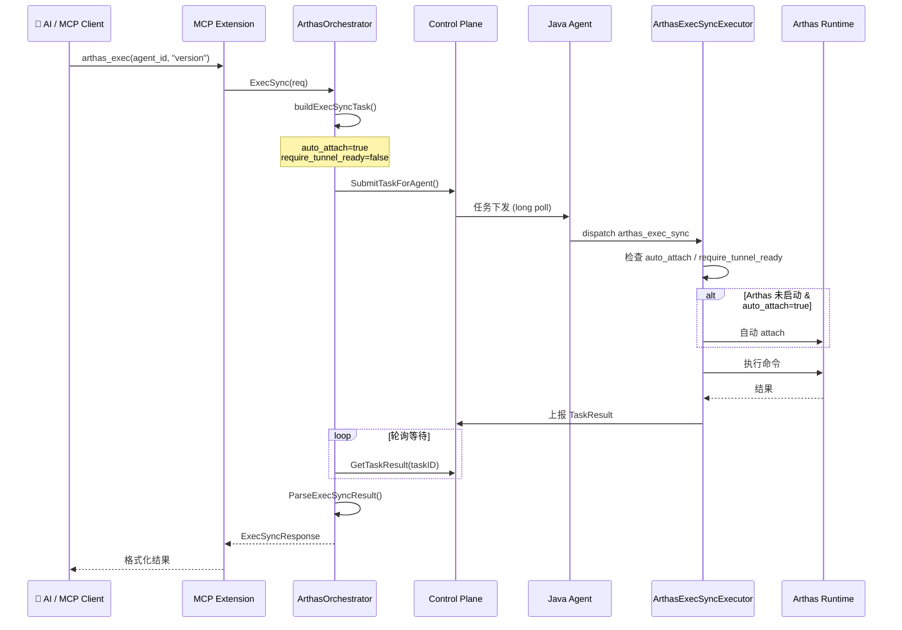
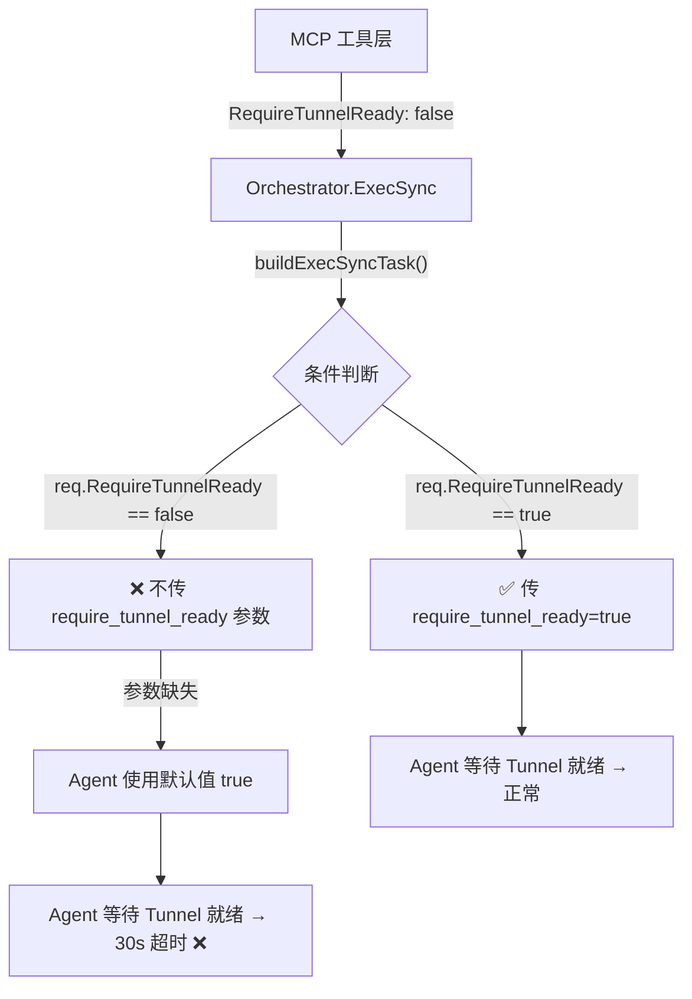

# Phase 3：同步闭环联调

## 需求背景

Phase 2 完成了 Collector 侧的同步任务编排 MVP（ArthasOrchestrator），Phase 1 完成了 Agent 侧的 `ArthasExecSyncExecutor`。Phase 3 的目标是将两端联调打通，验证完整的 **MCP → Collector → Agent → Arthas** 同步命令执行链路。

## 联调架构



## 修复记录

### Bug #1：`buildExecSyncTask` 参数传递缺陷（2026-03-31）

#### 问题现象

通过 MCP 工具执行 `arthas_exec` 命令时，Agent 侧始终 30s 超时：

```
[TASK-TIMEOUT] Task execution timeout: taskId=76664d5a-..., timeout=30,000ms
```

Agent 日志显示任务被正确接收和分发，但执行器卡在等待 Tunnel 就绪。

#### 根因分析



**Collector 侧 `buildExecSyncTask` 方法**（修复前）：

```go
// ❌ 仅在 true 时传递，false 时不传
if req.AutoAttach {
    params[model.ArthasParamAutoAttach] = true
}
if req.RequireTunnelReady {
    params[model.ArthasParamRequireTunnelReady] = true
}
```

**Agent 侧 `ArthasExecSyncExecutor`** 读取参数时使用默认值 `true`：

```java
boolean requireTunnelReady = params.optBoolean("require_tunnel_ready", true);
```

当 Collector 设置 `RequireTunnelReady=false` 但不传参数时，Agent 使用默认值 `true`，进入 `waitForTerminalReady()` 等待 Arthas 启动 + Tunnel 注册，30 秒后超时。

#### 修复方案

**文件**: `extension/mcpext/arthas_orchestrator.go` — `buildExecSyncTask` 方法

```go
// ✅ 始终显式传递布尔参数，避免依赖 Agent 侧默认值
params[model.ArthasParamAutoAttach] = req.AutoAttach
params[model.ArthasParamRequireTunnelReady] = req.RequireTunnelReady
```

#### 修复验证

| 对比项 | 修复前 | 修复后 |
|--------|--------|--------|
| **超时** | 30s 超时 `EXECUTION_TIMEOUT` | **不再超时** ✅ |
| **参数传递** | `require_tunnel_ready` 未传，Agent 默认 `true` | 显式传 `false` ✅ |
| **执行耗时** | 卡死 30s | **3ms 内返回** ✅ |
| **结果** | 无结果 | 有结构化结果 ✅ |

## 联调测试结果

### 测试 1：list_agents ✅

```
在线 Agent 列表（共 6 个）:
- test-java-gateway-service (online)
- java-user-service (online)
- test-java-market-service (online)
- test-java-order-service (online)
- test-java-stock-service (online)
- test-java-delivery-service (online)
```

### 测试 2：arthas_exec "version"（首次，触发 auto_attach）

- MCP 客户端侧 10s 超时（首次 attach 耗时较长）
- 但 Agent 侧 **成功完成了 auto_attach**

### 测试 3：arthas_status ✅

```
状态: tunnel_registered
说明: Arthas 已连接到 Tunnel，可以执行 Arthas 命令。
```

确认 auto_attach 成功，Arthas 已连接 Tunnel。

### 测试 4：arthas_exec "version"（第二次）

- **不再超时** ✅（修复前此处 30s 超时）
- 返回结构化错误：`COMMAND_EXECUTOR_INIT_FAILED`
- 错误信息："初始化 Arthas CommandExecutorImpl 失败: 类不存在"
- 执行耗时：3ms

## 遗留问题

### 问题 1：Agent 侧 `COMMAND_EXECUTOR_INIT_FAILED`（优先级：高）

**现象**：Arthas 已成功 attach 且 Tunnel 已连接，但通过 `arthas_exec_sync` 执行命令时，Agent 侧的 `ArthasStructuredCommandBridge` 无法初始化 `CommandExecutorImpl`。

**错误详情**：
```json
{
  "errorCode": "COMMAND_EXECUTOR_INIT_FAILED",
  "errorMessage": "初始化 Arthas CommandExecutorImpl 失败: 类不存在",
  "meta": {
    "arthasState": "RUNNING",
    "tunnelReady": true,
    "executionTimeMs": 3
  }
}
```

**可能原因**：
1. Agent 侧通过反射获取 Arthas 的 `CommandExecutorImpl` 类时，ClassLoader 隔离导致找不到类
2. Arthas 版本与 Agent 侧 `ArthasStructuredCommandBridge` 期望的类名/包路径不匹配
3. Arthas 启动后内部组件尚未完全初始化

**下一步**：需要检查 Agent 侧 `ArthasStructuredCommandBridge` 的反射逻辑和 Arthas ClassLoader 获取方式。

### 问题 2：MCP 客户端超时配置（优先级：低）

首次 `arthas_exec` 触发 auto_attach 时，MCP 客户端侧 10s 超时不够。Collector 侧的 Orchestrator 默认 30s + 10s 缓冲是合理的，但 MCP 传输层的客户端超时需要调大。

## 改动文件清单

| 文件 | 操作 | 说明 |
|------|------|------|
| `extension/mcpext/arthas_orchestrator.go` | **修改** | `buildExecSyncTask`: 始终显式传递 `auto_attach` 和 `require_tunnel_ready` |

## 任务进度

| 任务 | 状态 | 说明 |
|------|------|------|
| 修复 `buildExecSyncTask` 参数传递 | ✅ 完成 | 始终显式传递布尔参数 |
| 编译验证 | ✅ 完成 | `go build ./...` 通过 |
| 部署并联调 | ✅ 完成 | 参数传递修复验证通过 |
| Agent 侧 `COMMAND_EXECUTOR_INIT_FAILED` | 🔲 待排查 | Agent 侧 ClassLoader / 反射问题 |
| 完整命令执行闭环 | 🔲 待完成 | 依赖 Agent 侧问题修复 |
