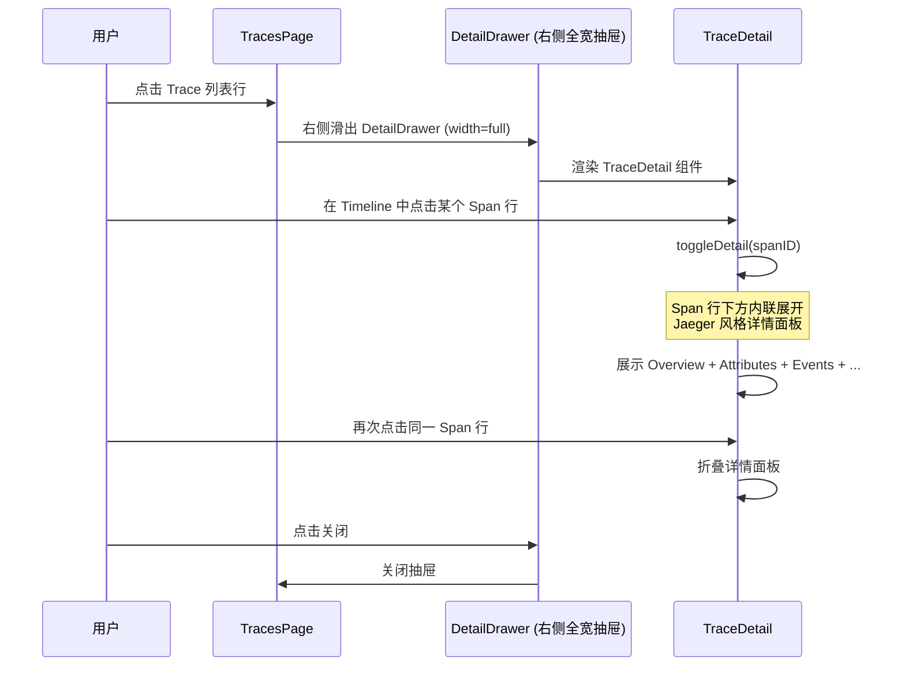
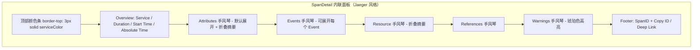

# Trace 页面优化

## 需求描述

优化 Trace 页面的详情展示方式，分两个层级：

### 第一层：Trace Detail 展示方式
- **原方案**：点击 Trace 列表行 → Modal 居中弹窗展示 TraceDetail
- **优化方案**：点击 Trace 列表行 → **右侧抽屉**（DetailDrawer）滑出展示 TraceDetail ✅

### 第二层：Span Detail 展示方式
- **方案**：和 Jaeger 保持一致，点击 Span 行后**内联展开/折叠**显示详情面板
- 详情面板采用 Jaeger 风格设计（颜色条 + Overview + Accordion 手风琴区域）

## 设计方案

### 交互流程

### Span 内联详情面板结构

### 设计亮点（参考 Jaeger）

- 顶部带服务颜色条（`border-top: 3px solid {color}`）
- Overview 使用 LabeledList 横排展示（Service / Duration / Start Time / Absolute Time）
- Attributes 折叠摘要（折叠时显示 `key=value` 摘要标签列表）
- KeyValueTable 带 hover 复制按钮
- Events 支持相对时间戳显示，每个 Event 可独立展开/折叠
- 长文本值支持 Show more / Show less 展开折叠
- 底部 Debug Info（SpanID + Copy ID / Copy Deep Link 按钮）

## 实施进展

- [x] 创建需求文档
- [x] 修改 TracesPage.tsx：Trace Detail 从 Modal 弹窗改为 DetailDrawer 右侧抽屉
- [x] 修改 TraceDetail.tsx：Span 点击采用 Jaeger 风格内联展开/折叠模式
- [x] 删除 SpanDetailDrawer.tsx（不再需要独立抽屉组件）
- [x] 编译验证通过（TypeScript 无错误）
- [x] 更新文档

## 2026-04-10：Trace Detail 抽屉布局刷新

### 问题复盘

用户反馈当前 `Trace Detail` 抽屉存在以下问题：

- 抽屉顶部存在无信息价值的空白头部，视觉上像“空壳容器”
- `TraceDetail.tsx` 内部再次套了一层卡片（`rounded + border + shadow`），形成“抽屉里再套页面”的层级冗余
- `Timeline` 虚拟列表容器写死 `maxHeight: 600px`，导致大屏下底部出现大量空白，空间利用率差
- Header、Tabs、Search、Timeline Header 各自单独占一行，固定区过高，真正的数据区被压缩
- 手风琴折叠箭头工具感偏重，细节不够精致

### 刷新目标

- 将 `Trace Detail` 改造成真正的**全高分析工作台**，而不是“抽屉中的卡片”
- 让 `Timeline` 成为主视图，自动吃满剩余垂直空间
- 压缩无效头部和重复边框，提升信息密度与专业感
- 将顶部操作、Tabs、搜索导航整合为统一工具区，减少层级割裂

### 实施方案

#### 1. `DetailDrawer.tsx` 容器能力增强

- 新增 `hideHeader`：允许复杂页面自行渲染完整头部，移除默认空白头部
- 新增 `bodyClassName`：支持内容区切换为 `full-bleed` / 全高布局，而不是固定 `px-6 py-4`
- `TracesPage.tsx` 中 `Trace Detail` 抽屉改为：隐藏默认头部 + 内容区 `p-0 overflow-hidden bg-slate-50`

#### 2. `TraceDetail.tsx` 全高工作台化

- 根布局改为 `h-full flex flex-col`，建立完整高度链
- 移除原先外层 `rounded-xl shadow-sm border` 卡片壳层
- 顶部重构为高信息密度摘要区：
  - root service / root operation
  - traceID
  - duration / spans / services / start time
  - error span count
  - service pills
- 关闭按钮内收至新头部，避免依赖抽屉默认空头部

#### 3. Tabs / Search / Timeline 工具区合并

- Tabs 改为紧凑 segmented control 样式
- Timeline 搜索与 match 导航按钮合并到同一工具栏
- 用 `searchSummary` 统一显示当前匹配进度或总 spans 数

#### 4. Timeline 主区全高化

- 用 `flex-1 min-h-0` 取代固定 `maxHeight: 600px`
- 时间轴容器改为真正的剩余空间布局，滚动区只属于 span 列表本身
- 顶部时间刻度行与列表体分离，保证视觉稳定

#### 5. 行视图与细节精修

- 左侧 `Service / Operation` 改为固定宽度信息轨（约 `340px~380px`）
- 缩紧层级缩进，减少树状结构带来的横向浪费
- Timeline bar 增加浅色轨道与 25%/50%/75% 基准线，提升可读性
- duration 文本仅在 bar 宽度足够时显示，避免窄条挤字
- Accordion 折叠控件由 chevron 改为更轻量的 `plus/minus` 控件

### 当前结果

- 抽屉顶部不再出现无意义的空白头部
- Trace 详情页从“卡片套娃”调整为真正的全屏分析工作台
- `Timeline` 能自动撑满抽屉剩余高度，大幅减少底部空白
- Header、Tabs、Search、导航层级更紧凑，空间利用率更高
- 折叠控件与时间轴细节更统一、更专业
- lint 校验通过（`TraceDetail.tsx` / `DetailDrawer.tsx` / `TracesPage.tsx`）

## 变更文件清单

| 文件 | 变更类型 | 说明 |
|------|----------|------|
| `src/pages/TracesPage.tsx` | **修改** | 将 `<Modal>` 替换为 `<DetailDrawer>`，并在后续接入 `width="wide"` + `suppressShellFloatingUI`，使 Trace Detail 成为更宽的沉浸式分析抽屉 |
| `src/components/TraceDetail.tsx` | **修改** | Span 点击采用 Jaeger 风格内联展开/折叠；新增 SpanDetail/AccordionSection/TagsSummary/KeyValueTable/TagValue/LongValueDisplay/EventsList 等子组件，并重构为全高工作台布局 |
| `src/components/DetailDrawer.tsx` | **修改** | 新增 `hideHeader` / `bodyClassName` / `suppressShellFloatingUI` / `wide`，并补齐 `shouldRender + isClosing` 退出动画状态机，使关闭动画、body lock、shell chrome lock 生命周期收敛到基础组件内部 |
| `src/contexts/ShellChromeContext.tsx` | **新增** | 独立的 shell chrome 协调上下文，用引用计数方式控制全局浮动控件显隐 |
| `src/layouts/MainLayout.tsx` | **修改** | 全局侧边栏折叠按钮改为消费 shell chrome 状态，在沉浸式抽屉场景下自动隐藏 |
| `src/index.css` | **修改** | 新增 `animate-slide-out-right` 与 `slideOutRight` 关键帧，支撑抽屉退出动画 |
| `src/components/SpanDetailDrawer.tsx` | **删除** | 不再需要独立抽屉组件 |
| `docs/span-detail-drawer.md` | **新建/更新** | 需求文档与后续布局/架构演进记录 |

## 遗留问题

（暂无）
