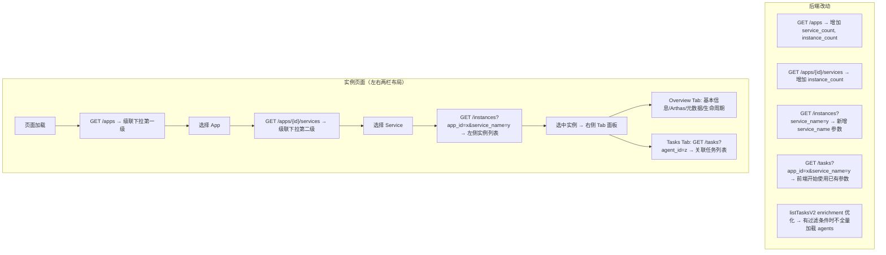
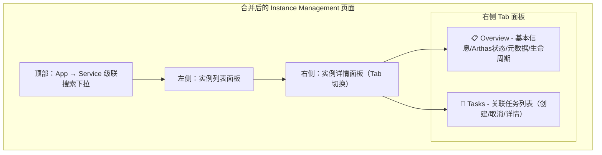
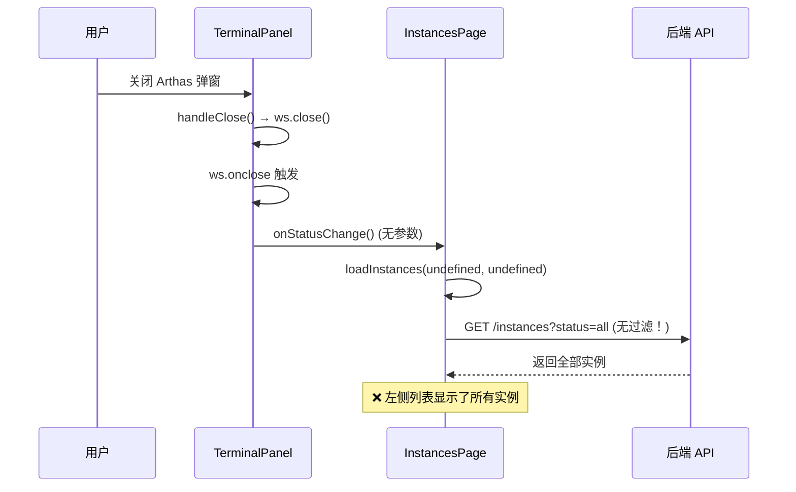

# 级联查询优化 - 任务页面 & 实例页面

## 需求背景

当前任务页面和实例页面的查询方式存在性能问题：
- **TasksPage**: `GET /tasks` 无参数全量拉取所有任务，前端从全量数据构建 App→Service→Instance 三级树
- **InstancesPage**: `GET /instances?status=all` 全量拉取所有实例，前端从全量数据构建 App→Service 两级树

数据量增大后，全量拉取+前端分组的方式会导致：
1. 后端 `listTasksV2` 每次调用 `ListApps()` + `GetAllAgents()` 做 enrichment，开销大
2. 前端一次性处理大量数据，渲染卡顿
3. 网络传输量大

## 方案 A：级联查询

改为先查 App 列表构建树，点击节点时带过滤参数查询后端。



## 方案 B：合并任务页面到实例页面（已实施）

任务管理页面与实例管理页面高度重合，任务本质上绑定到具体实例（agent_id）。
将任务功能合并到实例页面的 Tasks Tab 中，删除独立的任务管理页面。



## 实施清单

### 后端改动

| # | 文件 | 改动 | 状态 |
|---|------|------|------|
| 1 | `handlers.go` | `listApps` 增加 `service_count` 和 `instance_count` | ✅ |
| 2 | `handlers.go` | `listAppServices` 增加 `instance_count` | ✅ |
| 3 | `handlers.go` | `listAllInstances` 新增 `service_name` 查询参数 | ✅ |
| 4 | `handlers.go` | `listTasksV2` 优化 enrichment（有过滤条件时不全量加载 agents） | ✅ |

### 前端改动

| # | 文件 | 改动 | 状态 |
|---|------|------|------|
| 5 | `api.ts` + `client.ts` | 新增 `AppService`, `TaskListParams`, `InstanceListParams` 类型 + 带参数的 API 方法 | ✅ |
| 6 | `InstancesPage.tsx` | 重构为左右两栏布局：左侧实例列表 + 右侧 Tab 面板（Overview + Tasks） | ✅ |
| 7 | `InstanceTasksTab.tsx` | 新建独立组件：实例关联任务列表（创建/取消/详情） | ✅ |
| 8 | `TasksPage.tsx` | 已删除，功能合并到 InstancesPage 的 Tasks Tab | ✅ |
| 9 | `App.tsx` | 移除 TasksPage 路由 | ✅ |
| 10 | `Sidebar.tsx` | 移除 Tasks 导航入口 | ✅ |
| 11 | App/Service 下拉 | 改为 SearchableSelect 可搜索下拉，去除 "All" 选项 | ✅ |

### 验证

| 项目 | 状态 |
|------|------|
| Go 后端编译 (`go build ./...`) | ✅ 通过 |
| 前端 TypeScript 编译 (`tsc --noEmit`) | ✅ 通过 |

## 改动文件清单

### 后端
- `extension/adminext/handlers.go` — listApps/listAppServices/listAllInstances/listTasksV2 优化

### 前端
- `extension/adminext/webui-react/src/types/api.ts` — 新增 AppService, TaskListParams, InstanceListParams 类型
- `extension/adminext/webui-react/src/api/client.ts` — 新增 getAppServices, 增强 getInstances/getTasks 带参数
- `extension/adminext/webui-react/src/pages/InstancesPage.tsx` — 重构为左右两栏布局（Overview Tab + Tasks Tab）
- `extension/adminext/webui-react/src/components/InstanceTasksTab.tsx` — 新建：实例关联任务列表组件
- `extension/adminext/webui-react/src/pages/TasksPage.tsx` — 已删除
- `extension/adminext/webui-react/src/App.tsx` — 移除 TasksPage 路由
- `extension/adminext/webui-react/src/layouts/Sidebar.tsx` — 移除 Tasks 导航入口

## Bug 修复记录

### BUG-001：关闭 Arthas 弹窗后左侧实例列表加载全部数据

**现象**：关闭 Arthas 终端弹窗后，页面左侧探针列表加载了全部实例数据，而非当前选中 App/Service 下的实例。

**根因**：`TerminalPanel` 的 `onStatusChange` 回调直接绑定了 `loadInstances` 函数引用，但 `TerminalPanel` 内部调用 `onStatusChange?.()` 时不传参数，导致 `appId` 和 `serviceName` 都是 `undefined`，API 请求变成无过滤的全量查询。



**修复**：将 `onStatusChange={loadInstances}` 改为闭包形式，自动携带当前选中的 `selectedAppId` 和 `selectedServiceName`：

```tsx
// 修复前
onStatusChange={loadInstances}

// 修复后
onStatusChange={() => loadInstances(selectedAppId || undefined, selectedServiceName || undefined)}
```

**状态**：✅ 已修复 | **文件**：`InstancesPage.tsx`

---

## 遗留问题

- [ ] 右侧 Tab 面板后续可扩展更多 Tab（如 Logs、Metrics 等）
- [ ] 任务列表默认 limit=100，后续可考虑加载更多/无限滚动
- [ ] App 和 Service 的统计数据（service_count, instance_count）在实例上下线时不会自动刷新，需要手动刷新
- [ ] 左侧实例列表可考虑虚拟滚动优化（当实例数量 > 1000 时）
