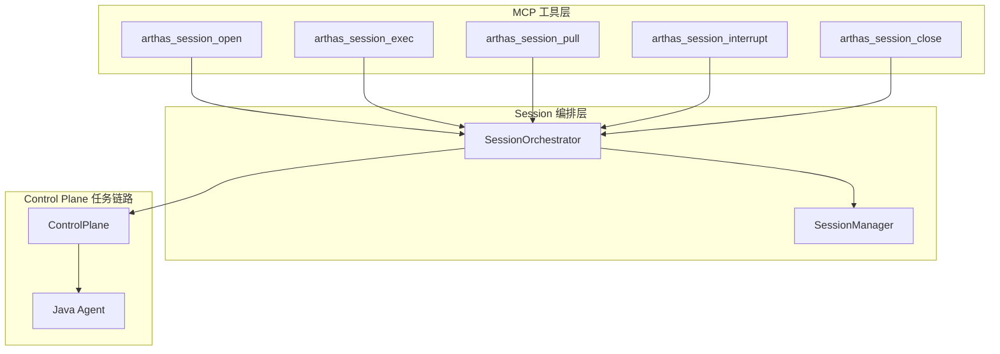
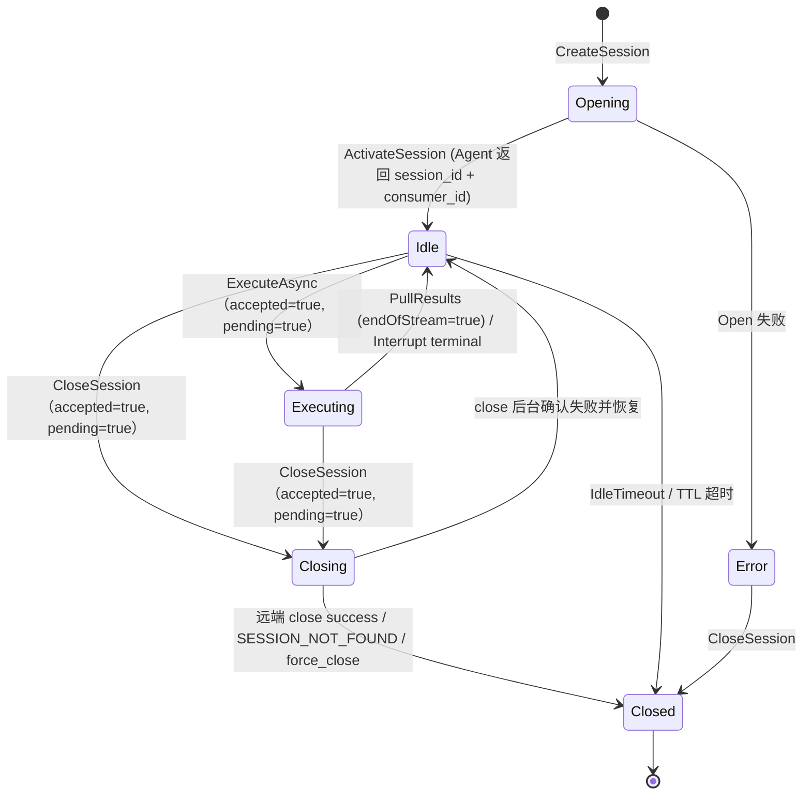
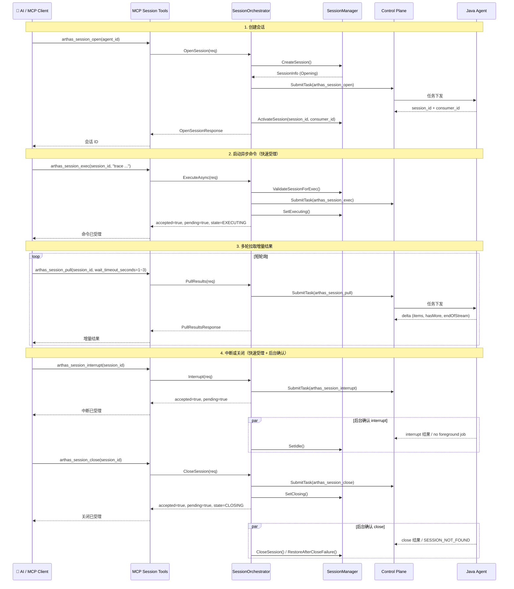

# Phase 5：Collector 异步 Session 编排

> 本文档同时作为本次 `consumer_id` 映射修复、超时预算收敛、`session` 生命周期收口与“两段式返回”改造的实施记录，持续维护需求背景、实施进展、未完成任务与遗留问题。

## 需求背景

### 本次修复背景（2026-04）

在线联调暴露出三个核心问题：

- `session_open` 成功后，Collector 未正确维护 Agent 返回的 `consumer_id`，导致后续 `session_pull` 身份校验失败
- `session_close` / `session_interrupt` 的总重试预算大于 MCP 工具层外层 `context`，导致最后一次重试可能被确定性打断
- 远端 Agent session 已被关闭或回收后，Collector 未及时将本地 `collector_session_id` 收敛为 terminal，导致后续 `pull / exec / close` 继续命中死 session
- Agent 已上报任务结果时，Collector 的 `waitForTaskResult` 仍可能因结果读取错误被吞掉而表现为轮询超时，掩盖真实故障位置

本次实施目标：

- 修复 `collector_session_id ↔ agent_session_id ↔ consumer_id` 的状态闭环
- 收敛 `close` / `interrupt` 的 timeout budget，避免外层上下文提前取消
- 在收到远端 `SESSION_NOT_FOUND` 时及时完成 Collector 本地终态收口
- 统一 `close` 的幂等语义，避免“远端已不存在但本地仍视为失败”的不一致行为
- 补充关键日志，提升后续联调可观测性
- 让任务结果读取错误显式暴露到等待逻辑，区分“结果未到达”和“结果读取失败”
- 将 `attach / session_exec / session_interrupt / session_close` 调整为 **快速受理 + 后台确认** 的两段式返回模型
- 将 `session_pull` 默认等待压缩为短轮询，避免把长等待直接暴露给 MCP 外层

Phase 2 完成了 Collector 侧的同步任务编排 MVP（ArthasOrchestrator），Phase 3 完成了同步闭环联调。Phase 5 的目标是实现 **Collector 侧异步 Session 编排能力**，支持 `trace`、`watch` 等需要等待方法调用触发的长命令。

### 设计原则

- **不把持续结果塞进任务 RUNNING 状态** — 每次 pull 都是独立任务
- **不新增独立长连接物理通道** — 复用现有 Control Plane 任务链路
- **不把 Arthas 原生 session 细节直接暴露给最上层** — Collector 侧 session_id 与 Agent 侧解耦

## 架构设计

### 整体架构



### 会话状态机



### 异步命令执行流程



## 实现组件

### 1. SessionManager (`arthas_session_manager.go`)

**职责**：管理 Arthas 异步会话的完整生命周期。

| 功能 | 说明 |
|------|------|
| 会话映射 | `collector_session_id` ↔ `agent_id` + `agent_session_id` + `consumer_id` + `state` |
| 状态机 | Opening → Idle → Executing → Closing → Closed |
| TTL 回收 | 会话总存活时间超限自动关闭 |
| Idle 回收 | 空闲超时自动关闭 |
| 幂等控制 | 基于 `request_id` 的幂等缓存 |
| 并发限制 | 最大并发会话数限制（默认 20） |
| 后台回收 | 定时检查并回收过期会话和幂等缓存 |
| 失败恢复 | `close` 后台确认失败时恢复到 close 前状态 |

**默认配置**：

| 参数 | 默认值 |
|------|--------|
| DefaultTTL | 10 分钟 |
| DefaultIdleTimeout | 2 分钟 |
| MaxSessions | 20 |
| ReapInterval | 30 秒 |
| IdempotencyTTL | 5 分钟 |

### 2. SessionOrchestrator (`arthas_session_orchestrator.go`)

**职责**：编排 Arthas 异步会话任务的完整生命周期。

| 方法 | 对应 task_type | 重试策略 | 说明 |
|------|---------------|---------|------|
| `OpenSession` | `arthas_session_open` | 最多 2 次 | 创建会话 → 等待 Agent 返回 `session_id + consumer_id` → 激活 |
| `ExecuteAsync` | `arthas_session_exec` | 不重试 | 启动异步命令 → **提交成功即返回 accepted/pending** |
| `PullResults` | `arthas_session_pull` | 最多 3 次 | 拉取增量结果 → 空轮询不视为失败 |
| `Interrupt` | `arthas_session_interrupt` | 后台确认 | 中断异步任务 → **提交成功即返回** → 后台等待终态并收敛为 Idle |
| `CloseSession` | `arthas_session_close` | 后台确认 | 关闭会话 → **提交成功即返回** → SessionManager 进入 `Closing` 并后台收口 |

**超时配置**：

| 参数 | 默认值 |
|------|--------|
| SessionOpenTimeoutMs | 30000 |
| SessionExecTimeoutMs | 30000 |
| SessionPullTimeoutMs | 3000 |
| SessionCloseTimeoutMs | 15000 |
| PollInterval | 500ms |

**本次实现补充**：

- `consumer_id` 仅以 Agent `session_open` 回包为准，并在 `ActivateSession(...)` 时落库
- `session_pull` 提交前打印实际下发的 `agent_session_id` 和 `consumer_id`
- `session_close` / `session_interrupt` 的工具层外层超时改为基于重试预算动态计算
- `session_pull` / `session_interrupt` / `session_close` / `session_exec` 收到远端 `SESSION_NOT_FOUND` 时，会将 Collector 本地 session 收敛为 terminal
- `session_close` 对“本地 session 不存在”和“远端 session 已不存在”统一按幂等成功处理
- `session_close` 已补充 MCP 工具层、编排层、SessionManager 三层结构化日志，可直接区分“幂等返回 / 提交失败 / 等待超时 / 远端返回失败 / 本地终态收口 / force 关闭”
- `waitForTaskResult` 现在会显式记录 `GetTaskResult(...)` 的底层读取错误，并直接返回错误，不再把读取失败伪装成普通轮询超时
- `session_exec` 改为提交成功即返回 `accepted=true`、`pending=true`、`state=EXECUTING`，不再同步等待 task result
- `session_interrupt` 改为提交成功即返回，后台通过 `task result / session state / no foreground job is running` 收敛最终状态
- `session_close` 改为提交成功即返回，SessionManager 先进入 `Closing`，后台再按 `success / SESSION_NOT_FOUND / force_close` 收口
- `arthas_attach` 改为提交成功即返回，后续通过 `arthas_status` 确认 `tunnel_registered`
- `session_pull` MCP 默认等待时间从 15 秒压缩到 3 秒，建议客户端使用 1~3 秒短轮询

### 3. Session Result Parser (`arthas_result_parser.go` 扩展)

**新增解析方法**：

| 方法 | 说明 |
|------|------|
| `ParseSessionOpenResult` | 解析 session_open 结果，提取 agent_session_id |
| `ParseSessionExecResult` | 解析 session_exec 结果，确认受理状态 |
| `ParseSessionPullResult` | 解析 session_pull 结果，提取 delta（空轮询返回空 delta） |
| `ParseSessionInterruptResult` | 解析 session_interrupt 结果 |
| `ParseSessionCloseResult` | 解析 session_close 结果 |

**增量结果结构 (SessionDelta)**：

```json
{
  "items": [...],       // 结构化结果条目
  "hasMore": true,      // 是否还有更多数据
  "endOfStream": false, // 当前异步命令是否已结束
  "totalItems": 3       // 本次返回的条目数
}
```

### 4. MCP Session 工具 (`tools_arthas_session.go`)

| 工具名 | 参数 | 说明 |
|--------|------|------|
| `arthas_session_open` | agent_id, ttl_seconds?, idle_timeout_seconds? | 创建异步会话 |
| `arthas_session_exec` | session_id, command | 在会话中启动异步命令 |
| `arthas_session_pull` | session_id, wait_timeout_seconds? | 拉取增量结果 |
| `arthas_session_interrupt` | session_id, reason? | 中断异步任务 |
| `arthas_session_close` | session_id, reason?, force? | 关闭会话 |

### 5. MCP Server 集成 (`mcp_server.go`)

- `mcpServerWrapper` 新增 `sessionManager` 和 `sessionOrchestrator` 字段
- `newMCPServerWrapper` 中初始化 SessionManager（含后台回收协程）和 SessionOrchestrator
- `registerTools` 中注册 5 个 Session 工具

## 改动文件清单

| 文件 | 操作 | 说明 |
|------|------|------|
| `extension/mcpext/arthas_session_manager.go` | **新增** | Session Manager：会话生命周期、映射、TTL/idle 回收、幂等控制 |
| `extension/mcpext/arthas_session_orchestrator.go` | **新增** | Session Orchestrator：5 个编排方法 + 任务构造器 + 结果等待 |
| `extension/mcpext/arthas_result_parser.go` | **修改** | 新增 5 个 Session 结果解析方法 + ParsedSessionResult |
| `extension/mcpext/tools_arthas_session.go` | **新增** | 5 个 MCP Session 工具注册和处理 |
| `extension/mcpext/mcp_server.go` | **修改** | 集成 SessionManager + SessionOrchestrator + 注册工具 |

## 任务进度

| 任务 | 状态 | 说明 |
|------|------|------|
| SessionManager 实现 | ✅ 完成 | 会话映射、状态机、TTL/idle 回收、幂等控制 |
| SessionOrchestrator 实现 | ✅ 完成 | 5 个编排方法 + 重试策略 + 超时语义 |
| Session Result Parser | ✅ 完成 | 5 个解析方法 + 空轮询处理 |
| MCP Session 工具 | ✅ 完成 | 5 个工具注册和处理 |
| MCP Server 集成 | ✅ 完成 | 初始化 + 注册 |
| `consumer_id` 状态闭环修复 | ✅ 完成 | `session_open` 激活阶段同时写入 `agent_session_id` 和 `consumer_id` |
| `close/interrupt` 超时预算收敛 | ✅ 完成 | 工具层外层 `context` 改为基于重试预算动态计算 |
| `session` 生命周期终态收口 | ✅ 完成 | 远端 `SESSION_NOT_FOUND` 会触发 Collector 本地 `CloseSessionWithReason(...)` 收口 |
| `close` 幂等语义统一 | ✅ 完成 | 本地不存在、已关闭、远端不存在三类场景统一按已关闭处理 |
| 关键排障日志补充 | ✅ 完成 | 已补充 `session_open` 成功日志、`session_pull` 下发日志、远端 terminal 收口日志 |
| `close` 细粒度日志补强 | ✅ 完成 | 已补充 MCP 返回总结日志、close attempt 日志、close 结果日志、waitForTaskResult 上下文字段、SessionManager 关闭来源日志 |
| 任务结果读取错误透传 | ✅ 完成 | `ControlPlane.GetTaskResult(...)` 已透传 error，`waitForTaskResult` 遇到读取失败会立即告警并返回 |
| 两段式返回改造 | ✅ 完成 | `attach / session_exec / session_interrupt / session_close` 已统一为快速受理 + 后台确认 |
| `session_pull` 短轮询收敛 | ✅ 完成 | 默认等待时间调整为 3 秒，并在工具层提示建议使用 1~3 秒短轮询 |
| 编译验证 | 🔄 进行中 | 本轮修改完成后需要重新执行 `go build ./...` |
| Agent 侧 Session 执行器 | 🔲 待实现 | Phase 6 联调前需要 Agent 侧实现 |
| 端到端联调 | 🔲 待完成 | 依赖 Agent 侧实现 |

## 遗留问题

### 问题 0：`session_open` 请求参数中的 `consumer_id` 协议语义需双端最终确认（优先级：中）

当前 Collector 修复策略是：

- 不再本地预生成最终可用的 `consumer_id`
- 以 Agent `session_open` 回包中的 `consumerId` 作为唯一权威值

这可以修复当前 pull 身份错配问题，但 `session_open` 请求是否还需要携带 `consumer_id` 作为 hint / metadata，仍建议在双端协议层做最终确认。

### 问题 1：`session_close` 的 MCP 客户端 10 秒超时仍需继续联调确认（优先级：高）

当前 Collector 已完成 timeout budget 收敛，并补上远端 `SESSION_NOT_FOUND` 的 terminal 收口，但真实链路仍观察到 `arthas_session_close` 在调用侧出现 10 秒超时现象。

在本轮两段式返回之后，这个问题理论上应明显缓解，因为 `close` 已不再同步等待最终结果，而是先返回 `accepted/pending`。

仍需继续确认的点：

- MCP 调用侧是否还存在独立的更短超时，可能先于“任务已受理”返回
- close 后台确认链路上的结果投递/透传是否仍存在额外延迟
- 底层任务结果读取链路是否仍存在存储读取失败

**下一步**：结合 Collector 日志与 MCP 调用层超时配置继续确认，区分“Collector 内部失败”与“调用侧先超时”。

**本轮补充后可直接观察的关键日志**：

- `tools_arthas_session.go`：`[arthas_session_close] 关闭会话完成 / 关闭会话失败 / 关闭会话返回业务错误`
- `arthas_session_orchestrator.go`：`[session-close] 提交任务 / 任务提交成功，等待结果 / 收到任务结果 / Collector 本地会话已关闭 / 关闭失败，已达到最大重试次数`
- `arthas_session_orchestrator.go`：`[waitForTaskResult] 轮询超时`（带 `operation=session-close`、`collector_session_id`、`agent_session_id`、`attempt`）
- `arthas_session_manager.go`：`[session-manager] 会话已关闭`（带 `close_source`、`state_before`、`current_task_id`）

### 问题 2：Agent 侧 Session 执行器未实现（优先级：高）

Collector 侧 Session 编排已完成，但 Agent 侧尚未实现以下执行器：
- `ArthasSessionOpenExecutor`
- `ArthasSessionExecExecutor`
- `ArthasSessionPullExecutor`
- `ArthasSessionInterruptExecutor`
- `ArthasSessionCloseExecutor`

**下一步**：Phase 6 需要在 Agent 侧实现这些执行器，然后进行端到端联调。

### 问题 3：SessionManager 停止时机

当前 `SessionManager.Start()` 在 `newMCPServerWrapper` 中调用，但 `Stop()` 尚未在 Extension 关闭时调用。需要在 Extension 的 `Shutdown` 方法中添加 SessionManager 的停止逻辑。

### 问题 4：需要补充端到端验证用例

建议在后续联调或测试中至少覆盖：

- `session_open` 成功后，`session_pull` 使用回写的 `consumer_id` 正常通过 Agent 身份校验
- `session_close` / `session_interrupt` 在最大重试次数下不会先于工具层外层 `context` 超时
- 远端 session 已被删除时，Collector 会立即将本地 session 收敛到 terminal，后续 `pull / exec / close` 不再继续命中死 session
- `close` 在本地不存在、已关闭、远端不存在三类场景下都表现为幂等成功
- `interrupt` 第二次重试返回 `no foreground job is running` 时，会按 no-op 终态收敛为成功
- `session_exec` 返回 `accepted/pending` 后，后续首次 `pull` 能正确观察到“无数据 / 有数据 / EOS”三种状态
- `arthas_attach` 返回 `accepted/pending` 后，可通过 `arthas_status=tunnel_registered` 完成状态确认
- 日志中可直接关联 `collector_session_id`、`agent_session_id`、`consumer_id`
- `close` 超时时可从日志中明确判断卡在“提交 / 等待结果 / 结果解析 / 本地收口 / MCP 返回”中的哪一段

### 问题 5：任务结果可见性链路仍需继续联调确认（优先级：高）

本轮已修复的不是业务语义本身，而是可观测性缺口：

- `ControlPlane.GetTaskResult(...)` 之前会丢弃底层 store 的读取 error
- `waitForTaskResult(...)` 因此无法区分“结果不存在”和“结果读取失败”
- 在 Redis 抖动、实例/前缀不一致或结果视图不一致时，最终表现会被误收敛成 `TASK_TIMEOUT`

本轮修复后，下次联调可直接根据日志判断：

- 是否真的没有结果
- 是否底层读取失败
- 是否需要进一步排查 Redis 连接、`keyPrefix`、多实例可见性或结果上报入口

**建议继续核对**：

- `ReportTaskResult` 是否稳定进入 Collector
- `store.SaveResult(...)` 与 `store.GetResult(...)` 是否命中同一份存储视图
- Redis 是否存在 `GET resultKey(task_id)` 超时或连接错误

## 本次实施验证

- 构建命令：`go build ./...`
- 构建结果：🔄 待执行
- 验证结论：本轮新增修复聚焦于 `session` 生命周期收口、`close` 幂等语义、任务结果读取错误透传，以及两段式返回收敛，待重新编译和联调确认

### 本轮新增日志补强说明（2026-04-02）

本轮针对 `close` 额外补充了以下日志能力：

- **MCP 工具层**：补充 `arthas_session_close` 的开始、业务错误、调用失败、完成总结日志，并记录 `elapsed`、`task_id`、`closed`、`error_code/error_message`
- **SessionOrchestrator**：补充本地幂等返回日志、Opening 会话直接本地关闭日志、每轮 close attempt 的提交与等待日志、close 结果解析日志、force 关闭日志、最大重试失败日志
- **waitForTaskResult**：支持透传操作上下文，`close` 场景下会输出 `operation=session-close`、`collector_session_id`、`agent_session_id`、`attempt`
- **SessionManager**：关闭日志新增 `close_source`、`state_before`、`current_command`、`current_task_id`，便于区分 `explicit_close / local_only_close / remote_terminal / force_close`

这些日志用于把 close 失败观测进一步细化为：

- 本地 session 不存在的幂等返回
- 本地 session 已终态的幂等返回
- task 提交失败
- waitForTaskResult 等待超时
- 远端 close 返回失败
- 远端已终止导致的 terminal 收口
- force 模式的本地关闭
- MCP 返回链路上的超时或中断

### 本轮新增结果读取可观测性修复（2026-04-02）

本轮新增修复聚焦 `interrupt / close / pull / 同步命令` 共用的任务结果等待路径：

- `extension/controlplaneext/extension.go`：`GetTaskResult(...)` 不再吞掉底层 `taskMgr.GetTaskResult(...)` 返回的 error
- `extension/mcpext/arthas_session_orchestrator.go`：`waitForTaskResult(...)` 读取任务结果失败时会输出 `[waitForTaskResult] 读取任务结果失败`，并带上 `task_id`、`poll_count`、`elapsed` 及场景上下文字段
- `extension/mcpext/arthas_orchestrator.go`：同步命令等待逻辑同步改为直接返回读取错误，避免同步 / 异步模式行为分叉
- `extension/mcpext/tools_arthas_lifecycle_test.go`：测试 helper 已同步到新的 error 透传语义

这轮修改的目标不是改变任务执行协议，而是避免底层读取失败被误观测成业务超时，从而为后续确认 Redis、`keyPrefix`、多实例读写视图问题提供更直接的证据。

### 本轮新增“两段式返回”改造说明（2026-04-02）

本轮新增修复聚焦 MCP 客户端 10 秒超时窗口与 Collector 内部等待模型错位的问题：

- `extension/mcpext/arthas_orchestrator.go`：`arthas_attach` 改为任务提交成功即返回 `accepted=true`、`pending=true`，后台异步等待 attach 结果并通过日志记录终态，最终确认方式改为 `arthas_status`
- `extension/mcpext/arthas_session_orchestrator.go`：`session_exec` 改为提交成功后立即 `SetExecuting(...)` 并返回，不再同步等待 `task result`
- `extension/mcpext/arthas_session_orchestrator.go`：`session_interrupt` 改为快速受理后后台确认，`INTERRUPTED` 与 `no foreground job is running` 均按幂等成功收敛为 Idle
- `extension/mcpext/arthas_session_orchestrator.go`：`session_close` 改为快速受理后先进入 `Closing`，后台根据 `success / SESSION_NOT_FOUND / force_close / 失败恢复` 完成终态收口
- `extension/mcpext/arthas_session_manager.go`：新增 `SessionStateClosing`、`SetClosing(...)` 与 `RestoreAfterCloseFailure(...)`，用于支撑 close 的后台确认与失败恢复
- `extension/mcpext/tools_arthas_session.go` 与 `extension/mcpext/tools_arthas_lifecycle.go`：MCP 返回文案统一调整为 `accepted / pending / confirmation_mode / confirmation_hint` 语义
- `session_pull` 默认等待时间从 15 秒降到 3 秒，推荐客户端使用 1~3 秒的短轮询模式，避免把长等待直接暴露给 MCP 外层

这一轮改造的目标不是一次请求内拿到所有终态，而是统一把“是否已提交成功”和“最终是否完成”拆成两个独立阶段，以降低假超时和误失败。