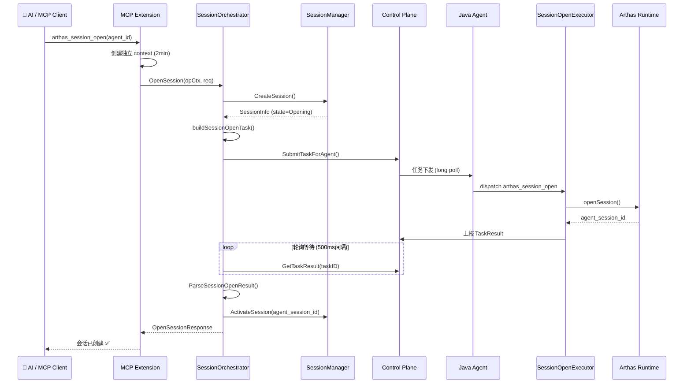
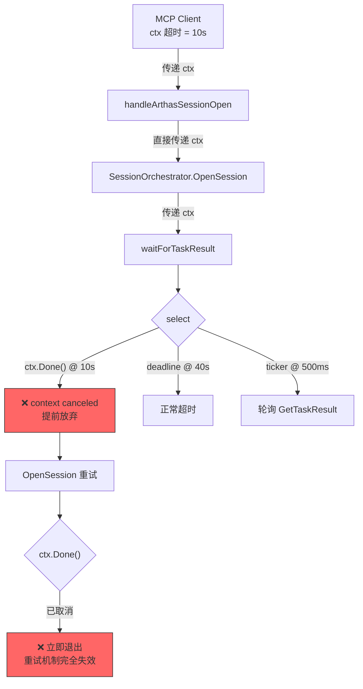

# Phase 6：异步 Session 闭环联调

## 需求背景

Phase 5 完成了 Collector 侧异步 Session 编排的代码实现（SessionOrchestrator + SessionManager + MCP 工具），Phase 6 的目标是将 Collector 侧与 Agent 侧联调打通，验证完整的 **MCP → Collector → Agent → Arthas** 异步会话链路。

## 联调架构



## 修复记录

### Bug #1：MCP 客户端 ctx 超时导致 Collector 侧提前放弃（2026-04-01）

#### 问题现象

通过 MCP 工具调用 `arthas_session_open` 时，固定 10 秒超时失败：
- 跨两台 Agent 一致复现
- 同步链路（`arthas_exec_sync`）工作正常
- Agent 侧 sessionRegistry 仍为 0，说明任务未真正执行

#### 根因分析



**时序分析**：

| 时间 | 事件 | 说明 |
|------|------|------|
| t=0s | MCP 客户端发起请求 | ctx 超时 = 10s |
| t=0s | OpenSession → SubmitTaskForAgent | 任务提交到 Redis ✅ |
| t=0.5s | waitForTaskResult 开始轮询 | 每 500ms 一次 |
| t=10s | MCP 客户端超时 | ctx 被取消 |
| t=10s | waitForTaskResult → ctx.Done() | 提前退出 ❌ |
| t=10s | 重试 attempt=1 → ctx.Done() | 立即退出 ❌ |
| t=?s | Agent long poll 拿到任务 | 但 Collector 已放弃 |

**核心问题**：所有 5 个 session handler 都直接传递 MCP 客户端的 `ctx`，导致：
1. Collector 侧只有 ~10 秒有效等待时间（而非预期的 40 秒）
2. 重试机制完全失效（ctx 已取消，重试立即退出）
3. 任务可能已提交到 Redis 但结果无人接收（孤儿任务）

#### 修复方案

**文件**: `extension/mcpext/tools_arthas_session.go` — 所有 5 个 handler

```go
// ✅ 修复前：直接使用 MCP 客户端 ctx
resp, err := w.sessionOrchestrator.OpenSession(ctx, &OpenSessionRequest{...})

// ✅ 修复后：使用独立 context，不受 MCP 客户端超时影响
opCtx, cancel := context.WithTimeout(context.Background(), 2*time.Minute)
defer cancel()
resp, err := w.sessionOrchestrator.OpenSession(opCtx, &OpenSessionRequest{...})
```

**各 handler 超时配置**：

| Handler | 独立 context 超时 | 说明 |
|---------|-------------------|------|
| `handleArthasSessionOpen` | 2 分钟 | 任务提交 + Agent 执行 + 结果回传 + 可能的重试 |
| `handleArthasSessionExec` | 2 分钟 | 同上 |
| `handleArthasSessionPull` | 2 分钟 | pull 等待超时由 waitTimeoutMs 参数控制 |
| `handleArthasSessionInterrupt` | 1 分钟 | 中断操作应较快完成 |
| `handleArthasSessionClose` | 1 分钟 | 关闭操作应较快完成 |

### Bug #2：缺少关键诊断日志（2026-04-01）

#### 问题现象

联调失败时无法从 Collector 日志中判断：
1. 任务是否真的提交成功了
2. 是 Collector 侧超时还是 MCP ctx 取消
3. Agent 是否上报了结果但 Collector 已经放弃
4. 轮询了多少次、耗时多久

#### 修复方案

**文件**: `extension/mcpext/arthas_session_orchestrator.go`

在以下关键节点添加诊断日志：

| 节点 | 日志级别 | 记录内容 |
|------|----------|----------|
| 任务提交前 | INFO | session_id, task_id, task_type, agent_id, attempt |
| 任务提交失败 | ERROR | session_id, task_id, error |
| 任务提交成功 | INFO | session_id, task_id, timeout_ms |
| 等待结果失败 | WARN | session_id, task_id, wait_timeout, error |
| 收到任务结果 | INFO | session_id, task_id, task_status, result_data |
| ctx 取消（重试时） | WARN | session_id, attempt, error |
| waitForTaskResult ctx 取消 | WARN | task_id, elapsed, poll_count, error |
| waitForTaskResult 超时 | WARN | task_id, timeout, elapsed, poll_count |
| waitForTaskResult 获取结果 | DEBUG | task_id, status, poll_count, elapsed |

## 改动文件清单

| 文件 | 操作 | 说明 |
|------|------|------|
| `extension/mcpext/tools_arthas_session.go` | **修改** | 所有 5 个 handler 使用独立 context 替代 MCP 客户端 ctx |
| `extension/mcpext/arthas_session_orchestrator.go` | **修改** | 在 OpenSession、ExecuteAsync、waitForTaskResult 关键节点添加诊断日志 |

## 任务进度

| 任务 | 状态 | 说明 |
|------|------|------|
| 修复 MCP ctx 超时问题 | ✅ 完成 | 所有 handler 使用独立 context |
| 添加诊断日志 | ✅ 完成 | 关键节点全覆盖 |
| 编译验证 | ✅ 完成 | `go build ./...` 通过 |
| 部署并联调 | 🔲 待测试 | 需要重新部署后验证 |
| Agent 侧 session_open 执行器验证 | 🔲 待验证 | 需要确认 Agent 侧是否正确执行 |

## 遗留问题

### 问题 1：Agent 侧 `ArthasSessionOpenExecutor` 是否正确执行（优先级：高）

**现象**：修复 Collector 侧 ctx 超时问题后，需要重新联调验证 Agent 侧是否能正确接收和执行 `arthas_session_open` 任务。

**验证方法**：
1. 部署修复后的 Collector
2. 调用 `arthas_session_open`
3. 观察 Collector 日志中的诊断信息（task_id、提交状态、轮询次数等）
4. 观察 Agent 日志中是否有 `arthas_session_open` 任务的接收和执行记录
5. 检查 Agent 侧 sessionRegistry 是否有新增会话

### 问题 2：同步工具层也需要类似的 ctx 修复（优先级：中）

`tools_arthas.go` 中的同步工具（`arthas_exec`、`arthas_attach` 等）也直接使用 MCP 客户端的 ctx。虽然同步命令通常较快完成（3ms），但首次 auto_attach 时可能需要较长时间（>10s），也会受到 MCP 客户端超时影响。

**建议**：在同步工具层也应用类似的独立 context 修复。
