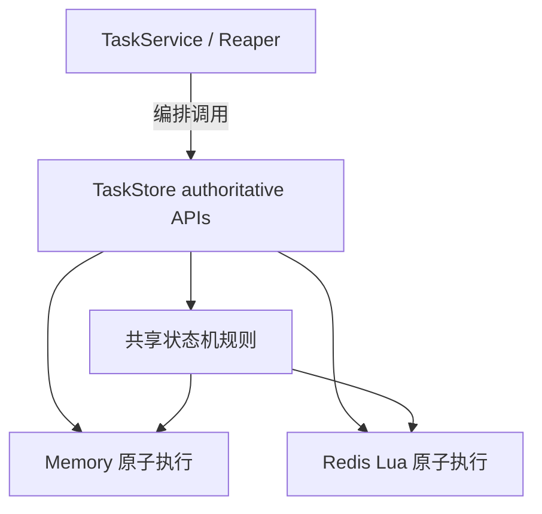

## 需求背景

用户希望基于**高内聚、低耦合**和代码设计原则，对任务状态机相关代码进行一次升维重构：

- 将**状态机规则定义**从 `memory` / `redis` 两份实现中抽离，减少重复代码
- 保持 `service` / `reaper` 负责**业务编排**
- 保持存储层负责**原子执行与一致性边界**
- 避免为了去重而破坏 Redis 侧的原子性与并发安全

## 重构目标

- 抽取一份共享的任务状态机规则定义，供 `store` 包内复用
- 让 [memory.go](/Users/junjiewwang/GolandProjects/github/custom-opentelemetry-collector/extension/controlplaneext/taskmanager/store/memory.go) 与 [redis.go](/Users/junjiewwang/GolandProjects/github/custom-opentelemetry-collector/extension/controlplaneext/taskmanager/store/redis.go) 对齐同一套语义
- 明确 `TaskStore` 并非“纯 CRUD”，而是**状态一致性边界**
- 补充测试，确保共享规则的契约可验证
- 完成后执行编译验证

## 设计边界

- **上层（`service` / `reaper`）**：负责何时触发状态迁移、是否发布事件、是否清理运行标记、是否保存结果
- **共享规则层（`store` 内部）**：负责状态迁移规则定义与结果判定
- **后端实现层（`memory` / `redis`）**：负责各自原子执行手段（锁 / Lua）以及存储细节

## 实施计划

- [x] 梳理现有实现与调用链
- [x] 创建共享状态机规则抽象
- [x] 改造 `memory` 实现复用共享规则
- [x] 改造 `redis` 实现复用共享规则/常量
- [x] 调整接口注释与职责描述
- [x] 补充/更新测试
- [x] 执行编译验证
- [x] 回填实施结果与遗留问题

## 当前进展

- 已确认当前调用链主要集中在：
  - [service.go](/Users/junjiewwang/GolandProjects/github/custom-opentelemetry-collector/extension/controlplaneext/taskmanager/service.go)
  - [reaper.go](/Users/junjiewwang/GolandProjects/github/custom-opentelemetry-collector/extension/controlplaneext/taskmanager/reaper.go)
  - [memory.go](/Users/junjiewwang/GolandProjects/github/custom-opentelemetry-collector/extension/controlplaneext/taskmanager/store/memory.go)
  - [redis.go](/Users/junjiewwang/GolandProjects/github/custom-opentelemetry-collector/extension/controlplaneext/taskmanager/store/redis.go)
- 已确认当前还没有专门记录本次重构的文档，因此新建本文档
- 已确认已有的 [state_machine.go](/Users/junjiewwang/GolandProjects/github/custom-opentelemetry-collector/extension/controlplaneext/taskmanager/state_machine.go) 位于 `taskmanager` 包，不适合被 `store` 包直接复用，因此最终在 `store` 边界新增了共享规则文件，同时把 `taskmanager` 包改造成对共享规则的兼容封装
- 已完成的代码改造：
  - 新增 [state_machine.go](/Users/junjiewwang/GolandProjects/github/custom-opentelemetry-collector/extension/controlplaneext/taskmanager/store/state_machine.go)，沉淀共享状态机规则、错误模型、状态常量与 `Apply*` 共享更新逻辑
  - 调整 [interface.go](/Users/junjiewwang/GolandProjects/github/custom-opentelemetry-collector/extension/controlplaneext/taskmanager/store/interface.go) 注释，明确 `TaskStore` 是**状态一致性边界**而非纯 CRUD
  - 改造 [memory.go](/Users/junjiewwang/GolandProjects/github/custom-opentelemetry-collector/extension/controlplaneext/taskmanager/store/memory.go)，让 `ApplyTaskResult` / `ApplyCancel` / `ApplySetRunning` 直接复用共享规则
  - 改造 [redis.go](/Users/junjiewwang/GolandProjects/github/custom-opentelemetry-collector/extension/controlplaneext/taskmanager/store/redis.go)，让 Lua 脚本中的终态判断与关键状态码使用共享常量拼装，降低语义漂移风险
  - 改造 [state_machine.go](/Users/junjiewwang/GolandProjects/github/custom-opentelemetry-collector/extension/controlplaneext/taskmanager/state_machine.go)，保留原有 `taskmanager` 调用面，但内部转发到 `store` 共享实现
- 已补充测试：
  - 新增 [state_machine_test.go](/Users/junjiewwang/GolandProjects/github/custom-opentelemetry-collector/extension/controlplaneext/taskmanager/store/state_machine_test.go)
  - 扩展 [memory_test.go](/Users/junjiewwang/GolandProjects/github/custom-opentelemetry-collector/extension/controlplaneext/taskmanager/store/memory_test.go) 中对 authoritative `Apply*` API 的覆盖
- 已完成验证：
  - `go test ./extension/controlplaneext/taskmanager/store ./extension/controlplaneext/taskmanager`
  - `go build ./extension/controlplaneext/taskmanager/...`

## 未完成事项

- 如需进一步降低 `memory` / `redis` 语义分叉风险，可以继续补一组“同一输入、同一输出”的跨后端契约测试（当前已完成共享规则测试与 memory authoritative API 测试）
- 如需继续提升架构一致性，可进一步评估是否将部分 `TaskHelper` 中与状态语义有关的方法也逐步收敛到共享规则边界

## 遗留问题

- Redis Lua 中仍然需要保留脚本级原子更新，无法完全复用 Go 侧逻辑体，这部分只能做到**语义共享**而非**执行代码共享**
- 当前 `GetAllTasks()` 仍依赖 `ListTaskInfos()` 全量读取，本次重构先聚焦状态机职责边界，不顺带扩展查询模型
- 当前 Redis 侧还没有独立测试文件；若后续继续演进 `Apply*` 逻辑，建议补充 Redis backend 集成测试以增强回归保护
