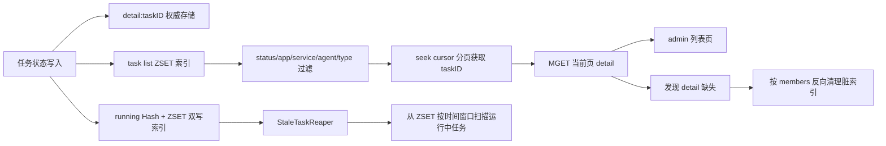
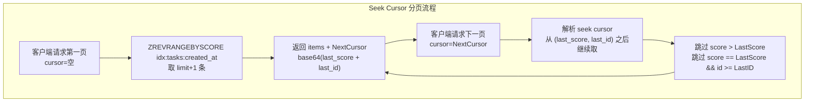
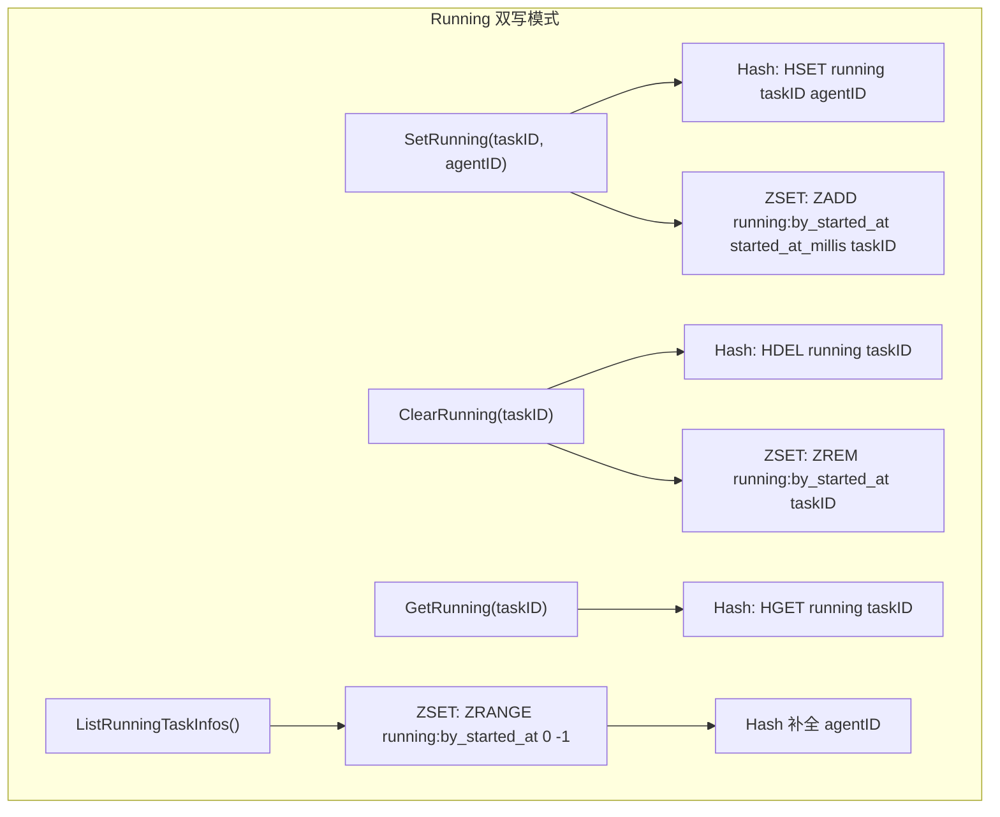

## 需求记录

### 背景

当前 `taskmanager` 最初同时存在两类 Redis 读放大问题：

- `StaleTaskReaper` 通过全量 `ListTaskInfos()` 扫描所有任务详情，再筛选 `RUNNING` 任务
- admin 列表虽然已经切到分页过滤读模型，但 Redis backend 仍然通过 `SCAN detail:* + MGET` 全量读取后再过滤分页

这会把 `detail:*` 主存储同时用于权威写入和后台查询，在任务量增长时容易出现 `SCAN + MGET` 读超时告警。

### 本次目标

- 将 `reaper` 从“全量扫 `detail:*`”改为“只扫运行中任务集合”
- 在现有 `TaskStore` 接口上补齐运行中任务枚举能力
- 保持 `memory` / `redis` 两种后端行为一致
- 将 Redis 的 `ListTaskInfos()` / `ListTaskInfosPage()` 从全量扫描演进为真正的索引查询
- 保持 admin 侧分页过滤接口不变，对外继续返回 `next_cursor` / `has_more`

### 架构方向

- **写模型**：`detail:<taskID>` 仍作为权威任务详情存储
- **运行中索引**：通过 `running` 追踪结构，支撑 `reaper` 定向扫描
- **任务列表索引**：新增按 `created_at/status/app/service/agent/type` 组织的 Redis `ZSET` 读模型
- **反向成员索引**：通过 `idx:tasks:members:<taskID>` 记录任务挂载过的索引 key，用于删除与脏索引清理
- **查询策略**：列表查询先在 Redis 索引侧做并集 / 交集 / 分页，再仅对当前页 `MGET detail:<taskID>`

### 结构示意

### 当前进展

- [x] 梳理 `store` / `reaper` / `service` 当前实现
- [x] 补齐 `TaskStore` 运行中任务查询接口
- [x] 修改 `redis` / `memory` store 实现
- [x] 将 `reaper` 改为只扫描运行中任务
- [x] 在 `TaskStore` / `TaskManager` 上新增分页过滤查询模型：`ListTaskInfosPage()` / `ListTasks()`
- [x] `memory` / `redis` backend 统一接入 `TaskListQuery`、状态过滤、游标分页和按 `created_at_millis` 倒序排序
- [x] admin 侧 [handlers.go](/Users/junjiewwang/GolandProjects/github/custom-opentelemetry-collector/extension/adminext/handlers.go) 已切到新读模型，并对外返回 `next_cursor` / `has_more`
- [x] Redis `ListTaskInfos()` / `ListTaskInfosPage()` 已切换为基于 `ZSET` 索引的真正查询，不再依赖 `SCAN detail:*` 做列表分页
- [x] Redis 写路径已同步维护任务列表索引，并在 `Start()` 阶段支持对历史 `detail:*` 数据进行索引回填
- [x] 查询页发现 `detail` 缺失时，会按 `idx:tasks:members:<taskID>` 反向清理脏索引、结果和运行中残留
- [x] 补充或调整测试
- [x] 执行编译验证

### 补充实施（2026-04-03）

- [x] 为 `RedisTaskStore` 新增独立集成测试 [redis_integration_test.go](/Users/junjiewwang/GolandProjects/github/custom-opentelemetry-collector/extension/controlplaneext/taskmanager/store/redis_integration_test.go)
- [x] 集成测试改为直连真实 `redis-server` 进程，覆盖 Lua 状态机脚本、`running` 索引清理语义与列表读模型回归
- [x] 测试在本机缺少 `redis-server` 时自动 `Skip`，避免影响普通开发环境下的默认测试流
- [x] Redis backend 新增任务列表索引 key：`created_at`、`status`、`app`、`service`、`agent`、`type`
- [x] `SaveTaskInfo()`、`UpdateTaskInfo()`、`ApplyTaskResult()`、`ApplyCancel()`、`ApplySetRunning()`、`DeleteTaskInfo()` 已统一接入索引维护
- [x] `ListTaskInfosPage()` 支持状态并集与多维过滤交集，并使用临时查询索引承载分页查询
- [x] `Start()` 增加索引回填逻辑，确保历史任务详情可平滑迁移到新读模型
- [x] 新增 Redis 集成测试覆盖：分页过滤、状态并集 + 多维交集、脏索引懒清理、启动回填

### 补充实施（2026-04-03 第二轮）

- [x] **启动 backfill 优化**：`backfillTaskIndexes()` 开头检查全局索引 `idx:tasks:created_at` 是否已存在，已有数据则跳过回填
- [x] **启动异步化**：`Start()` 中的 backfill 改为 goroutine 异步执行，不阻塞启动流程，加 60s 超时保护
- [x] **深分页 seek cursor**：将 offset cursor 演进为基于 `(created_at_millis, taskID)` 的 seek cursor
  - Cursor 格式：`base64(json{"s": last_score, "id": last_id})`
  - 向后兼容：纯数字 cursor 仍按 offset 解析
  - Redis 端使用 `ZREVRANGEBYSCORE` + 同分值 ID 去重实现 seek 分页
  - Memory 端使用排序后线性扫描实现 seek 分页
- [x] **running 结构双写**：从 `Hash(taskID → agentID)` 演进为 Hash + ZSET 双写模式
  - `SetRunning()`：同时写入 `Hash` 和 `ZSET(running:by_started_at, score=started_at_millis)`
  - `ClearRunning()`：同时从 Hash 和 ZSET 删除
  - `ListRunningTaskInfos()`：优先从 ZSET 读取（支持按 started_at 排序），Hash 补全 agentID
  - `GetRunning()`：仍从 Hash 精确查询
  - `cleanupStaleRunningEntries()`：同时清理 Hash 和 ZSET 中的脏数据
- [x] 补充 seek cursor 分页测试（memory + redis）
- [x] 补充同分值 seek cursor 去重测试
- [x] 补充 running ZSET 双写集成测试
- [x] 补充 backfill 跳过集成测试
- [x] 更新所有分页断言适配 seek cursor 格式
- [x] 编译验证通过，全部测试通过

### 未完成任务

- 如需统一 `memory` / `redis` 的状态机回归保障，可继续抽一层共享 store contract test
- admin handler 当前仍会为列表页全量加载 app / agent 元数据，后续可继续收敛为按页 enrichment

### 遗留问题

- Redis 列表查询已经摆脱 `SCAN detail:*`，多条件过滤仍依赖临时 `ZUNIONSTORE` / `ZINTERSTORE` key；如果查询量继续增大，后续可评估缓存策略
- 任务详情 TTL 过期后，索引清理当前采用查询时懒清理模型；如果后续出现大量冷数据残留，可考虑补充后台索引 reaper
- 当前 Redis 集成测试依赖本机可执行 `redis-server`；如果后续 CI 环境没有该二进制，需要补一层测试环境准备或容器化基建
- seek cursor 在 Redis 端对同分值大量 task 的场景，需要逐条检查 ZScore 做去重，极端情况下可能有性能开销；后续可考虑使用 Lua 脚本优化
