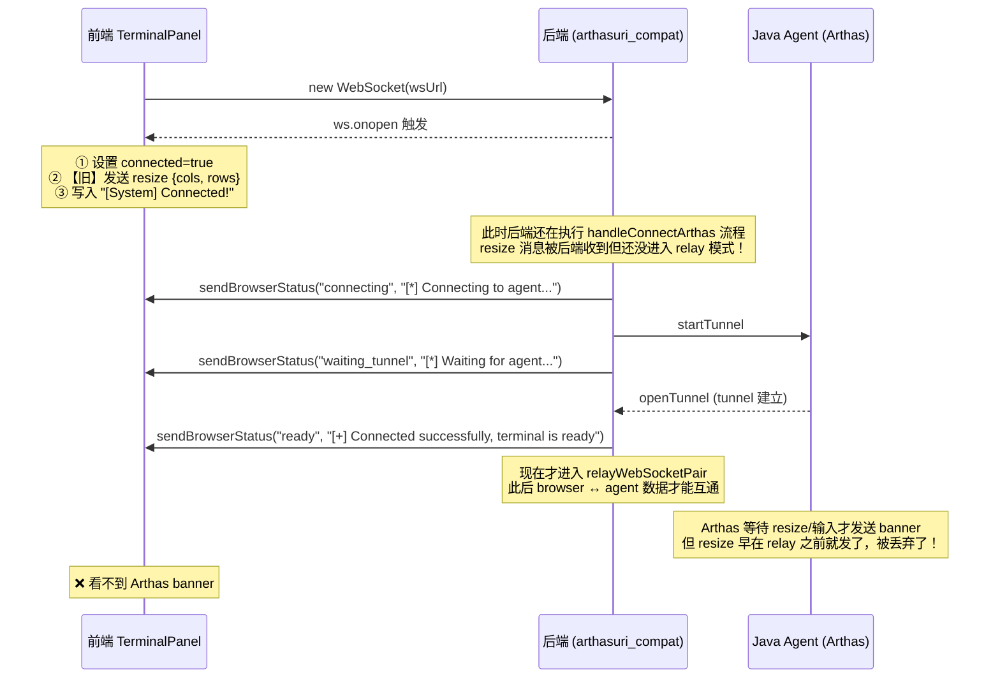
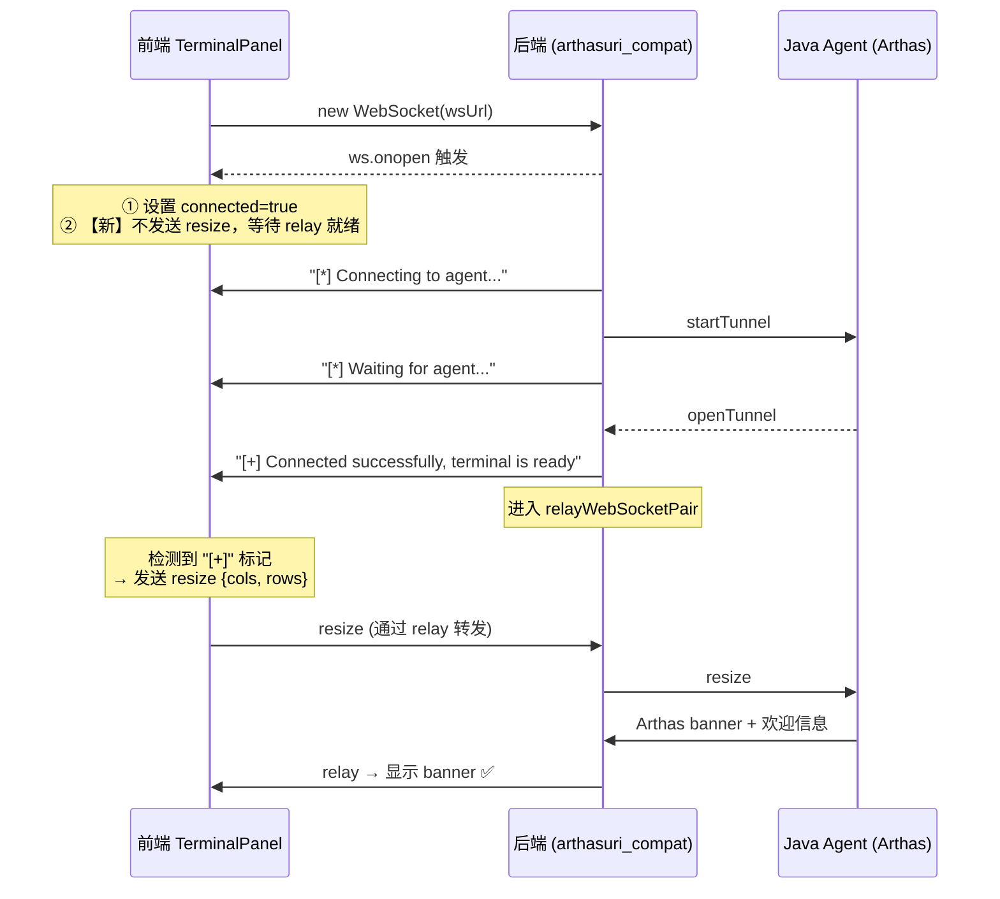

# Arthas Terminal 首次连接不显示 Banner 修复

## 需求背景

首次点击 Arthas 按钮连接时，页面显示 `[+] Connected successfully, terminal is ready`，但没有回显 Arthas 的欢迎信息（banner、版本号、pid 等）。

## 问题分析

### 连接流程时序

### 根因

1. **`ws.onopen`** 只表示浏览器到后端的 WebSocket 连接建立，**不代表后端到 Arthas Agent 的 tunnel 已建立**
2. 前端在 `ws.onopen` 时就发送了 `resize` 命令，但此时后端还在执行 agent 连接流程，**尚未进入 `relayWebSocketPair` 中继模式**
3. 这个 resize 消息没有被转发给 Arthas agent
4. Arthas 通常在收到终端 resize 事件或第一个输入后才发送欢迎 banner，由于 resize 被丢弃，banner 不会输出

## 解决方案

### 修复后的时序

### 代码改动

| # | 文件 | 改动 | 状态 |
|---|------|------|------|
| 1 | `TerminalPanel.tsx` | 添加 `relayReadyRef` 标记，追踪 relay 是否就绪 | ✅ |
| 2 | `TerminalPanel.tsx` | `ws.onopen` 中移除 resize 发送逻辑（此时 relay 未建立） | ✅ |
| 3 | `TerminalPanel.tsx` | `ws.onmessage` 中检测 `[+]` ready 状态消息后，延迟 100ms 发送 resize | ✅ |

### 验证

| 项目 | 状态 |
|------|------|
| TypeScript 编译 (`tsc --noEmit`) | ✅ 通过 |

## 改动文件清单

- `extension/adminext/webui-react/src/components/Terminal/TerminalPanel.tsx` — 修复 resize 发送时机

## 遗留问题

- [ ] 如果网络延迟较大，100ms 延迟可能不够，可考虑增加重试机制
- [ ] 后续可考虑后端在 relay 建立后主动发送一个特殊的 "relay_ready" 结构化消息，而非依赖文本匹配 `[+]`
