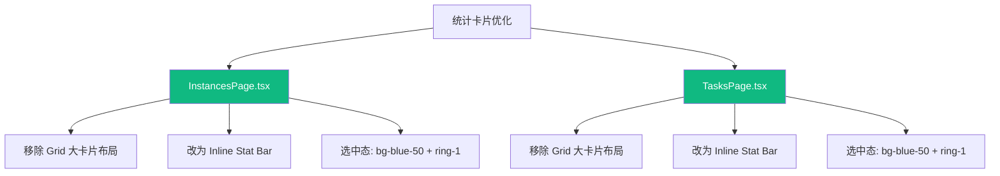

# 统计卡片紧凑化优化

> **需求来源**: UI/UX 体验优化 — 统计卡片占据空间过大，视觉噪音重  
> **实施日期**: 2026-04-04

---

## 📋 需求概述

InstancesPage 和 TasksPage 的统计卡片（Status Filter Cards）采用独立大卡片 Grid 布局，存在以下问题：

1. 每个卡片 `p-4` 内边距 + `text-2xl` 数字，视觉上过于"重"
2. 5/6 个卡片占据一整行 Grid，垂直空间浪费严重（~80px 高度）
3. `shadow-sm` + `border` + `rounded-xl` 每个卡片独立阴影和边框，视觉噪音大
4. 卡片之间 `gap-4` 间距偏大

**优化目标**: 将统计卡片弱化为紧凑的内联标签条（Inline Stat Bar），类似 Grafana/Datadog 的统计条风格，高度从 ~80px 压缩到 ~40px。

---

## 🗺️ 实施方案



### 设计对比

**优化前（独立大卡片）**:
```
┌─────────┐ ┌─────────┐ ┌─────────┐ ┌─────────┐ ┌─────────┐
│ TOTAL   │ │ ONLINE  │ │ OFFLINE │ │ ARTHAS  │ │ ARTHAS  │
│         │ │         │ │         │ │ READY   │ │ N/A     │
│   42    │ │   38    │ │    4    │ │   30    │ │   12    │
└─────────┘ └─────────┘ └─────────┘ └─────────┘ └─────────┘
```

**优化后（紧凑内联标签条）**:
```
┌──────────────────────────────────────────────────────────────┐
│ ● Total 42 │ ● Online 38 │ ○ Offline 4 │ ◆ Arthas 30 │ … │
└──────────────────────────────────────────────────────────────┘
```

### 关键样式变更

| 属性 | 优化前 | 优化后 |
|------|--------|--------|
| 容器 | `grid grid-cols-5 gap-4` | `flex items-center gap-1` 单行容器 |
| 单项 | `p-4 rounded-xl shadow-sm border` | `px-3 py-1.5 rounded-md` 紧凑按钮 |
| 数字 | `text-2xl font-bold` | 正常 `text-xs font-bold` 与标签同行 |
| 选中态 | `ring-2 ring-blue-500 bg-blue-50` | `bg-blue-50 ring-1 ring-blue-200 shadow-sm` |
| 高度 | ~80px | ~40px |

---

## ✅ 实施进展

- [x] InstancesPage.tsx — 统计卡片改为 Inline Stat Bar
- [x] TasksPage.tsx — 统计卡片改为 Inline Stat Bar
- [x] TypeScript 编译通过
- [x] 修复未使用变量 `idx` 的 TS 错误

---

## 📁 修改文件汇总

| 文件 | 操作 | 说明 |
|------|------|------|
| `src/pages/InstancesPage.tsx` | 修改 | 统计卡片 Grid → Inline Stat Bar |
| `src/pages/TasksPage.tsx` | 修改 | 统计卡片 Grid → Inline Stat Bar |

---

## ✅ 验证结果

- ✅ TypeScript 编译通过（`tsc --noEmit`）
- ✅ 统计标签条一行展示，紧凑美观
- ✅ 选中态高亮清晰，交互流畅
- ✅ 垂直空间节省约 40px

---

## 📝 遗留问题

- 无
