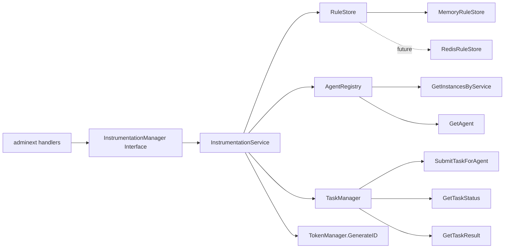
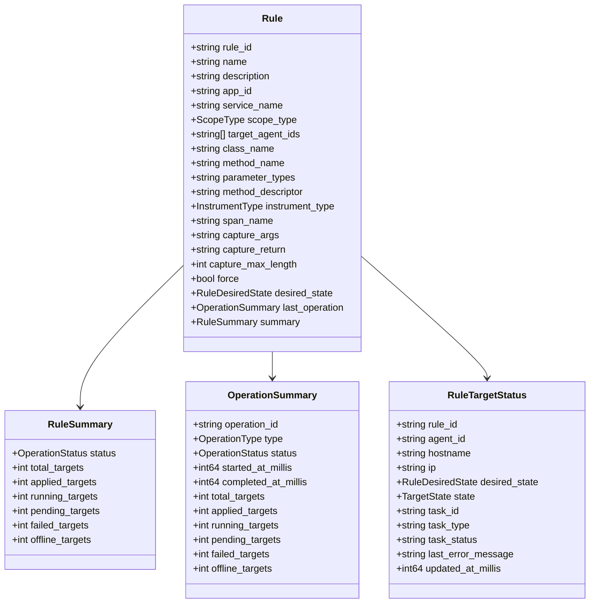
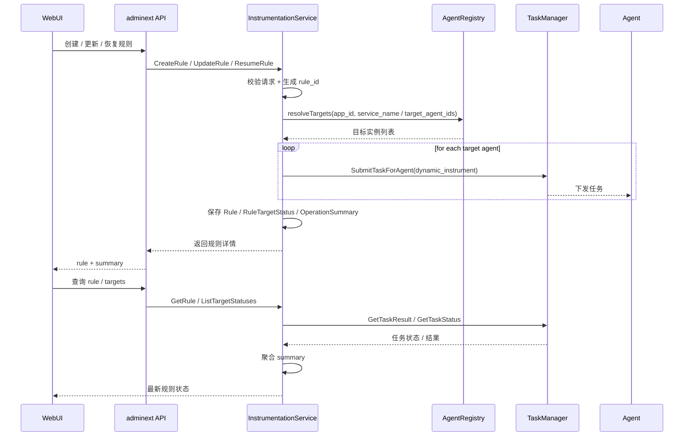
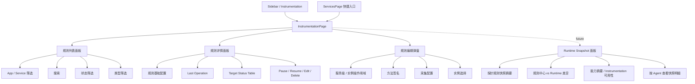
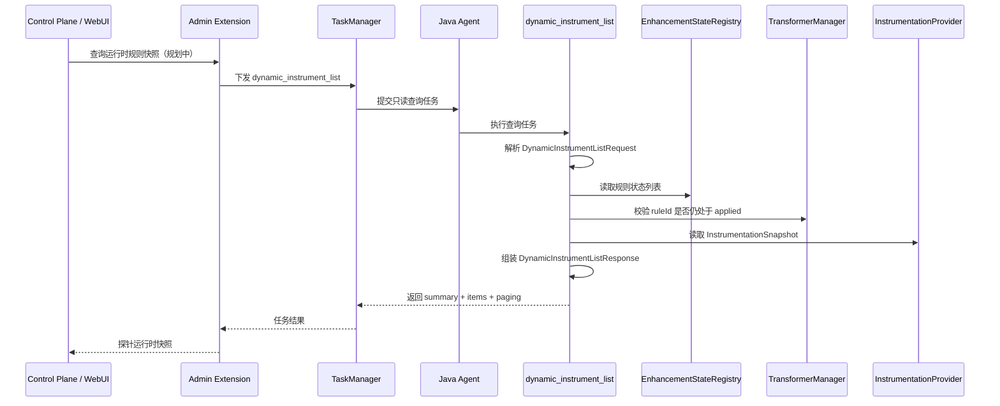
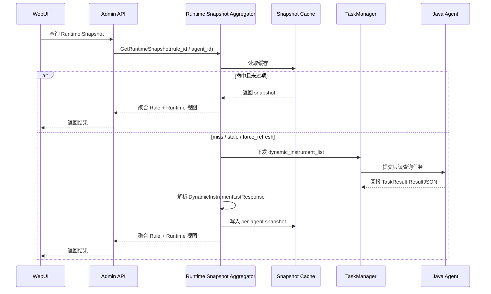
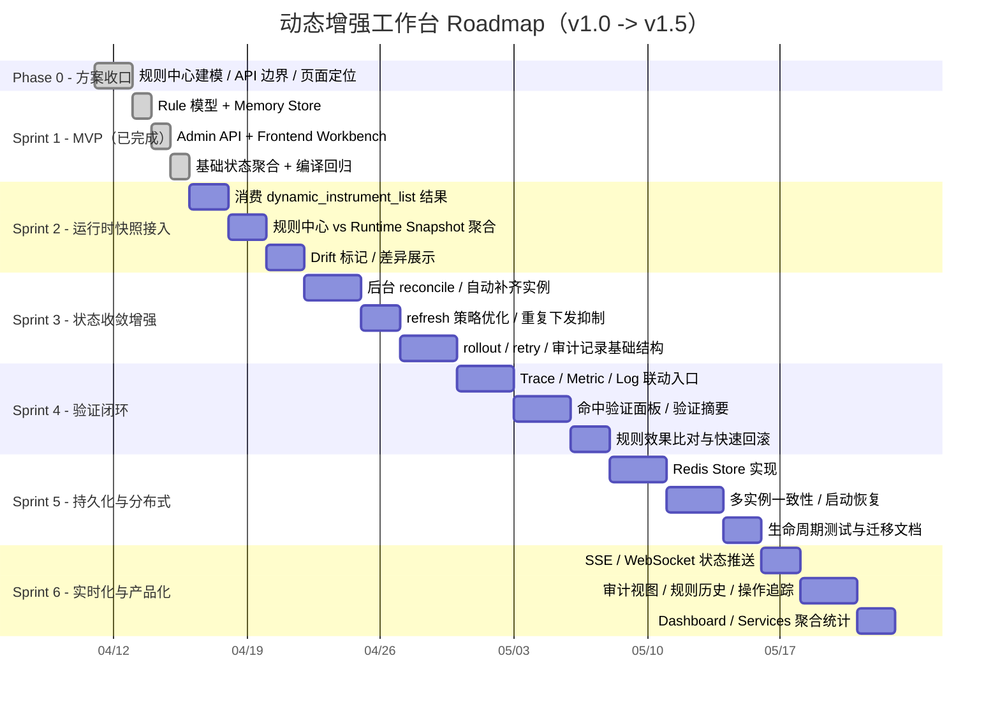
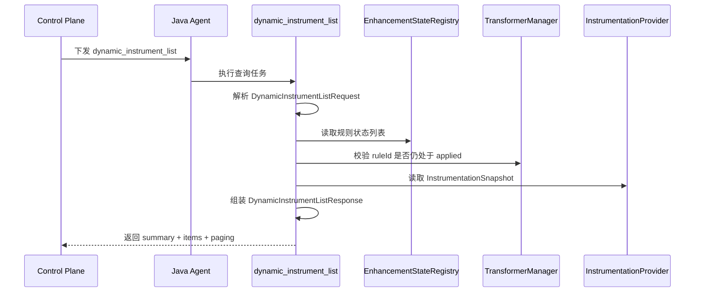

# 动态增强工作台架构设计与实施 Roadmap

> 状态：Sprint 1 已落地，进入增强阶段  
> 更新时间：2026-04-14 10:37  
> 当前结论：**采用“规则中心 + 任务执行通道 + 探针运行时快照聚合展示 + 服务端缓存聚合层”架构，前后端主链路已贯通；探针侧 `dynamic_instrument_list` 已具备前置能力，后续按 roadmap 继续补齐控制面消费、`Runtime Snapshot Aggregator / Cache`、双视角聚合、自动 reconcile、持久化与实时化能力。**

---

## 1. 需求目标

建设一个面向服务与规则的动态增强工作台，让动态增强从“实例页中的通用任务表单”升级为“规则中心 + 下发执行 + 验证闭环”的产品能力。

本次实施遵循以下原则：

- 规则是一等公民，任务退回执行通道
- 服务是主视角，实例是执行目标
- 前后端共同演进，优先保证产品效果与架构清晰
- 保持现有 `Tasks` 能力兼容，不破坏现有实例管理与任务管理职责边界
- 先完成可用闭环，再逐步补齐自动化、持久化、实时推送与高级验证

### 1.1 产品目标

动态增强工作台最终需要提供以下用户能力：

1. 按 `App + Service` 统一管理动态增强规则
2. 支持服务级和实例级两种作用域
3. 支持规则创建、编辑、暂停、恢复、删除
4. 能看见规则最近一次下发动作与目标实例状态
5. 能把规则结果与 Trace / Metric / Log 验证手段串起来
6. 在实例变化后，系统能够逐步具备自动补齐与持续收敛能力

### 1.2 非目标（当前阶段不强求）

当前阶段明确**不把以下能力塞进首批交付**：

- 不在 WebUI 运行时做复杂动态增强推导计算
- 不引入新的通用任务系统替代 `taskmanager`
- 不在首版就强行完成 `redis` 存储和分布式一致性方案
- 不在首版就做完整 rollout 编排、审批流、审计中心
- 不在首版就绑定特定日志平台或高级命中分析引擎

---

## 2. 当前实现状态（与代码对齐）

### 2.1 已落地能力

- 后端新增 `extension/controlplaneext/instrumentationmanager` 领域层
- 定义 `InstrumentationManager`、`Rule`、`RuleTargetStatus`、`CreateRuleRequest`、`UpdateRuleRequest` 等核心模型
- 基于 `MemoryRuleStore` 落地首版规则存储
- `adminext` 新增 `/api/v2/instrumentation/rules` 及相关子路由
- 前端新增独立 `Instrumentation` 页面和规则编辑器弹窗
- 前端在侧边栏新增入口，并在 `Services` 页面提供带上下文跳转入口
- 规则下发复用现有 `taskmanager.SubmitTaskForAgent(...)`，执行类型为：
  - `dynamic_instrument`
  - `dynamic_uninstrument`
- 规则状态可基于任务结果进行聚合和刷新
- 探针侧已新增只读任务 `dynamic_instrument_list`（前置能力已就绪，当前仓库尚未消费其结果）
- 已通过定向验证：
  - `go test ./extension/adminext ./extension/controlplaneext/...`
  - `npm run build`

### 2.2 当前仍未落地能力

- 控制面消费 `dynamic_instrument_list` 结果，并与规则中心做双视角聚合
- `Runtime Snapshot Aggregator / Cache`（含 TTL、dirty 标记、manual refresh、singleflight 刷新控制）
- `redis` 版规则存储
- 实例变化后的自动 reconcile
- 更细粒度 rollout / retry / 审计记录
- 规则命中验证面板
- 与 Trace / Metric / Log 查询页的验证联动
- SSE / WebSocket 实时状态推送

---

## 3. 架构决策

### 3.1 核心设计决策

1. 新增独立的动态增强规则管理层，不把规则塞入 `service` 元数据，也不把规则职责塞入 `taskmanager`
2. 规则生命周期与任务生命周期分离：规则描述“期望状态”，任务描述“执行过程与回执”
3. 前端新增独立工作台页面，不继续堆叠在 `InstancesPage` / `InstanceTasksTab` 中
4. 保持老入口兼容，但新工作台为主入口
5. 首版优先落地 `memory` 版规则中心，`redis` 方案后补
6. 服务级规则优先支持“手动刷新 + 重新下发”，自动收敛能力后续增强
7. 运行时快照查询采用 **ControlPlane 聚合缓存层**，规则变更只触发 `dirty / invalidate`，不直接伪造运行时成功状态

### 3.2 为什么不继续使用“任务即规则”模型

如果继续把动态增强仅作为任务表单中的一个任务类型，会导致：

- 规则没有独立 ID 和生命周期
- 前端无法围绕规则做持续管理和状态展示
- 用户只能看到一次任务，而不能看到长期意图
- “暂停 / 恢复 / 删除 / 重试 / 验证”都只能绕着任务做变形，语义不清晰

因此必须把**规则**和**任务**拆开：

- **规则**：长期存在，表达期望状态
- **任务**：短时执行，表达某一次 apply / remove 动作

### 3.3 双视角状态模型

随着探针侧 `dynamic_instrument_list` 落地，动态增强工作台后续不再只有控制面单视角，而是要同时维护两类状态来源：

| 视角 | 数据来源 | 语义 | 用途 |
|------|----------|------|------|
| 控制面规则视角 | `RuleStore` + `TaskManager` | 表达**期望状态**与最近一次下发结果 | 管理、编排、操作入口 |
| 探针运行时视角 | `dynamic_instrument_list` 任务结果 | 表达 JVM 当前**实际快照**与真实是否生效 | 校验、对账、诊断、漂移识别 |

后续页面展示应明确区分：

- **Desired State**：规则中心当前希望实例处于的状态
- **Runtime Snapshot**：探针 JVM 当前真实记录的规则状态
- **Drift**：两者不一致时，需要高亮展示并给出诊断线索

### 3.4 为什么需要运行时快照查询能力

仅靠控制面现有 `RuleStore + TaskManager` 聚合，只能回答：

- 我想下发什么
- 我最近给哪些实例下发过什么
- 任务执行结果是什么

但无法完整回答：

- 探针 JVM 当前到底保存了哪些动态增强规则
- 某条规则现在是否仍然真实生效
- `ACTIVE` 状态是否已经失真
- 当前 JVM 是否具备增强能力、Instrumentation 是否可用

因此 `dynamic_instrument_list` 的价值不是替代规则中心，而是为规则中心提供**运行时校验面**。

---

## 4. 目标架构设计图

### 4.1 总体架构图

```mermaid
graph TB
    subgraph "React WebUI"
        UI1[InstrumentationPage]
        UI2[InstrumentationRuleEditor]
        UI3[ServicesPage 快捷入口]
        UI4[ApiClient]
        UI5[Runtime Snapshot / Drift 展示 - 规划中]
    end

    subgraph "Admin Extension"
        API1[/GET POST\n/api/v2/instrumentation/rules/]
        API2[/GET PUT DELETE\n/api/v2/instrumentation/rules/{ruleID}/]
        API3[/POST pause\/resume/]
        API4[/GET targets/]
        API5[/POST runtime-snapshot query - 规划中/]
        H[instrumentation_handlers.go]
    end

    subgraph "ControlPlane - Rule Center"
        MGR[InstrumentationManager]
        SVC[InstrumentationService]
        STORE[RuleStore]
        MEM[MemoryRuleStore]
        REDIS[(RedisRuleStore - 规划中)]
        AGG[Rule + Runtime Snapshot Aggregator - 规划中]
    end

    subgraph "Existing Shared Components"
        AR[AgentRegistry]
        TM[TaskManager]
        TOK[TokenManager]
    end

    subgraph "Agent Runtime"
        A1[Agent A]
        A2[Agent B]
        A3[Agent N]
        EXE[dynamic_instrument_list Executor]
        REG[EnhancementStateRegistry]
        TFM[TransformerManager]
        PROV[InstrumentationProvider]
    end

    UI1 --> UI4
    UI2 --> UI4
    UI3 --> UI1
    UI5 --> UI4
    UI4 --> API1
    UI4 --> API2
    UI4 --> API3
    UI4 --> API4
    UI4 -. future .-> API5

    API1 --> H
    API2 --> H
    API3 --> H
    API4 --> H
    API5 -. future .-> H
    H --> MGR
    MGR --> SVC
    SVC --> STORE
    STORE --> MEM
    STORE -. 未来 .-> REDIS
    SVC --> AR
    SVC --> TM
    SVC --> TOK
    SVC -. future .-> AGG
    AGG -. future .-> TM

    TM -->|dynamic_instrument / dynamic_uninstrument| A1
    TM -->|dynamic_instrument / dynamic_uninstrument| A2
    TM -->|dynamic_instrument / dynamic_uninstrument| A3
    TM -. future dynamic_instrument_list .-> EXE
    EXE --> REG
    EXE --> TFM
    EXE --> PROV

    style MGR fill:#dbeafe,stroke:#2563eb,stroke-width:2px
    style SVC fill:#e0f2fe,stroke:#0284c7,stroke-width:2px
    style MEM fill:#dcfce7,stroke:#16a34a,stroke-width:2px
    style REDIS fill:#fef3c7,stroke:#d97706,stroke-width:2px
    style AGG fill:#fce7f3,stroke:#db2777,stroke-width:2px
    style EXE fill:#ede9fe,stroke:#7c3aed,stroke-width:2px
```

### 4.2 后端分层图



### 4.3 核心领域模型图



### 4.4 规则下发时序图



### 4.5 前端信息架构图



### 4.6 探针运行时快照查询时序图



---

## 5. 核心数据流设计

### 5.1 创建规则

- 前端提交 `CreateInstrumentationRuleRequest`
- `adminext` handler 调用 `InstrumentationManager.CreateRule`
- `InstrumentationService`：
  - 校验参数
  - 生成 `rule_id`
  - 保存规则
  - 解析目标实例
  - 为每个目标实例下发 `dynamic_instrument`
  - 生成 `RuleTargetStatus[]`
  - 聚合 `RuleSummary` 和 `OperationSummary`

### 5.2 暂停 / 删除规则

- 暂停和删除都不直接移除目标状态
- 而是生成一次 `remove` 操作
- 下发 `dynamic_uninstrument`
- 规则层分别保留：
  - `desired_state=paused`
  - `desired_state=deleted`

### 5.3 状态刷新

当前状态刷新采用**按需读取 + 聚合计算**模式：

- 查询规则详情或目标列表时
- `InstrumentationService.refreshRule()` 会：
  - 读取目标状态
  - 调 `taskMgr.GetTaskResult()` / `GetTaskStatus()`
  - 刷新单个目标状态
  - 重新汇总规则级 summary

这意味着当前模式更接近：

- **展示时刷新**
- 而不是**后台持续 reconcile**

### 5.4 服务级与实例级作用域差异

| 维度 | 服务级 | 实例级 |
|------|--------|--------|
| `scope_type` | `service` | `instance` |
| 目标解析 | `AgentRegistry.GetInstancesByService(appID, serviceName)` | `target_agent_ids` 指定 |
| 适用场景 | 对整个服务统一打点 | 灰度、单机验证、问题排查 |
| 当前自动收敛 | 暂无 | 不涉及 |

### 5.5 运行时规则快照查询

探针端新增只读任务 `dynamic_instrument_list` 后，控制面未来可以补齐一条新的查询链路；但**不应把每一次页面查询都直接翻译成一次探针任务**。

如果页面进入、切换规则、多人同时查看、手动刷新都直接下发 `dynamic_instrument_list`，会带来几个问题：

- 每次查询都会走一遍 `TaskManager -> Agent Long Poll -> Result Report` 完整链路
- 同一 Agent 的重复查看会产生重复任务，增加探针与控制面负担
- 页面刷新频率会与任务系统成本强耦合，体验和可扩展性都较差
- `dynamic_instrument_list` 是只读诊断任务，天然更适合由控制面做聚合缓存，而不是把任务系统当成查询接口直接暴露给 UI

因此这里的推荐设计是：

1. `dynamic_instrument_list` 仍然是**真实数据来源**
2. 控制面新增 **Runtime Snapshot Aggregator / Cache** 作为查询中枢
3. UI 默认读取聚合层结果，而不是直接驱动一次任务下发
4. 当缓存 miss / 过期 / 用户主动 refresh 时，聚合层再按 Agent 定向触发查询任务
5. 聚合层消费 `TaskResult.ResultJSON`，写入 **per-agent runtime snapshot cache**
6. 页面最终看到的是 `RuleStore + RuleTargetStatus + Runtime Snapshot Cache` 的聚合视图

### 5.6 服务端缓存设计

#### 5.6.1 缓存放置位置

推荐把缓存放在 **ControlPlane 聚合层**，而不是放在 `adminext`、`RuleStore` 或 `TaskManager` 中。

| 位置 | 是否推荐 | 原因 |
|------|----------|------|
| `adminext` handler | 不推荐 | handler 应保持轻量，只做 HTTP 参数转换与 API 编排，不应承担缓存与聚合职责 |
| `RuleStore` | 不推荐 | `RuleStore` 的职责是规则定义与目标状态存储，不应混入探针运行时快照 |
| `TaskManager` | 不推荐 | `TaskManager` 负责任务下发、任务状态与结果存取，可作为原始结果来源，但不应成为面向工作台的查询缓存中心 |
| **Runtime Snapshot Aggregator / Cache** | **推荐** | 职责清晰，既能消费任务结果，又能按 Rule / Agent 聚合，并可承接 TTL、singleflight、manual refresh、dirty 标记等逻辑 |

这也与前文的设计原则保持一致：**规则中心、任务执行通道、运行时查询聚合层三者分层，而不是把职责继续塞进已有组件。**

#### 5.6.2 推荐缓存模型

缓存主键应优先采用 **Agent 视角**，而不是直接按 Rule 视角落主缓存。原因是 `dynamic_instrument_list` 的原始返回天然是某个 JVM / Agent 的本地快照。

推荐最小缓存单元如下：

| 缓存对象 | 推荐 Key | 主要内容 | 说明 |
|----------|----------|----------|------|
| Agent Runtime Snapshot | `instrumentation:runtime:agent:{agent_id}` | `summary`、`items`、`source_task_id`、`refreshed_at_millis`、`expires_at_millis`、Agent 基础元信息 | 主缓存，直接承接探针返回结果 |
| Agent Snapshot Meta | `instrumentation:runtime:agent-meta:{agent_id}` | `dirty`、`last_refresh_status`、`last_error_message`、`last_requested_at_millis` | 用于刷新控制与诊断展示 |
| Rule Runtime Projection | 可选，不作为 MVP 必需 | 某 Rule 在多个 Agent 上的运行时投影结果 | 首版建议**按读时聚合**，热点场景再考虑派生缓存 |

其中：

- **主缓存是 per-agent snapshot**
- **Rule 视角结果首版通过聚合计算得到**，避免写多份主数据造成一致性负担
- `TaskResult.ResultJSON` 仍保留为底层原始结果，可用于诊断、回放和问题排查，但不直接作为页面主查询结构

#### 5.6.3 查询与刷新策略

推荐采用 **cache-first + on-demand refresh + manual refresh override** 模式。



推荐行为约定：

- **普通查询**：优先返回未过期缓存
- **缓存 miss**：同步触发一次定向刷新，并等待该次结果
- **缓存过期**：由聚合层按 Agent 维度触发一次受 `singleflight` 保护的刷新，避免并发重复查询
- **手动刷新**：显式绕过缓存，强制重新触发 `dynamic_instrument_list`
- **批量页面查询**：只刷新当前页面需要的 Agent 集合，不一次性广播到所有实例

TTL 建议：

- **默认 TTL**：`15s ~ 30s`
- **手动刷新**：无视 TTL，强制刷新
- **离线 Agent**：允许返回最近一次缓存结果，但页面需标记“stale / offline”

这里的关键点不是把缓存做成“绝对实时”，而是把它做成**对页面友好、对任务系统友好、且语义可解释**的查询层。

#### 5.6.4 写入、失效与脏标记策略

用户提出的“新增时更新、删除时更新”在控制面侧不应被实现成“直接伪造运行时成功状态”，而应拆成两类动作：

1. **规则侧状态照常更新**：`RuleStore` / `RuleTargetStatus` 继续按现有链路记录期望状态与任务状态
2. **运行时缓存侧做 dirty / invalidate**：标记相关 Agent 的 runtime snapshot 需要重新校验

推荐触发规则如下：

| 触发事件 | 对缓存的动作 |
|----------|--------------|
| 创建规则 / 恢复规则 / 更新激活规则 | 标记目标 Agent 缓存为 `dirty`，必要时同步失效 |
| 暂停规则 / 删除规则 | 标记目标 Agent 缓存为 `dirty`，等待下一次读取或主动刷新重新拉取真实快照 |
| 手动 refresh | 直接绕过缓存重新查询，并覆盖缓存 |
| Agent 上下线 / 服务实例集合变化 | 标记对应 Agent 缓存为 `dirty`，避免旧快照长期误导 |
| `dynamic_instrument_list` 查询成功 | 覆盖写入缓存，清除 `dirty` 标记 |
| `dynamic_instrument_list` 查询失败 | 保留旧缓存，更新 `last_refresh_status` / `last_error_message` |

这意味着：

- **规则变更会推动缓存失效，但不会直接伪造 runtime snapshot 成功结果**
- **运行时真相只能来自 Agent 的 `dynamic_instrument_list` 响应**
- **控制面写入的是“需要重新校验”的信号，而不是“已经真实生效”的结论**

#### 5.6.5 并发与实现约束

为了避免高频页面查询形成刷新风暴，缓存层需要至少具备以下约束：

- 对同一 `agent_id` 的刷新使用 `singleflight` 或等效去重机制
- 刷新逻辑与展示聚合逻辑分离，避免 handler 中写大段缓存控制代码
- 缓存层输出 freshness 元信息，例如：
  - `refreshed_at_millis`
  - `expires_at_millis`
  - `is_stale`
  - `last_refresh_status`
- 首版优先实现内存缓存；后续如需要跨 Collector 实例共享，再考虑把缓存状态或派生投影迁移到 `redis`

### 5.7 控制面聚合展示策略

控制面不应直接把 `dynamic_instrument_list` 原始结果平铺到页面，而应由聚合层统一产出展示模型：

1. **规则中心主表**：仍以 `RuleStore` 中的规则为主键
2. **目标状态表**：继续展示控制面侧任务执行状态
3. **运行时快照视图**：从 `Runtime Snapshot Cache` 读取，并按 Agent 或按 Rule 聚合展示
4. **差异检测**：标记以下异常情况：
   - 规则中心存在，但探针快照缺失
   - 规则中心标记 `active`，但 `is_effective=false`
   - 探针快照存在，但规则中心已 `deleted`
   - Instrumentation 不可用，导致规则无法真实生效
   - 页面展示的是 stale snapshot，需要提示用户手动 refresh 或等待下一次刷新

### 5.8 展示模型建议

后续页面建议采用“三层信息 + 新鲜度提示”展示：

| 层级 | 数据来源 | 展示位置 |
|------|----------|----------|
| 规则定义层 | `RuleStore` | 规则详情头部 / 编辑弹窗 |
| 控制面执行层 | `RuleTargetStatus` + `TaskManager` | `Target Status Table` |
| JVM 运行时层 | `Runtime Snapshot Cache` + `dynamic_instrument_list` | `Runtime Snapshot` 面板（规划中） |

同时建议在 `Runtime Snapshot` 面板显式展示：

- `refreshed_at`
- `is_stale`
- `last_refresh_status`
- 手动刷新入口
- 当前结果来自缓存还是刚刚触发的探针查询

---

## 6. Roadmap（实施级完整版）

### 6.1 路线图总览

> 关键原则：**先交付可用的规则中心，再逐步增强自动收敛、验证联动、持久化和实时能力；不要把所有高风险能力绑在首批上线里。**



### 6.2 分阶段说明

### Phase 0：方案收口（已完成）

**目标**：在编码前把关键边界定死，避免“规则”和“任务”模型再次混淆。

**已完成事项**：

- 明确采用“规则中心 + 任务通道”架构
- 确定首版 `memory` 优先，`redis` 后补
- 确定 WebUI 独立页面，而不是继续堆在 `InstancesPage`
- 确定服务级 / 实例级双作用域模型

**验收标准**：

- [x] 文档、后端模型、前端页面使用同一套术语
- [x] API 资源从 `/tasks` 抽离为 `/instrumentation/rules`
- [x] 不再把“规则”等价成“任务类型”

### Sprint 1：MVP（已完成）

**目标**：交付一套可用的规则中心最小闭环。

**已完成事项**：

- 后端 `InstrumentationManager` / `InstrumentationService` / `MemoryRuleStore`
- Admin API：查询、创建、更新、暂停、恢复、删除、目标状态列表
- 前端 `InstrumentationPage` / `InstrumentationRuleEditor`
- 规则下发复用 `taskmanager`
- 基础任务结果聚合和规则状态展示

**验收标准**：

- [x] 可创建规则并下发 `dynamic_instrument`
- [x] 可暂停 / 恢复 / 删除规则并下发 `dynamic_uninstrument`
- [x] 可查看规则列表、详情和目标状态
- [x] `go test ./extension/adminext ./extension/controlplaneext/...` 通过
- [x] `npm run build` 通过

### Sprint 2：运行时快照接入

**目标**：把探针端 `dynamic_instrument_list` 正式纳入控制面与工作台主链路，形成“规则中心 + JVM 快照 + 服务端缓存聚合层”三段式模型。

**范围**：

- 控制面新增对 `dynamic_instrument_list` 的任务下发与结果消费能力
- 新增 `Runtime Snapshot Aggregator / Cache`
- 解析 `DynamicInstrumentListResponse.summary + items + paging`
- 按 Rule / Agent 聚合运行时快照
- 支持 TTL、dirty 标记、manual refresh、singleflight 刷新控制
- 在工作台中展示 `Runtime Snapshot` 面板
- 标记规则中心状态与运行时状态不一致的 drift 场景

**关键设计点**：

- 运行时快照是**校验视角**，不能替代规则中心主数据
- 页面上必须明确区分 `desired_state`、任务状态、`runtime_status`、`is_effective`
- 快照查询应支持按 Agent 定向下发，避免一次性对全部实例产生额外压力
- 缓存主数据以 `agent_id` 维度存储，Rule 视角结果首版按读时聚合
- 规则变更只触发 `dirty / invalidate`，不直接伪造 runtime success

**验收标准**：

- [ ] 控制面可对指定实例下发 `dynamic_instrument_list`
- [ ] 控制面具备 `Runtime Snapshot Aggregator / Cache`，同一 Agent 在 TTL 内重复查询不会反复下发任务
- [ ] 能正确解析并持久化一次查询结果（内存缓存或任务结果缓存均可）
- [ ] 工作台可展示探针运行时规则列表、能力摘要和 freshness 信息
- [ ] 至少识别并展示 3 类 drift：缺失、失效、已删除残留
- [ ] 手动 refresh 可绕过缓存并触发一次新的探针查询

### Sprint 3：状态收敛增强（已完成首版）

**目标**：把“可手动刷新”提升为“具备持续收敛能力”。

**范围**：

- 后台 reconcile worker
- 服务级规则实例自动补齐
- 对离线 / 新上线实例的规则再应用策略
- 重复下发抑制与幂等优化
- rollout / retry / 审计结构初版

**已完成事项**：

- `InstrumentationService.Start()` 已启动后台 reconcile worker，按固定周期扫描服务级规则
- 服务级 `active` 规则会在发现新实例后自动补齐目标并下发 `dynamic_instrument`
- 目标状态为 `offline` 且实例重新在线后，会自动重新进入 apply / remove 收敛流程
- reconcile 与页面查询已拆分：UI 负责查询展示，后台 worker 负责持续收敛
- 已加入最小重试抑制：基于 `last_dispatch_at_millis` + `reconcile_retry_interval_millis` 避免高频重复下发
- 已增加首版最近审计结构 `recent_audits`，记录 manual / reconcile 的 apply、remove、target_discovered、target_pruned 事件
- 工作台规则详情页已展示最近审计记录，并在选中规则/手动刷新时自动拉取最新 targets + runtime snapshot

**关键设计点**：

- 规则层需要记录“期望目标集合”与“当前执行集合”的差异
- 后台循环必须与展示时刷新分离，避免 UI 查询承担系统收敛逻辑
- 要结合 `dynamic_instrument_list` 的运行时快照，识别“任务成功但运行时未生效”的异常
- 要有最小幂等保护，避免对同一实例反复重复下发

**验收标准**：

- [x] 新实例注册后，服务级激活规则可自动补齐
- [x] 离线实例恢复后可重新进入收敛流程
- [x] 刷新逻辑与 reconcile 逻辑职责清晰分离
- [x] 有基础审计结构可追踪最近几次操作

### Sprint 4：验证闭环

**目标**：从“能下发”升级到“能验证效果”。

**范围**：

- 与 `TracesPage`、`MetricsPage`、未来日志视图建立跳转联动
- 规则详情中增加验证摘要
- 支持“下发前 / 下发后”快速比对
- 增加一键回滚入口
- 把 `dynamic_instrument_list` 的能力摘要（如 `instrumentation_available`、`enhancement_capability`）纳入诊断信息展示

**验收标准**：

- [ ] 规则页可跳转到对应 Trace / Metric 查询入口
- [ ] 至少支持一种规则效果验证摘要
- [ ] 回滚动作在 UI 中清晰可见且可操作
- [ ] 运行时能力不足时页面可给出明确诊断提示

### Sprint 5：持久化与分布式（已完成首版）

**目标**：支持 Collector 多实例或重启场景下的规则延续。

**范围**：

- 实现 `redis` 版 `RuleStore`
- 启动恢复和数据校验
- 多实例并发读写一致性方案
- 迁移文档与回退策略

**已完成事项**：

- 已实现 `RedisRuleStore`，将规则持久化到 `{keyPrefix}:rules`，并将每条规则的目标状态持久化到 `{keyPrefix}:targets:{rule_id}`
- `instrumentationmanager.NewInstrumentationManager(...)` 的 `redis` 分支已正式接线，不再返回“未实现”错误
- Store `Start()` 已增加 Redis 连接探活、规则 JSON 校验、孤儿目标清理与损坏目标清理，支持启动恢复时的数据自检
- 已采用基于 Redis `WATCH + TxPipelined` 的乐观锁保护 `SaveRule(...)` / `SaveTargetStatuses(...)`，降低多实例并发写时的状态漂移
- 已补充 Redis 集成测试，覆盖重启恢复、多实例共享可见性、启动校验清理与并发创建一致性
- 配置模板已更新说明：`instrumentation_manager.type` 现已支持 `memory` / `redis`

**验收标准**：

- [x] 重启后规则可恢复
- [x] 多实例部署时规则状态不发生明显漂移
- [x] `redis` 存储链路具备测试覆盖

### Sprint 6：实时化与产品化

**目标**：提升使用体验和运维可观测性。

**范围**：

- SSE / WebSocket 状态推送
- 规则历史视图 / 审计视图
- Dashboard / Services 聚合统计
- 更完善的规则筛选、历史查询与故障定位

**验收标准**：

- [ ] 规则页不依赖手动刷新也可看到状态变化
- [ ] 操作历史可追踪
- [ ] 管理页可看到规则数量、运行状态、异常分布

#### Sprint 6 前置子任务（S6-P0）：分布式 Runtime Snapshot 共享缓存与 Dirty 广播

**一句话目标**：将 `runtime snapshot cache` 从“进程内局部缓存”升级为“Redis 共享缓存 + 跨实例 dirty 传播 + 分布式 refresh 抑制”，为 `Sprint 6` 的实时化能力打基础。

**问题背景**：

- 规则与目标状态已经通过 `RedisRuleStore` 持久化，但 `runtime snapshot cache` 仍然保存在当前 Collector 进程内存中
- 在多 Collector + LB 场景下，A 实例刷新过的 snapshot 结果不会自动被 B 实例看到
- 规则变更后的 `dirty` 标记当前只在本实例生效，不会跨实例传播
- 不同实例可能对同一 `agent_id` 重复触发 `dynamic_instrument_list`，造成额外探针查询开销

**本子任务目标**：

- 让 runtime snapshot 在多实例间共享，减少“刚刷新又像没刷新”的体验抖动
- 让 `dirty / invalidate` 可以跨实例传播，而不是只在单实例内生效
- 让同一 `agent_id` 的刷新尽量只由一个 Collector 实例负责，避免重复查询
- 保持当前 `RuleStore + TaskManager + AgentRegistry` 主链路不变，聚焦验证/诊断层增强

**范围内**：

- 抽象 `RuntimeSnapshotStore`
- 实现 Redis 版 runtime snapshot store
- 增加跨实例 `dirty` 广播
- 增加跨实例 refresh lease / 查询抑制
- 改造 `runtime_snapshot_service.go` 的读写路径
- 增加 Redis 集成测试与配置文档

**范围外**：

- 不在本子任务中实现 SSE / WebSocket 页面主动推送
- 不在本子任务中实现长期历史审计与快照归档
- 不引入更重的分布式锁编排或跨机房一致性协议
- 不改造 `RuleStore` / `TaskManager` 主控制链路

**设计原则**：

- Redis 共享 snapshot 是跨实例的真相源，进程内缓存只作为 L1 加速层
- `dirty` 广播负责“加速失效”，但 correctness 仍由 Redis 中的 `dirty / expires_at_millis` 控制
- 不把 `Runtime Snapshot Cache` 塞进 `RuleStore`、`TaskManager` 或 `adminext`，保持职责边界清晰
- 保留当前 per-agent 聚合模型，避免为分布式支持而重写整条运行时快照链路

**建议架构**：

- L1：当前进程内 `runtimeSnapshotStore`，继续承担低延迟读取和本地 `singleflight`
- L2：Redis 共享 snapshot store，承载跨 Collector 实例共享结果
- Pub/Sub：通过 Redis channel 广播 `dirty` 事件，驱动各实例失效本地 L1
- Lease：通过 Redis `SET NX PX` 为同一 `agent_id` 建立短租约，避免多实例并发重复刷新

**建议 Redis Key 设计**：

- `instrumentation:runtime:agent:{agent_id}`：共享 snapshot JSON
- `instrumentation:runtime:lease:{agent_id}`：refresh lease（value 为 `instance_id`）
- `instrumentation:runtime:events:dirty`：dirty 广播 channel
- 可选：在 snapshot 结构中增加 `owner_instance_id` / `updated_at_millis` 以辅助排障

**建议流程**：

1. 读 runtime snapshot 时先查本地 L1
2. L1 miss / stale / dirty 时再查 Redis L2
3. L2 也 miss / stale / dirty 时，尝试获取对应 `agent_id` 的 refresh lease
4. 抢到 lease 的实例负责真实下发 `dynamic_instrument_list`
5. 没抢到 lease 的实例短轮询 Redis，等待共享结果写回
6. 规则 apply / remove / reconcile 标脏时，先写 Redis `dirty=true`，再广播 dirty 事件
7. 各实例收到广播后立即失效本地 L1，即使广播丢失，后续读取 Redis 时也能看到 `dirty` 状态并重新刷新

**建议代码落点**：

- 新增 `runtime_snapshot_store.go`：抽象 `RuntimeSnapshotStore`
- 新增 `runtime_snapshot_store_memory.go`：承接当前内存实现
- 新增 `runtime_snapshot_store_redis.go`：Redis 实现
- 新增 `runtime_snapshot_pubsub.go`：dirty 订阅/广播逻辑
- 改造 `runtime_snapshot_service.go`：从直接读写本地 map 改为依赖 store 抽象
- 改造 `service.go` / `factory.go`：挂接 snapshot store、subscriber 与实例标识
- 更新 `config/template/config.yaml`：补充 snapshot store / dirty channel / lease TTL 说明

**建议配置策略**：

- 简化优先：当 `instrumentation_manager.type=memory` 时，snapshot store 仍为 memory
- 当 `instrumentation_manager.type=redis` 时，默认同时启用 Redis snapshot store + dirty 广播 + lease
- 当前仅额外暴露 `runtime_snapshot_shared_sync_interval_millis` 与 `runtime_snapshot_lease_ttl_millis` 两个配置，避免配置面过早膨胀

**验收标准**：

- [ ] A 实例刷新过某个 rule 的 runtime snapshot 后，B 实例在 TTL 内可读取到相同 freshness / runtime 结果
- [ ] 任一实例触发 apply / remove / reconcile 标脏后，其他实例的本地 L1 可在 1 秒内失效
- [ ] 双实例并发读取同一 `agent_id` 且缓存 miss 时，实际只下发一次 `dynamic_instrument_list`
- [ ] Collector 重启后，只要 Redis 中 snapshot 未过期，仍可被复用
- [ ] Redis 集成测试覆盖共享读取、dirty 广播、lease 抑制、重启恢复与过期语义

**建议实施顺序**：

1. 先抽 `RuntimeSnapshotStore` 接口，保留当前 memory 行为不变
2. 再实现 Redis snapshot store，把 `Get / Save / MarkDirty` 迁移到共享层
3. 接入 Redis Pub/Sub，完成跨实例 dirty 传播
4. 加入 refresh lease，抑制跨实例重复查询
5. 最后补测试、模板配置和文档回填

**与 Sprint 6 的关系**：

- 这是 `Sprint 6` 的前置子任务，而不是 `Sprint 6` 的全部内容
- 解决的是“多实例共享验证视角的一致性”问题
- 完成后再继续做 SSE / WebSocket / 历史视图 / Dashboard 聚合，整体实现风险更可控

---

#### Sprint 6 前置子任务（S6-P1）：`RuleDeletionJobStore` 接口草案 + Redis Lua 原子脚本设计

**一句话目标**：把“用户面硬删除 + 后台 deletion job 收敛”进一步细化到**可编码的存储接口边界**与**Redis 原子事务脚本边界**，避免后续实现时出现“先删规则、后建 job”的 correctness 缺口。

**设计原则**：

- `RuleDeletionJobStore` 负责 **真相源持久化 + lease ownership + 原子状态迁移**，不承载业务调度决策
- Pub/Sub 只做加速，不进入 store correctness 主接口；建议拆出伴随的 `RuleDeletionJobEventBus`
- 对 job / targets 的写回必须以 **bundle** 为单位，并通过 `lease_token` 校验，防止旧 owner 僵尸写
- 删除入口必须暴露 **原子建 job + 删 rule** 能力，而不是让 service 层自己分两步拼接
- Redis 实现优先复用项目现有模式：
  - `taskmanager/store/redis.go` 的 Lua CAS / 状态机脚本风格
  - `servicemanager/store/redis.go` 的 create-if-absent 原子建模风格

**推荐接口草案**：

```go
// RuleDeletionJobStore 只负责持久化、租约和原子写回。
type RuleDeletionJobStore interface {
    // 删除入口：原子冻结当前 rule/targets 快照，创建 deletion job，删除主规则数据。
    CreateJobFromRuleDeletion(ctx context.Context, req CreateRuleDeletionJobRequest) (*CreateRuleDeletionJobResult, error)

    // 读取入口：worker 读取 job + targets 的统一快照，减少多次往返。
    GetJobBundle(ctx context.Context, jobID string) (*RuleDeletionJobBundle, error)

    // 调度入口：获取到期 job，供扫描线程 claim。
    ListDueJobs(ctx context.Context, beforeMillis int64, limit int) ([]*RuleDeletionJobRef, error)

    // owner 协调：每个 job 单 owner。
    TryAcquireJobLease(ctx context.Context, jobID, instanceID, leaseToken string, ttl time.Duration) (bool, error)
    RenewJobLease(ctx context.Context, jobID, leaseToken string, ttl time.Duration) (bool, error)
    ReleaseJobLease(ctx context.Context, jobID, leaseToken string) error

    // owner 写回：只有持有当前 leaseToken 的 worker 才能写。
    UpdateJobBundleWithLease(ctx context.Context, req UpdateRuleDeletionJobBundleRequest) (*RuleDeletionJob, error)

    // GC：清理 success/expired 且超过 retention 的 job。
    DeleteFinishedJobsBefore(ctx context.Context, beforeMillis int64, limit int) (int, error)

    Start(ctx context.Context) error
    Close() error
}

type CreateRuleDeletionJobRequest struct {
    RuleID                      string
    JobID                       string
    RequestedBy                 string
    RequestedAtMillis           int64
    RuleSnapshot                *Rule
    ExpectedRuleUpdatedAtMillis int64
    Job                         *RuleDeletionJob
}

type CreateRuleDeletionJobResult struct {
    Job            *RuleDeletionJob
    FrozenTargets  []*RuleDeletionTargetStatus
    AlreadyDeleted bool
}

type RuleDeletionJobBundle struct {
    Job     *RuleDeletionJob
    Targets []*RuleDeletionTargetStatus
}

type RuleDeletionJobRef struct {
    JobID            string
    NextRunAtMillis  int64
    Status           RuleDeletionJobStatus
}

type UpdateRuleDeletionJobBundleRequest struct {
    JobID             string
    LeaseToken        string
    Job               *RuleDeletionJob
    Targets           []*RuleDeletionTargetStatus
    ExpectedVersion   int64
    NextRunAtMillis   int64
    RetentionUntilMillis int64
}
```

**接口边界说明**：

- **为什么必须有 `CreateJobFromRuleDeletion(...)`**
  - 如果只暴露 `CreateJob(...)` 和 `DeleteRule(...)` 两个独立方法，service 层无法保证两者同事务，容易出现“rule 已删但 job 没建”的 correctness 漏洞
- **为什么必须有 `GetJobBundle(...)` / `UpdateJobBundleWithLease(...)`**
  - worker 的主循环天然处理的是 `job + targets + next_run_at` 这个 bundle，而不是分散字段
  - 拆成多个零散 `SaveJob(...)` / `SaveTargets(...)` 方法，未来很容易漏掉 `lease_token` 校验
- **为什么 `PublishJobEvent(...)` 不进 store 主接口**
  - 事件是加速层，不是 correctness 真相源；建议单独抽 `RuleDeletionJobEventBus`，避免 memory store / redis store 因事件语义耦合过深

**推荐配套类型**：

```go
type RuleDeletionJobStatus string

const (
    RuleDeletionJobStatusPending        RuleDeletionJobStatus = "pending"
    RuleDeletionJobStatusRunning        RuleDeletionJobStatus = "running"
    RuleDeletionJobStatusPartialSuccess RuleDeletionJobStatus = "partial_success"
    RuleDeletionJobStatusSuccess        RuleDeletionJobStatus = "success"
    RuleDeletionJobStatusFailed         RuleDeletionJobStatus = "failed"
    RuleDeletionJobStatusExpired        RuleDeletionJobStatus = "expired"
)

var (
    ErrRuleDeletionJobNotFound = errors.New("rule deletion job not found")
    ErrRuleDeletionLeaseLost   = errors.New("rule deletion job lease lost")
    ErrRuleDeletionConflict    = errors.New("rule deletion job optimistic conflict")
)
```

**Redis Key 建议（进一步细化）**：

- `{keyPrefix}:deletion_jobs`：Hash，`job_id -> job JSON`
- `{keyPrefix}:deletion_targets:{job_id}`：String，`[]RuleDeletionTargetStatus JSON`
- `{keyPrefix}:deletion_jobs:scheduled`：ZSet，score=`next_run_at_millis`
- `{keyPrefix}:deletion_jobs:gc`：ZSet，score=`retention_until_millis`
- `{keyPrefix}:deletion_jobs:lease:{job_id}`：String，value=`lease_token`
- `{keyPrefix}:deletion_jobs:events`：Pub/Sub channel

**Redis Lua 原子脚本设计**：

1. **`createDeletionJobFromRuleScript`**
   - **目标**：原子完成“校验 rule 仍存在且未漂移 → 创建 deletion job → 冻结 targets → 删除 rule 主数据”
   - **KEYS**：
     - `rules_hash_key`
     - `rule_targets_key`
     - `deletion_jobs_hash_key`
     - `deletion_targets_key`
     - `scheduled_zset_key`
   - **ARGV**：
     - `rule_id`
     - `job_id`
     - `expected_rule_updated_at_millis`
     - `job_json`
     - `job_targets_json_if_missing`
     - `next_run_at_millis`
   - **脚本语义**：
     1. `HGET rules_hash rule_id`
     2. 不存在则返回 `{-1, ''}`，表示规则已不存在
     3. `cjson.decode(rule_json)`，校验 `updated_at_millis == expected_rule_updated_at_millis`
     4. 若不一致返回 `{-2, current_rule_json}`，表示规则在删除前已被别人修改
     5. 校验 `HGET deletion_jobs job_id` 不存在，否则返回 `{-3, existing_job_json}`
     6. 读取当前 `rule_targets_key`；若不存在则用 `job_targets_json_if_missing` 兜底（通常为空数组）
     7. `HSET deletion_jobs job_id job_json`
     8. `SET deletion_targets_key frozen_targets_json`
     9. `ZADD scheduled_zset next_run_at job_id`
     10. `HDEL rules_hash rule_id`
     11. `DEL rule_targets_key`
     12. 返回 `{1, frozen_targets_json}`
   - **为什么这里不做 lease**：
     - 创建 job 是删除 API 的单次原子迁移，不是后台 worker claim；lease 应只存在于 worker 生命周期

2. **`tryAcquireDeletionJobLeaseScript`**
   - **目标**：按 `job_id` 抢占单 owner lease，并在必要时兼容当前 owner 续租
   - **KEYS**：
     - `lease_key`
   - **ARGV**：
     - `lease_token`
     - `ttl_millis`
   - **脚本语义**：
     1. 若 key 不存在，`PSETEX lease_key ttl lease_token`，返回 `1`
     2. 若当前值等于 `lease_token`，`PEXPIRE` 续租，返回 `2`
     3. 否则返回 `0`
   - **返回码建议**：
     - `1` = 新拿到 lease
     - `2` = 已是当前 owner，完成续租
     - `0` = 被其他 owner 持有

3. **`renewDeletionJobLeaseScript`**
   - **目标**：仅当当前 lease 仍属于自己时续租
   - **KEYS**：
     - `lease_key`
   - **ARGV**：
     - `lease_token`
     - `ttl_millis`
   - **脚本语义**：
     1. `GET lease_key`
     2. 值等于 `lease_token` 时 `PEXPIRE`
     3. 返回 `1/0`
   - **说明**：
     - 如果 `tryAcquire...` 已兼容 owner 自续租，这个脚本也可以只作为显式语义封装，便于 worker 实现更清楚

4. **`updateDeletionJobBundleWithLeaseScript`**
   - **目标**：只有持有当前 `lease_token` 的 owner 才能原子写回 `job + targets + scheduled/gc`
   - **KEYS**：
     - `lease_key`
     - `deletion_jobs_hash_key`
     - `deletion_targets_key`
     - `scheduled_zset_key`
     - `gc_zset_key`
   - **ARGV**：
     - `job_id`
     - `lease_token`
     - `expected_version`
     - `job_json`
     - `targets_json`
     - `next_run_at_millis`
     - `retention_until_millis`
     - `terminal_flag` (`0/1`)
   - **脚本语义**：
     1. 校验 `GET lease_key == lease_token`，不匹配返回 `-1`
     2. `HGET deletion_jobs job_id`，不存在返回 `-2`
     3. 解析当前 `job.version`，若与 `expected_version` 不同返回 `-3`
     4. `HSET deletion_jobs job_id job_json`
     5. `SET deletion_targets_key targets_json`
     6. 若 `terminal_flag=0`：
        - `ZADD scheduled_zset next_run_at job_id`
        - `ZREM gc_zset job_id`
     7. 若 `terminal_flag=1`：
        - `ZREM scheduled_zset job_id`
        - 若 `retention_until_millis > 0` 则 `ZADD gc_zset retention_until job_id`
     8. 返回 `1`
   - **返回码建议**：
     - `1` = success
     - `-1` = lease lost
     - `-2` = job not found
     - `-3` = version conflict

5. **`deleteFinishedDeletionJobsScript`**
   - **目标**：GC 已完成且超过 retention 的 job、targets 与调度索引
   - **KEYS**：
     - `deletion_jobs_hash_key`
     - `scheduled_zset_key`
     - `gc_zset_key`
   - **ARGV**：
     - `now_millis`
     - `limit`
     - `targets_key_prefix`
   - **脚本语义**：
     1. `ZRANGEBYSCORE gc_zset -inf now LIMIT 0 limit`
     2. 对每个 `job_id`：
        - `HGET deletion_jobs job_id`，若不存在则直接清索引
        - 解码 job，只有 `status in {success, expired}` 才允许物理删除
        - `HDEL deletion_jobs job_id`
        - `DEL targets_key_prefix .. job_id`
        - `ZREM scheduled_zset job_id`
        - `ZREM gc_zset job_id`
     3. 返回删除数量

**关键实现建议**：

- **Rule 乐观校验建议**
  - 当前 `Rule` 尚无显式 `version` 字段；首版建议在 `CreateJobFromRuleDeletion(...)` 中先使用 `expected_rule_updated_at_millis` 做 optimistic fence
  - 若后续进入正式实施，建议评估是否统一给 `Rule`、`RuleDeletionJob` 增加 `version`
- **为什么 job 更新脚本要带 `expected_version`**
  - lease 解决“谁能写”，version 解决“同 owner 本轮是否基于过期快照写回”
  - 两者职责不同，建议同时保留
- **为什么 GC 也建议走 Lua**
  - `job + targets + scheduled + gc` 是一组关联对象，批量清理时需要尽量保持索引一致，避免留下 orphan key

**Worker 与接口的配合方式**：

1. 事件线程 / 扫描线程调用 `ListDueJobs(...)`
2. 每个候选 job 调用 `TryAcquireJobLease(...)`
3. claim 成功后读取 `GetJobBundle(...)`
4. 业务层计算新的 `job/targets/next_run_at`
5. 通过 `UpdateJobBundleWithLease(...)` 一次性写回
6. 长循环中定期 `RenewJobLease(...)`
7. 到终态后通过 `UpdateJobBundleWithLease(...)` 将 job 从 `scheduled` 迁到 `gc`
8. GC 线程调用 `DeleteFinishedJobsBefore(...)`

**验收标准（接口与脚本级）**：

- [ ] 删除 API 可以通过一次 store 调用原子完成“建 job + 删 rule”
- [ ] worker 失去 lease 后，旧 owner 的写回被脚本拒绝
- [ ] 同一 job 的 `job` / `targets` / `scheduled/gc` 索引不会在成功路径上分叉
- [ ] `taskmanager` 风格的 Lua 返回码语义可以直接复用到 deletion job 集成测试
- [ ] Redis 重启、事件丢失、owner 漂移场景下，扫描兜底仍能继续推进 job

---

## 7. 当前代码映射

### 7.1 后端文件映射

| 文件 | 当前职责 |
|------|----------|
| `extension/controlplaneext/instrumentationmanager/interface.go` | 规则模型、接口、枚举定义 |
| `extension/controlplaneext/instrumentationmanager/service.go` | 规则 CRUD、目标解析、任务下发、状态聚合 |
| `extension/controlplaneext/instrumentationmanager/store.go` | `RuleStore` 抽象与 `MemoryRuleStore` |
| `extension/controlplaneext/instrumentationmanager/factory.go` | manager 工厂与 `memory/redis` 分支入口 |
| `extension/controlplaneext/component_factory.go` | `CreateInstrumentationManager(...)` 装配入口 |
| `extension/adminext/instrumentation_handlers.go` | Admin API handler |
| `extension/adminext/router.go` | `/api/v2/instrumentation/*` 路由注册 |
| `extension/adminext/extension.go` | manager 生命周期初始化与关闭 |

### 7.2 前端文件映射

| 文件 | 当前职责 |
|------|----------|
| `extension/adminext/webui-react/src/types/instrumentation.ts` | 规则与目标状态类型定义 |
| `extension/adminext/webui-react/src/api/client.ts` | 动态增强相关 API 客户端 |
| `extension/adminext/webui-react/src/pages/InstrumentationPage.tsx` | 工作台主页面 |
| `extension/adminext/webui-react/src/components/InstrumentationRuleEditor.tsx` | 创建 / 编辑弹窗 |
| `extension/adminext/webui-react/src/layouts/Sidebar.tsx` | 导航入口 |
| `extension/adminext/webui-react/src/pages/ServicesPage.tsx` | 服务上下文跳转入口 |

---

## 8. 风险与约束

### 8.1 当前主要风险

- 当前 Agent 侧尚未提供规则中心式状态回报，本轮先以控制面规则状态 + 下发任务结果聚合为准
- 控制面已经消费 `dynamic_instrument_list` 结果，并通过 `RuleStore + TargetStatus + Runtime Snapshot` 聚合运行时诊断视图，但当前仍是按需查询 + 服务端缓存，而不是 Agent 主动上报流
- `dynamic_instrument_list` 返回的是**当前 JVM 生命周期内**的运行时快照，不覆盖跨重启历史审计
- 服务端缓存仍会引入 freshness 权衡，需要通过 TTL、dirty 标记、refresh lease、手动刷新入口和 stale 提示共同控制
- 服务级规则的“实例自动补齐”已由 `reconcile` 首版覆盖，但复杂拓扑和更强一致性策略仍可在后续 Sprint 继续增强
- `runtime snapshot cache` 已支持 Redis 共享缓存、跨实例 dirty 广播与分布式 refresh 抑制；当前剩余挑战主要转向实时推送与排障视图产品化
- `log` 类型验证能力后续可能需要专门的日志查询页配合

### 8.2 设计约束

- 不应把规则状态计算分散到多个页面或多个 handler 中
- 不应让前端直接拼装任务模型替代规则模型
- 不应在多个实现类中复制相同聚合逻辑，后续若出现共性逻辑应抽到公共 helper / base 层
- 不应把 `Runtime Snapshot Cache` 直接塞进 `adminext`、`RuleStore` 或 `TaskManager`，避免职责污染
- 不应在首版引入过深的工作流编排，避免压垮主线交付

---

## 9. 下一步建议

按照当前实现状态，建议优先级如下：

1. **先做 Sprint 2 的 runtime snapshot 接入 + 服务端缓存聚合层**，把探针端 `dynamic_instrument_list` 能力安全接入控制面
2. **再做 Sprint 3 的 reconcile 骨架**，把服务级规则变成持续收敛模型
3. **随后做 Sprint 4 的验证闭环**，把规则和 Trace / Metric / Log 查询能力串起来
4. **最后补 Sprint 5 的 `redis` 存储**，把单机 MVP 提升到可分布式运行

也就是说，当前最值得继续推进的主线不是继续堆 UI，而是：

- runtime snapshot 消费与缓存聚合能力
- 差异检测与 freshness 提示能力
- 后台收敛能力
- 验证联动能力
- 持久化能力

---

## 10. 动态增强规则列表任务实施记录（探针侧前置能力）

### 10.1 需求背景

当前探针端仅支持 `dynamic_instrument` 与 `dynamic_uninstrument` 两类任务，控制面无法主动查询探针内已下发规则列表以及每条规则的当前生效状态。

为支撑工作台侧“查看已下发规则列表与生效状态”的能力，探针端已新增只读任务类型 `dynamic_instrument_list`，用于返回 JVM 运行时视角的动态增强规则快照。

### 10.2 目标范围

- 新增探针任务类型：`dynamic_instrument_list`
- 返回当前探针内已知规则列表、生命周期状态、当前是否真实生效
- 返回 Instrumentation 可用性与增强能力摘要
- 将新任务注册到 `DynamicInstrumentationIntegration`，使其自动参与任务能力上报
- 将任务请求/响应 DTO 归档到 `instrument/dto` 目录下统一管理

### 10.3 设计摘要

- **状态来源**：`EnhancementStateRegistry`
- **生效判定**：`TransformerManager.isApplied(ruleId)` 与状态 `ACTIVE` 共同决定
- **能力来源**：`InstrumentationProvider.getSnapshot()`
- **入参对象**：`io.opentelemetry.sdk.extension.controlplane.instrument.dto.DynamicInstrumentListRequest`
- **出参对象**：`io.opentelemetry.sdk.extension.controlplane.instrument.dto.DynamicInstrumentListResponse`
- **DTO 目录**：`sdk-extensions/controlplane/src/main/java/io/opentelemetry/sdk/extension/controlplane/instrument/dto/`
- **返回结构**：`summary + items + paging`
- **支持过滤**：`rule_id`、`class_name`、`method_name`、`type`、`status`、`active_only`
- **支持附加选项**：`include_config`、`limit`、`offset`

### 10.4 探针侧处理流程



### 10.5 入参说明

| 参数名 | 类型 | 必填 | 默认值 | 说明 |
| --- | --- | --- | --- | --- |
| `rule_id` | `String` | 否 | 空字符串 | 按规则 ID 精确过滤 |
| `class_name` | `String` | 否 | 空字符串 | 按目标类全限定名精确过滤 |
| `method_name` | `String` | 否 | 空字符串 | 按目标方法名精确过滤 |
| `type` | `String` | 否 | 空 | 增强类型过滤，支持 `trace`、`metric`、`log` |
| `status` | `String` | 否 | 空 | 生命周期状态过滤，支持 `pending`、`active`、`reverting`、`reverted`、`failed` |
| `active_only` | `boolean` | 否 | `false` | 是否仅返回当前真实生效的规则 |
| `include_config` | `boolean` | 否 | `false` | 是否在结果项中附带规则配置 `config` |
| `limit` | `int` | 否 | `100` | 分页大小，范围 `1-500` |
| `offset` | `int` | 否 | `0` | 分页起始偏移量，必须大于等于 `0` |

### 10.6 出参说明

- **`summary`**：整体汇总信息，由 `DynamicInstrumentListResponse.Summary` 管理
  - `registered_total`：注册表中的规则总数
  - `total`：当前过滤条件下命中的规则数
  - `pending/active/reverting/reverted/failed`：按生命周期状态聚合的数量
  - `effective`：当前真实生效的规则数
  - `active_transformer_count`：当前处于激活状态的 transformer 数
  - `instrumentation_available`：当前 JVM 是否可访问 `Instrumentation`
  - `enhancement_capability`：当前 JVM 是否具备增强能力
  - `supports_retransform` / `supports_redefine`：JVM 增强能力细项
  - `instrumentation_source`：Instrumentation 来源
  - `diagnostic_message`：诊断信息

- **`items`**：规则明细列表，由 `DynamicInstrumentListResponse.Item` 管理
  - `rule_id`、`class_name`、`method_name`、`method_descriptor`、`parameter_types`
  - `type`、`span_name`
  - `status`、`runtime_status`
  - `is_applied`、`is_effective`
  - `created_at_millis`、`activated_at_millis`、`reverted_at_millis`
  - `error_message`、`enhanced_class_name`
  - `config`：仅在 `include_config=true` 时返回

- **`paging`**：分页信息，由 `DynamicInstrumentListResponse.Paging` 管理
  - `offset`
  - `limit`
  - `returned`
  - `has_more`

### 10.7 实施进展

- [x] 明确任务类型、查询参数与返回结构
- [x] 设计基于 `EnhancementStateRegistry` + `TransformerManager` 的运行时快照查询方案
- [x] 新增 `DynamicInstrumentListExecutor`
- [x] 在 `DynamicInstrumentationIntegration` 中注册新任务执行器
- [x] 执行 `:sdk-extensions:controlplane:compileJava` 编译校验
- [x] 补充入参说明文档
- [x] 将入参和出参改为 Java 对象统一管理
- [x] 将请求/响应 DTO 归档到 `instrument/dto` 目录并完成跨包可见性调整

### 10.8 实际实现结果

- 已新增 `dynamic_instrument_list` 任务执行器，支持按 `rule_id`、`class_name`、`method_name`、`type`、`status`、`active_only` 过滤
- 入参已由 `DynamicInstrumentListRequest` 统一管理，封装参数解析、默认值和校验逻辑
- 出参已由 `DynamicInstrumentListResponse` 统一管理，封装 `summary`、`items`、`paging` 结构与 JSON 序列化逻辑
- 请求/响应 DTO 已归档到 `instrument/dto` 目录，并通过 `public` API 暴露给执行器使用
- `summary` 中已包含 `instrumentation_available`、`enhancement_capability`、`active_transformer_count` 等运行时能力摘要
- `items` 中已包含规则标识、目标方法、生命周期状态、时间戳、错误信息以及 `is_effective`

### 10.9 控制面侧设计影响

探针端该能力落地后，动态增强工作台需要做以下设计补齐：

1. 增加“查询运行时规则快照”的控制面任务编排能力
2. 引入 `Runtime Snapshot Aggregator / Cache`，而不是只展示规则中心的 `RuleTargetStatus`
3. 页面上新增 `Runtime Snapshot` 区域，用于展示：
   - JVM 当前已知规则列表
   - 当前真实生效数量
   - Instrumentation / Enhancement Capability 摘要
   - 规则中心与运行时快照差异
   - freshness / stale / refresh 状态
4. 在规则详情中区分：
   - 控制面期望状态
   - 任务执行状态
   - 探针运行时状态
5. 规则变更后只标记相关 Agent 快照为 `dirty`，真实运行时状态仍以探针回报为准

### 10.10 返回结果约定

```json
{
  "summary": {
    "registered_total": 3,
    "total": 2,
    "active": 1,
    "failed": 1,
    "effective": 1,
    "active_transformer_count": 1,
    "instrumentation_available": true,
    "enhancement_capability": true
  },
  "items": [
    {
      "rule_id": "UserService.handleLogin_trace",
      "class_name": "com.example.UserService",
      "method_name": "handleLogin",
      "type": "trace",
      "status": "active",
      "is_effective": true
    }
  ],
  "paging": {
    "offset": 0,
    "limit": 100,
    "returned": 1,
    "has_more": false
  }
}
```

### 10.11 遗留事项

- 当前结果反映的是**当前 JVM 生命周期内**的运行时快照，不覆盖跨重启历史审计
- 运行时快照当前仅使用内存缓存，Collector 重启后不会保留历史快照
- 当前收敛为**轮询式 reconcile**，尚未提供 SSE / WebSocket 实时推送，页面看到后台状态变化仍主要依赖页面刷新或重新加载
- runtime drift 的自动重试目前优先复用已有快照缓存，不会在每一轮 reconcile 中强制触发新的 `dynamic_instrument_list`
- 尚未与 Trace / Metric / Log 页建立验证闭环，也未提供自动推送机制

### 10.12 控制面与工作台接入记录（2026-04-14）

**本轮完成**：

- 后端 `InstrumentationService` 已接入 `dynamic_instrument_list` 任务下发、轮询结果、`ResultJSON` 解析与 per-agent 缓存聚合
- 运行时快照缓存以 `agent_id` 为主键，已支持 TTL、dirty、failure TTL 与 `singleflight` 合并刷新
- 规则 apply / remove 后会统一标记相关 Agent 快照 dirty，不伪造 runtime success
- Admin API 已提供 runtime snapshot 查询与强制刷新能力
- `adminext.Start(...)` 已补齐 `initInstrumentationManager(...)` 调用，避免 `/api/v2/instrumentation/*` 在服务已启动时仍返回 `instrumentation manager not available`
- 配置模板已显式补充 `admin.instrumentation_manager` 段，并注明当前仅支持 `memory`
- 工作台已增加 `Runtime Snapshot` 面板，展示 per-agent runtime 状态、capability、freshness 与 drift
- Sprint 3 首版已落地：后台 reconcile worker、服务级规则自动补齐、offline 目标恢复后的再 apply/remove、重复下发抑制与最近审计记录
- 工作台规则详情页已新增 `Recent Audit` 区域，并补充 `dispatch` 时间展示与选中规则时自动拉取 runtime snapshot

**本轮验证**：

- `go test ./extension/controlplaneext/instrumentationmanager ./extension/adminext` 通过
- `go test ./extension/controlplaneext/...` 通过
- `npm run build` 通过

**后续待办**：

- 进入 Sprint 6：补 SSE / WebSocket 推送与更实时的页面状态刷新
- 评估 `runtime snapshot cache` 是否也需要 Redis 化，以支持跨实例共享 freshness 与 runtime 诊断
- 继续完善分布式场景下的迁移文档、回退策略与运维说明

### 10.13 Sprint 5：持久化与分布式实施记录（2026-04-14）

**本轮完成**：

- 新增 `RedisRuleStore`，使用 Redis Hash 持久化规则主数据，使用按 `rule_id` 分片的 String JSON 持久化目标状态列表
- `instrumentationmanager.NewInstrumentationManager(...)` 的 `redis` 分支已正式创建 `RedisRuleStore` 并接入 `InstrumentationService`
- Store 启动阶段已加入数据校验：损坏规则 JSON、损坏目标 JSON、孤儿目标 key 会在启动时被清理
- `SaveRule(...)` 与 `SaveTargetStatuses(...)` 已使用 `WATCH + TxPipelined` 做乐观锁保护，降低多实例并发写引起的状态漂移
- 配置模板说明已更新，`instrumentation_manager.type` 现可配置为 `redis`

**本轮验证**：

- `go test ./extension/controlplaneext/instrumentationmanager` 通过
- Redis 集成测试已覆盖：重启恢复、多实例共享可见性、启动校验清理、并发创建一致性
- `go test ./extension/controlplaneext/...` 通过，确认未破坏现有控制面模块

**当前边界**：

- 规则与目标状态已持久化，但 `runtime snapshot cache` 仍是进程内缓存，不会跨 Collector 实例共享
- 当前并发一致性以“规则级别乐观锁 + 最终一致读”为主，尚未引入更重的分布式锁或版本号协议

---

## 11. 实施说明

本文件用于持续记录动态增强工作台需求的实施进展；后续每轮实施结束后应同步更新：

- 已完成能力
- roadmap 进度
- 架构调整
- 遗留问题
- 验证结果

文档中不记录敏感信息。 
