## docs 目录按日期整理 — 实施记录

### 背景

`docs/` 目录下积累了大量文档（28 个 `.md` 文件 + 1 个 `ai-skills` 子目录），全部平铺在同一层级，难以按时间维度管理和快速查看最新文章。

### 需求

1. 将 `docs/` 下的 `.md` 文件按 **git 首次提交日期（年-月-日）** 创建子目录归类
2. `ai-skills/` 目录从 `docs/` 中移出，放到**项目根目录**与 `docs/` 同级，作为独立专题目录管理
3. 整理后的结构便于按时间倒序查看最新文档

### 实施方案

- 通过 `git log --diff-filter=A` 获取每个文件的首次提交日期
- 按 `YYYY-MM-DD` 格式创建日期子目录
- 使用 `mv` 命令将文件移入对应日期目录
- 将 `ai-skills/` 整体移动到项目根目录

### 目录结构

```mermaid
graph TD
    ROOT["custom-opentelemetry-collector/"]
    ROOT --> AI["ai-skills/ （独立专题目录）"]
    ROOT --> DOCS["docs/"]

    DOCS --> D0119["2026-01-19/"]
    D0119 --> F01["refeactor.md"]

    DOCS --> D0310["2026-03-10/"]
    D0310 --> F02["fix-task-duplicate-dispatch.md"]
    D0310 --> F03["instances-page-redesign.md"]

    DOCS --> D0311["2026-03-11/"]
    D0311 --> F04["dynamic-instrumentation-task-form.md"]
    D0311 --> F05["searchable-select-component.md"]

    DOCS --> D0312["2026-03-12/"]
    D0312 --> F06["mcp-extension-design.md"]

    DOCS --> D0320["2026-03-20/"]
    D0320 --> F07["fix-double-sidebar.md"]
    D0320 --> F08["jaeger-comparison-and-trace-metric-query-design.md"]
    D0320 --> F09["p3-ui-optimize.md"]
    D0320 --> F10["react-migration-and-observability.md"]

    DOCS --> D0331["2026-03-31/"]
    D0331 --> F11["cross-node-programmatic-arthas.md"]
    D0331 --> F12["mcp-extension-config.md"]

    DOCS --> D0401["2026-04-01/"]
    D0401 --> F13["phase0-protocol-freeze.md"]
    D0401 --> F14["phase3-sync-loop-integration.md"]
    D0401 --> F15["span-detail-drawer.md"]

    DOCS --> D0403["2026-04-03/"]
    D0403 --> F16["cascade-query-optimization.md"]
    D0403 --> F17["mcpext-arthas-diagnostic-skill-implementation.md"]
    D0403 --> F18["phase5-async-session.md"]
    D0403 --> F19["phase6-async-session-integration.md"]
    D0403 --> F20["task-store-state-machine-refactor.md"]
    D0403 --> F21["taskmanager-running-index-reaper-implementation.md"]

    DOCS --> D0404["2026-04-04/"]
    D0404 --> F22["arthas-terminal-banner-fix.md"]
    D0404 --> F23["stat-card-compact-optimization.md"]

    DOCS --> D0407["2026-04-07/"]
    D0407 --> F24["service-entity-architecture.md"]

    DOCS --> D0413["2026-04-13/"]
    D0413 --> F25["arthas-terminal-newline-fix.md"]

    DOCS --> D0414["2026-04-14/"]
    D0414 --> F26["dynamic-instrumentation-workbench.md"]
    D0414 --> F27["instrumentation-page-refresh-fix.md"]

    DOCS --> D0415["2026-04-15/"]
    D0415 --> F28["six-hats-review-deletion-logic.md"]

    DOCS --> D0416["2026-04-16/"]
    D0416 --> F29["deleted-rule-gc-implementation.md"]
```

### 文件清单（按日期倒序）

| 日期 | 文件 | 说明 |
|------|------|------|
| 2026-04-16 | deleted-rule-gc-implementation.md | 已删除规则 GC 实现 |
| 2026-04-15 | six-hats-review-deletion-logic.md | 六顶帽子评审删除逻辑 |
| 2026-04-14 | dynamic-instrumentation-workbench.md | 动态插桩工作台 |
| 2026-04-14 | instrumentation-page-refresh-fix.md | 插桩页面刷新修复 |
| 2026-04-13 | arthas-terminal-newline-fix.md | Arthas 终端换行修复 |
| 2026-04-07 | service-entity-architecture.md | 服务实体架构 |
| 2026-04-04 | arthas-terminal-banner-fix.md | Arthas 终端 Banner 修复 |
| 2026-04-04 | stat-card-compact-optimization.md | 统计卡片紧凑优化 |
| 2026-04-03 | cascade-query-optimization.md | 级联查询优化 |
| 2026-04-03 | mcpext-arthas-diagnostic-skill-implementation.md | MCP Arthas 诊断技能实现 |
| 2026-04-03 | phase5-async-session.md | Phase5 异步会话 |
| 2026-04-03 | phase6-async-session-integration.md | Phase6 异步会话集成 |
| 2026-04-03 | task-store-state-machine-refactor.md | TaskStore 状态机重构 |
| 2026-04-03 | taskmanager-running-index-reaper-implementation.md | TaskManager 运行索引 Reaper 实现 |
| 2026-04-01 | phase0-protocol-freeze.md | Phase0 协议冻结 |
| 2026-04-01 | phase3-sync-loop-integration.md | Phase3 同步循环集成 |
| 2026-04-01 | span-detail-drawer.md | Span 详情抽屉 |
| 2026-03-31 | cross-node-programmatic-arthas.md | 跨节点编程式 Arthas |
| 2026-03-31 | mcp-extension-config.md | MCP 扩展配置 |
| 2026-03-20 | fix-double-sidebar.md | 修复双侧边栏 |
| 2026-03-20 | jaeger-comparison-and-trace-metric-query-design.md | Jaeger 对比与 Trace 指标查询设计 |
| 2026-03-20 | p3-ui-optimize.md | P3 UI 优化 |
| 2026-03-20 | react-migration-and-observability.md | React 迁移与可观测性 |
| 2026-03-12 | mcp-extension-design.md | MCP 扩展设计 |
| 2026-03-11 | dynamic-instrumentation-task-form.md | 动态插桩任务表单 |
| 2026-03-11 | searchable-select-component.md | 可搜索选择组件 |
| 2026-03-10 | fix-task-duplicate-dispatch.md | 修复任务重复分发 |
| 2026-03-10 | instances-page-redesign.md | 实例页面重设计 |
| 2026-01-19 | refeactor.md | 重构 |

### 当前进展

- [x] 通过 git log 获取所有文件的首次提交日期
- [x] 创建 14 个日期子目录（2026-01-19 ~ 2026-04-16）
- [x] 将 28 个 `.md` 文件移入对应日期目录
- [x] 将 `ai-skills/` 目录移到项目根目录（与 `docs/` 同级）
- [x] 创建实施记录文档
- [x] 验证目录结构正确性

### 未完成任务

（无）

### 遗留问题

- 项目中如有其他文件引用了 `docs/` 下文档的旧路径（如 `docs/xxx.md`），需要手动更新为新路径（如 `docs/2026-04-03/xxx.md`）
- `ai-skills/` 移到根目录后，如有其他地方引用 `docs/ai-skills/` 路径也需同步更新
- 后续新增文档时，建议按创建日期放入对应的 `YYYY-MM-DD` 目录下
