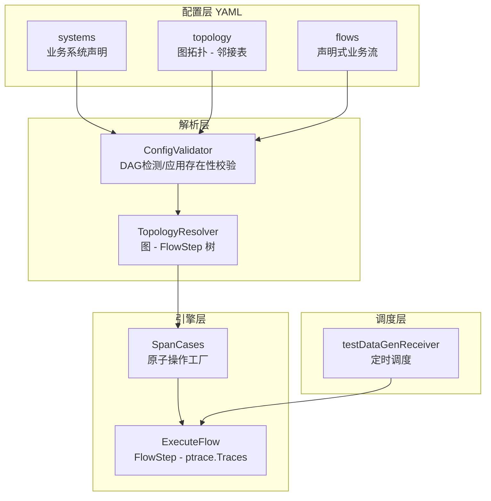
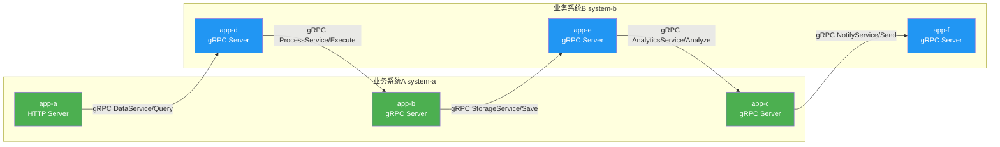
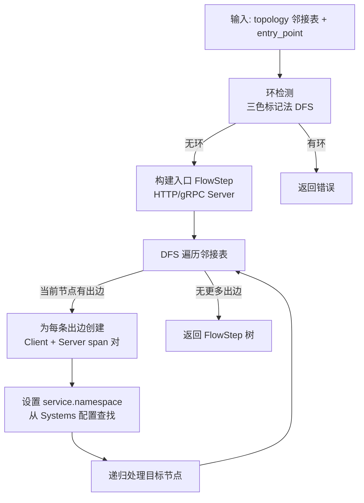
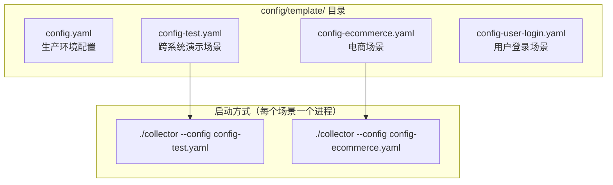
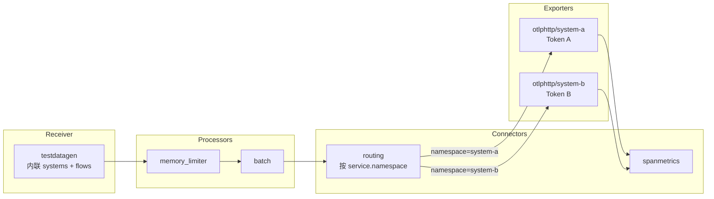

# TestDataGen 架构重构 — 声明式配置驱动

## 背景

客户希望有个演示需求，需要构造跨业务系统的调用链数据：
- 业务系统A 下有应用 ABC
- 业务系统B 下有应用 DEF
- 调用链路：A→D→B→E→C→F
- 两个业务系统对应两个 Token，上报地址相同

同时，现有 testdatagen 架构存在以下问题：
1. 配置冗余：`scenarios` 和 `flows` 两套配置体系，基础场景和业务流各自独立
2. 场景孤立：`basic_trace`、`mysql_database` 等场景无法组合成复杂业务流
3. 缺少业务系统概念：没有 `service.namespace` 的抽象
4. 扩展新场景成本高：每新增一个场景需要新建文件 + 注册 + 配置
5. Flow 硬编码：业务流的调用链结构硬编码在 Go 代码中

## 需求 / 目标

1. 重构 testdatagen 架构，使用**声明式配置驱动**替代硬编码场景
2. 引入**图数据结构（邻接表）**表达调用拓扑，支持扇出、扇入等复杂拓扑
3. 引入**业务系统**概念（`service.namespace`），支持多 Token 场景
4. 高内聚低耦合、健壮性和可扩展性
5. 新增场景只需配置 YAML，无需编写 Go 代码
6. 保留硬编码 Flow 作为 escape hatch（向后兼容）

### 约束条件

| 项目 | 确认内容 |
|------|---------|
| 调用链拓扑 | 同步链式调用：A→D→B→E→C→F |
| 应用内部行为 | 完整支持（MySQL、Redis、MongoDB、Kafka、中间件等） |
| 业务语义 | 通用命名即可 |
| 独立 Scenario | 不保留，全部迁移到 Flow 中 |
| 业务系统 Token | 两个业务系统对应两个 Token，上报地址相同 |

## 方案设计

### 核心架构



### 图拓扑数据结构

使用**有向图的邻接表**表示调用拓扑：



### TopologyResolver 核心算法



### 生成的 Trace 结构

```
TraceID: xxxx
├── [Server] app-a (system-a): HTTP POST /api/v1/process
│   └── [Client] app-a: grpc.client DataService/Query -> app-d
│       └── [Server] app-d (system-b): grpc.server DataService/Query
│           └── [Client] app-d: grpc.client ProcessService/Execute -> app-b
│               └── [Server] app-b (system-a): grpc.server ProcessService/Execute
│                   └── [Client] app-b: grpc.client StorageService/Save -> app-e
│                       └── [Server] app-e (system-b): grpc.server StorageService/Save
│                           └── [Client] app-e: grpc.client AnalyticsService/Analyze -> app-c
│                               └── [Server] app-c (system-a): grpc.server AnalyticsService/Analyze
│                                   └── [Client] app-c: grpc.client NotifyService/Send -> app-f
│                                       └── [Server] app-f (system-b): grpc.server NotifyService/Send
```

### 配置格式设计

```yaml
testdatagen:
  interval: 10s
  
  systems:
    - name: "business-system-a"
      namespace: "system-a"
      applications:
        - name: "app-a"
          type: "http"
          version: "1.0.0"
        - name: "app-b"
          type: "grpc"
        - name: "app-c"
          type: "grpc"
          
    - name: "business-system-b"
      namespace: "system-b"
      applications:
        - name: "app-d"
          type: "grpc"
        - name: "app-e"
          type: "grpc"
        - name: "app-f"
          type: "grpc"

  flows:
    - name: "cross_system_demo"
      enabled: true
      description: "跨业务系统演示"
      error_rate: 0.03
      entry_point:
        app: "app-a"
        protocol: "http"
        method: "POST"
        route: "/api/v1/process"
      topology:
        app-a:
          - target: "app-d"
            protocol: "grpc"
            service: "DataService"
            method: "Query"
        app-d:
          - target: "app-b"
            protocol: "grpc"
            service: "ProcessService"
            method: "Execute"
        # ... 以此类推

  registered_flows:
    - name: "ecommerce_order"
      enabled: true
      config:
        error_rate: 0.05
```

### 文件结构设计

```
config/
├── template/
│   ├── config.yaml                        # 生产环境配置（agent gateway 模式）
│   └── config-test.yaml                   # 场景：跨业务系统演示（完整 Collector 配置）

receiver/testdatagenreceiver/
├── config.go                    # 配置结构（Systems + Flows 内联）
├── topology_resolver.go         # 图拓扑解析器（支持 internal_steps）
├── declarative_flow.go          # 声明式 Flow 实现
├── business_flow.go             # ExecuteFlow 引擎 + FlowStep
├── span_cases.go                # 原子操作工厂
├── receiver.go                  # 接收器核心（直接使用内联配置）
├── factory.go                   # 工厂
├── helpers.go                   # 辅助函数
└── testdata/
```

### 一场景一配置文件架构

每个场景对应一个完整的 Collector 配置文件，通过 `--config` 参数指定运行哪个场景。



#### 单场景 Pipeline 架构（含 Routing Connector）



#### 设计决策

| 决策点 | 选择 | 理由 |
|--------|------|------|
| 场景管理方式 | 一场景一完整配置文件 | OTel 原生支持、零自定义加载逻辑、完全自包含 |
| 多 Token 路由 | routing connector | 按 resource.attributes["service.namespace"] 精确分流 |
| 运行模式 | 一次一场景，多场景多进程 | 简单可靠，互不干扰 |
| scenarios_dir | 已移除 | 场景涉及 exporter/connector/pipeline，不是 receiver 内部能解决的 |
| ScenarioLoader | 已移除 | 不再需要目录扫描和合并逻辑 |

#### 场景文件格式（含 internal_steps）

```yaml
# 场景元信息
name: "ecommerce_order"
enabled: true
description: "电商下单：gateway → order-service → payment-service → notification-service"
error_rate: 0.05

# 业务系统声明（场景自包含）
systems:
  - name: "ecommerce"
    namespace: "e-commerce"
    applications:
      - name: "api-gateway"
        type: "http"
        version: "2.3.1"
      - name: "order-service"
        type: "grpc"
        version: "1.5.2"

# 入口点
entry_point:
  app: "api-gateway"
  protocol: "http"
  method: "POST"
  route: "/api/v1/orders"

# 调用拓扑（图邻接表 + 应用内部行为）
topology:
  api-gateway:
    internal_steps:
      - type: "middleware"
        name: "auth"
      - type: "middleware"
        name: "rateLimit"
    calls:
      - target: "order-service"
        protocol: "grpc"
        service: "OrderService"
        method: "CreateOrder"
  order-service:
    internal_steps:
      - type: "service_method"
        method: "OrderService.createOrder"
      - type: "redis"
        operation: "GET"
        key_pattern: "user:session:{user_id}"
      - type: "mysql"
        database: "inventory_db"
        operation: "SELECT"
        table: "products"
      - type: "mysql"
        database: "order_db"
        operation: "INSERT"
        table: "orders"
    calls:
      - target: "payment-service"
        protocol: "kafka"
        topic: "order-events"
```

## 实施 Roadmap

### Phase 1：核心框架重构（当前阶段）

| 步骤 | 任务 | 文件 | 状态 |
|------|------|------|------|
| 1.1 | 重构配置结构 | `config.go` | ✅ 已完成 |
| 1.2 | 实现图拓扑解析器 | `topology_resolver.go` | ✅ 已完成 |
| 1.3 | 实现声明式 Flow | `declarative_flow.go` | ✅ 已完成 |
| 1.4 | ExecuteFlow 支持动态 namespace | `business_flow.go` | ✅ 已完成 |
| 1.5 | 重构 Receiver 调度逻辑 | `receiver.go` | ✅ 已完成 |
| 1.6 | 简化注册中心为 FlowRegistry | `scenario_registry.go` | ✅ 已完成 |
| 1.7 | 删除独立场景层 | `scenario.go` + `scenarios/` | ✅ 已完成 |
| 1.8 | 更新配置模板 | `config/template/config-test.yaml` | ✅ 已完成 |
| 1.9 | 编译验证 | - | ✅ 通过 |

### Phase 2：功能验证与修复（待实施）

| 步骤 | 任务 | 说明 |
|------|------|------|
| 2.1 | 端到端运行验证 | 启动 collector 验证数据生成是否正确 |
| 2.2 | 验证 Trace 结构 | 确认生成的 span 父子关系、属性是否正确 |
| 2.3 | 验证 service.namespace | 确认不同应用的 namespace 设置正确 |
| 2.4 | 验证 registered_flows | 确认 ecommerce_order/user_login 仍可正常工作 |
| 2.5 | 修复发现的问题 | - |

### Phase 3：多 Token 路由（已完成）

| 步骤 | 任务 | 说明 | 状态 |
|------|------|------|------|
| 3.1 | 引入 routing connector | 在 `components.go` 注册 `routingconnector`，`go.mod` 添加依赖 | ✅ 已完成 |
| 3.2 | 配置两个 exporter | `config_cross_system_demo.yaml` 中已配置 `otlphttp/system-a` 和 `otlphttp/system-b` | ✅ 已完成 |
| 3.3 | 配置 routing connector pipeline | 入口 pipeline → routing → 分流到 `traces/system-a` 和 `traces/system-b` | ✅ 已完成 |
| 3.4 | 编译验证 | `go build` 通过 | ✅ 已完成 |
| 3.5 | 端到端验证 | 确认不同业务系统的数据上报到正确的 Token | ⏳ 待验证 |

### Phase 4：增强功能（后续可选）

| 步骤 | 任务 | 说明 |
|------|------|------|
| 4.1 | 行为增强（Enrichments） | 为应用注入内部行为（MySQL、Redis 等） |
| 4.2 | 迁移现有 Flow | 将 ecommerce_order/user_login 迁移为声明式 |
| 4.3 | Metrics 支持 | 恢复指标生成能力 |
| 4.4 | 扇出/并行调用支持 | 验证图拓扑对并行调用的支持 |

### Phase 5：独立场景配置文件 + 去除硬编码（已完成，后被 Phase 6 取代）

> ⚠️ Phase 5 的 scenarios_dir 方案已被 Phase 6 取代。原因：一个完整的"场景"涉及 exporter/connector/pipeline 等 Collector 级别资源，不是 receiver 内部能解决的。

### Phase 6：一场景一配置文件 + Routing Connector（已完成）

| 步骤 | 任务 | 文件 | 状态 |
|------|------|------|------|
| 6.1 | 简化 Config：移除 ScenariosDir、ScenarioFile 结构 | `config.go` | ✅ 已完成 |
| 6.2 | 删除场景文件加载器 | `scenario_loader.go` | ✅ 已完成 |
| 6.3 | 简化 Receiver：移除目录加载逻辑 | `receiver.go` | ✅ 已完成 |
| 6.4 | 删除 config/scenarios/ 目录 | `config/scenarios/` | ✅ 已完成 |
| 6.5 | 重写配置为完整 Collector 配置（含 routing connector） | `config/template/config-test.yaml` | ✅ 已完成 |
| 6.6 | 编译验证 | - | ✅ 通过 |

## 遗留问题

1. ~~**多 Token 路由**：当前配置了两个 exporter（system-a 和 system-b），但需要 routing connector 按 `service.namespace` 分流到不同 exporter。~~ → Phase 6 已通过 routing connector 解决
2. ~~**现有硬编码 Flow 迁移**：`ecommerce_order` 和 `user_login` 保留为 `registered_flows`，后续可选择迁移为声明式配置。~~ → Phase 5 已迁移
3. ~~**行为增强（Enrichments）**：当前声明式 Flow 只生成跨服务调用 span，后续可增加 `enrichments` 配置为应用注入内部行为。~~ → Phase 5 已通过 internal_steps 支持
4. **Metrics 支持**：当前移除了独立的 Metric 场景，后续如需恢复可通过声明式配置实现。
5. **端到端验证**：代码已编译通过，routing connector 已注册（`routingconnector v0.120.0`），但尚未进行运行时验证（需确认 routing connector 是否正确按 `service.namespace` 分流）。
6. **更多场景配置文件**：当前只有 `config-test.yaml`（跨系统演示），后续可新增 `config-ecommerce.yaml`、`config-user-login.yaml` 等。
