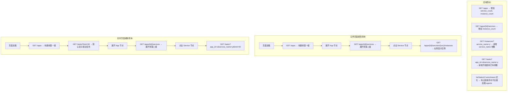

# 级联查询优化 - 任务页面 & 实例页面

## 需求背景

当前任务页面和实例页面的查询方式存在性能问题：
- **TasksPage**: `GET /tasks` 无参数全量拉取所有任务，前端从全量数据构建 App→Service→Instance 三级树
- **InstancesPage**: `GET /instances?status=all` 全量拉取所有实例，前端从全量数据构建 App→Service 两级树

数据量增大后，全量拉取+前端分组的方式会导致：
1. 后端 `listTasksV2` 每次调用 `ListApps()` + `GetAllAgents()` 做 enrichment，开销大
2. 前端一次性处理大量数据，渲染卡顿
3. 网络传输量大

## 方案 A：级联查询

改为先查 App 列表构建树，点击节点时带过滤参数查询后端。

## 实施清单

### 后端改动

| # | 文件 | 改动 | 状态 |
|---|------|------|------|
| 1 | `handlers.go` | `listApps` 增加 `service_count` 和 `instance_count` | ✅ |
| 2 | `handlers.go` | `listAppServices` 增加 `instance_count` | ✅ |
| 3 | `handlers.go` | `listAllInstances` 新增 `service_name` 查询参数 | ✅ |
| 4 | `handlers.go` | `listTasksV2` 优化 enrichment（有过滤条件时不全量加载 agents） | ✅ |

### 前端改动

| # | 文件 | 改动 | 状态 |
|---|------|------|------|
| 5 | `api.ts` + `client.ts` | 新增 `AppService`, `TaskListParams`, `InstanceListParams` 类型 + 带参数的 API 方法 | ✅ |
| 6 | `InstancesPage.tsx` | 改造为级联查询模式：树从 Apps API 构建，点击节点触发带参数的实例查询 | ✅ |
| 7 | `TasksPage.tsx` | 改造为级联查询模式：树从 Apps API 构建，点击节点触发带参数的任务查询 | ✅ |

### 验证

| 项目 | 状态 |
|------|------|
| Go 后端编译 (`go build ./...`) | ✅ 通过 |
| 前端 TypeScript 编译 (`tsc --noEmit`) | ✅ 通过 |

## 改动文件清单

### 后端
- `extension/adminext/handlers.go` — listApps/listAppServices/listAllInstances/listTasksV2 优化

### 前端
- `extension/adminext/webui-react/src/types/api.ts` — 新增 AppService, TaskListParams, InstanceListParams 类型
- `extension/adminext/webui-react/src/api/client.ts` — 新增 getAppServices, 增强 getInstances/getTasks 带参数
- `extension/adminext/webui-react/src/pages/InstancesPage.tsx` — 级联查询改造
- `extension/adminext/webui-react/src/pages/TasksPage.tsx` — 级联查询改造

## 遗留问题

- [ ] 树节点展开状态在刷新后会丢失（可考虑持久化到 localStorage）
- [ ] 任务页面默认 limit=200，后续可考虑加载更多/无限滚动
- [ ] App 和 Service 的统计数据（service_count, instance_count）在实例上下线时不会自动刷新，需要手动刷新
