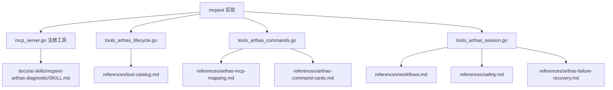

## 需求记录

### 背景

希望在仓库中维护一套可归档、可持续演进的 skill source，用于指导 LLM 基于 `mcpext` 当前真实支持的 MCP 能力来使用 Arthas，减少盲猜、错误选型以及错误命令生成。

### 目标

- 在 Git 仓库内维护 skill source，而不是依赖被忽略的目录
- 以 `mcpext` 当前已实现的工具能力为准，不脱离真实实现
- 后续可继续补充 Arthas 官方命令知识，但要映射到当前 MCP 支持范围
- 让模型优先学会“如何在 `mcpext` 约束下正确使用 Arthas”

### 当前实施范围

- 创建仓库内 skill source 目录：`docs/ai-skills/mcpext-arthas-diagnostic/`
- 建立 `SKILL.md` 与维护 `README.md`
- 建立基于当前实现的参考文档：工具速查、映射、工作流、命令卡片、失败恢复、安全边界

### 当前进展

- [x] 梳理 `mcpext` 当前已支持的工具分组与参数边界
- [x] 创建仓库内 skill source 基础结构
- [x] 创建 `SKILL.md`
- [x] 创建 `README.md`
- [x] 创建参考文档集合
- [x] 执行编译验证
- [ ] 根据未来新增 MCP tool 持续演进文档

### 关键事实来源

- `extension/mcpext/mcp_server.go`
- `extension/mcpext/tools_arthas_lifecycle.go`
- `extension/mcpext/tools_arthas_commands.go`
- `extension/mcpext/tools_arthas_session.go`

### 结构示意

### 未完成任务

- 后续视需要补充 Arthas 官方命令知识的版本化来源与更多命令卡片
- 未来如新增 `sm` / `monitor` / `tt` 等专用 MCP tool，需要同步更新 skill 文档

### 遗留问题

- 当前 `sm`、`monitor`、`tt`、`ognl` 等尚未有专用 MCP tool，技能中只能明确为 fallback 范围
- 还没有自动化校验脚本来对比 `registerTools()` 和文档是否漂移
