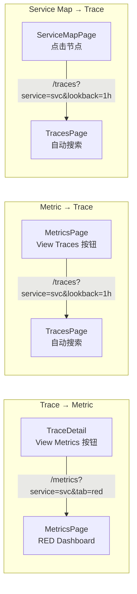
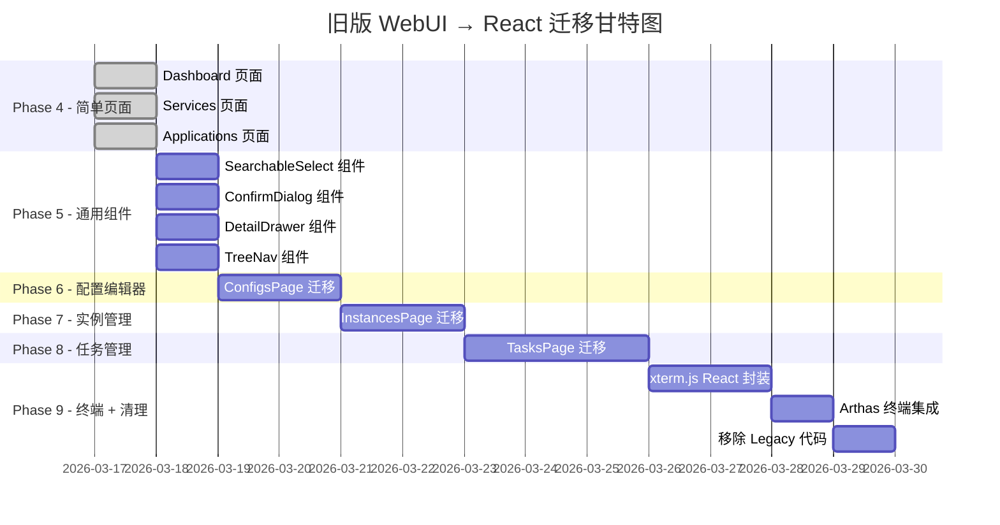
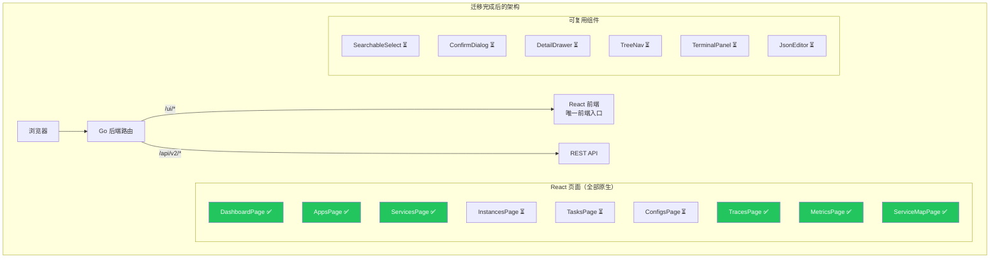

# 🚀 React 渐进式迁移 + Trace/Metric 可观测性功能

> 需求文档 & 实施进展记录

## 📋 背景

将前端从 Alpine.js 渐进式迁移到 React + TypeScript，同时新增 Trace/Metric 数据查询可视化功能。

采用**方案 C（渐进式迁移）**：
1. 先搭建 React + Vite + TypeScript 骨架
2. 新功能（Trace/Metric 页面）直接用 React 开发
3. 旧页面低优先级逐步迁移

## 🏗️ 架构设计

### 双前端并存方案

```
extension/adminext/
├── webui/                    # 旧 Alpine.js 前端（保留，挂载在 /legacy/）
│   ├── index.html
│   ├── js/, views/, css/
│   └── vendor/
│
├── webui-react/              # 新 React 前端（挂载在 /ui/）
│   ├── src/
│   │   ├── App.tsx
│   │   ├── main.tsx
│   │   ├── api/              # API 层（复用旧 API 逻辑）
│   │   ├── components/       # 通用组件
│   │   ├── contexts/         # React Context（Auth 等）
│   │   ├── hooks/            # 自定义 Hooks
│   │   ├── layouts/          # 布局组件
│   │   ├── pages/            # 页面组件
│   │   │   ├── DashboardPage.tsx    # 占位，后续迁移
│   │   │   ├── TracesPage.tsx       # 🆕 Phase 1
│   │   │   ├── MetricsPage.tsx      # 🆕 Phase 2
│   │   │   └── LegacyPage.tsx       # iframe 嵌入旧页面
│   │   ├── types/            # TypeScript 类型定义
│   │   └── utils/            # 工具函数
│   ├── package.json
│   ├── vite.config.ts
│   ├── tsconfig.json
│   └── tailwind.config.ts
│
├── webui.go                  # Go embed 改造（同时嵌入两套前端）
└── router.go                 # 路由改造（/ui/ → React, /legacy/ → Alpine）
```

### Go 侧 embed 改造

```go
//go:embed webui-react/dist/*
var reactUIFS embed.FS     // React 构建产物

//go:embed webui/*
var legacyUIFS embed.FS    // 旧 Alpine.js 前端

// 路由:
// /ui/*     → React SPA
// /legacy/* → 旧 Alpine.js
// /         → 重定向到 /ui/
```

## 📊 实施阶段

### Phase 0: React 骨架搭建（✅ 已完成）

| 步骤 | 内容 | 状态 |
|------|------|------|
| 0.1 | 初始化 Vite + React + TypeScript 项目 | ✅ 完成 |
| 0.2 | 配置 Tailwind CSS + 主题色系 | ✅ 完成 |
| 0.3 | 搭建骨架（路由 + 布局 + Auth Context + API 层） | ✅ 完成 |
| 0.4 | 实现 Sidebar + 导航 + Legacy iframe 嵌入 | ✅ 完成 |
| 0.5 | Go 侧 webui.go 改造支持 React embed | ✅ 完成 |
| 0.6 | 构建验证 + 编译检查 | ✅ 完成 |

**构建结果**：
- React 前端：`npm run build` ✅（产物 ~78KB gzip）
- Go 后端：`go build` ✅（双前端 embed 成功）
- 路由结构：`/ui/` → React SPA，`/legacy/` → Alpine.js，`/` → 301 → `/ui/`

### Phase 1: Trace 查询（✅ 已完成）

**后端（Go）：**

| 步骤 | 内容 | 状态 |
|------|------|------|
| 1.1 | `config.go` 添加 `ObservabilityConfig`（Jaeger/Prometheus 端点） | ✅ 完成 |
| 1.2 | 创建 `observability_handler.go`（Trace Query Proxy + Metric Query Proxy） | ✅ 完成 |
| 1.3 | `router.go` 注册 `/api/v2/observability/*` 路由 | ✅ 完成 |
| 1.4 | `extension.go` 初始化 `obsClient` 查询客户端 | ✅ 完成 |

**前端（React）：**

| 步骤 | 内容 | 状态 |
|------|------|------|
| 1.5 | 创建 `types/trace.ts` Jaeger 响应类型定义 | ✅ 完成 |
| 1.6 | `api/client.ts` 添加 Trace/Metric 查询 API 方法 | ✅ 完成 |
| 1.7 | 创建 `utils/trace.ts` 数据转换工具函数 | ✅ 完成 |
| 1.8 | 实现 `TracesPage.tsx` 完整搜索面板+结果列表 | ✅ 完成 |
| 1.9 | 实现 `TraceDetail.tsx` Span 时间轴可视化组件 | ✅ 完成 |

**新增 API 路由：**

| 端点 | 代理目标 | 功能 |
|------|---------|------|
| `GET /api/v2/observability/traces` | Jaeger `/api/traces` | 搜索 Traces |
| `GET /api/v2/observability/traces/{traceID}` | Jaeger `/api/traces/{id}` | 获取单个 Trace 详情 |
| `GET /api/v2/observability/traces/services` | Jaeger `/api/services` | Service 列表 |
| `GET /api/v2/observability/traces/services/{svc}/operations` | Jaeger `/api/services/{svc}/operations` | Operation 列表 |
| `GET /api/v2/observability/metrics/query` | Prometheus `/api/v1/query` | Instant query |
| `GET /api/v2/observability/metrics/query_range` | Prometheus `/api/v1/query_range` | Range query |
| `GET /api/v2/observability/metrics/labels` | Prometheus `/api/v1/labels` | Label 名称列表 |
| `GET /api/v2/observability/metrics/labels/{name}/values` | Prometheus `/api/v1/label/{name}/values` | Label 值列表 |
| `GET /api/v2/observability/metrics/series` | Prometheus `/api/v1/series` | Series 元数据 |
| `GET /api/v2/observability/metrics/metadata` | Prometheus `/api/v1/metadata` | Metric 元数据 |

**配置方式（config.yaml）：**

```yaml
admin:
  observability:
    jaeger:
      endpoint: "http://jaeger-query:16686"
    prometheus:
      endpoint: "http://prometheus:9090"
```

**构建结果**：
- React 前端：`npm run build` ✅（产物 ~82KB gzip，含 Trace 页面）
- Go 后端：`go build` ✅

### Phase 2: Metric 查询（✅ 已完成）

**前端（React）：**

| 步骤 | 内容 | 状态 |
|------|------|------|
| 2.1 | 安装 ECharts 依赖 (`echarts` + `echarts-for-react`) | ✅ 完成 |
| 2.2 | 创建 `types/metric.ts` Prometheus HTTP API 响应类型定义 | ✅ 完成 |
| 2.3 | 更新 `api/client.ts` Metric 方法返回类型（替换 unknown 为类型安全） | ✅ 完成 |
| 2.4 | 创建 `utils/metric.ts` 数据转换 + 预设面板 + 时间范围计算 | ✅ 完成 |
| 2.5 | 创建 `components/TimeSeriesChart.tsx` ECharts 时间序列组件（Tree-shaking） | ✅ 完成 |
| 2.6 | 实现 `MetricsPage.tsx`（PromQL 查询面板 + RED Dashboard 面板） | ✅ 完成 |
| 2.7 | Vite 代码分割优化（React / ECharts 独立打包） | ✅ 完成 |

**MetricsPage 功能：**

- **PromQL Query Tab**：自由输入 PromQL 表达式 + 示例查询快捷填充 + ECharts 折线图展示
- **RED Dashboard Tab**：选择 Service → 自动并行加载 6 个预设面板
  - Request Rate (QPS)
  - Error Rate (%)
  - Latency P50 / P95 / P99
  - Requests by Status Code
- **共享时间范围选择器**：15m / 30m / 1h / 3h / 6h / 12h / 24h / 2d / 7d
- **自动 step 计算**：根据时间范围自动选择合适的查询步长

**新增依赖：**

| 包名 | 版本 | 说明 |
|------|------|------|
| `echarts` | ^5.x | Apache ECharts 核心（Tree-shaking 按需导入） |
| `echarts-for-react` | ^3.x | React ECharts 包装组件 |

**构建产物（代码分割后）：**

| 文件 | 大小 | gzip |
|------|------|------|
| `vendor-react-*.js` | 49 KB | 17 KB |
| `index-*.js` | 234 KB | 72 KB |
| `vendor-echarts-*.js` | 568 KB | 191 KB |
| `index-*.css` | 18 KB | 4 KB |
| **合计** | **869 KB** | **284 KB** |

### Phase 3: 联动 & 增强（✅ 已完成）

**Trace ↔ Metric 双向联动：**

| 步骤 | 内容 | 状态 |
|------|------|------|
| 3.1 | `TraceDetail.tsx` 添加 "View Metrics" / "More Traces" 联动按钮 | ✅ 完成 |
| 3.2 | `TracesPage.tsx` 支持 URL 查询参数（`?service=xxx&lookback=1h`），从 Metric 页面跳转时自动填充搜索条件并触发搜索 | ✅ 完成 |
| 3.3 | `MetricsPage.tsx` RED Dashboard 添加 "View Traces" 联动按钮 + 支持 URL 参数（`?service=xxx&tab=red`） | ✅ 完成 |

**Service Map 服务拓扑图：**

| 步骤 | 内容 | 状态 |
|------|------|------|
| 3.4 | 后端 `observability_handler.go` 新增 `handleGetDependencies` 代理 Jaeger Dependencies API | ✅ 完成 |
| 3.5 | 后端 `router.go` 注册 `GET /api/v2/observability/dependencies` 路由 | ✅ 完成 |
| 3.6 | 前端 `types/trace.ts` 新增 `JaegerDependencyLink` 类型 | ✅ 完成 |
| 3.7 | 前端 `api/client.ts` 新增 `getDependencies()` 方法 | ✅ 完成 |
| 3.8 | 创建 `pages/ServiceMapPage.tsx` — ECharts Graph 力导向拓扑图 | ✅ 完成 |
| 3.9 | `App.tsx` 添加 `/service-map` 路由 | ✅ 完成 |
| 3.10 | `Sidebar.tsx` 添加 Service Map 导航菜单项 | ✅ 完成 |

**联动跳转路径：**



**ServiceMapPage 功能：**

- ECharts Graph 力导向布局拓扑图
- 节点大小按调用量对数缩放
- 边粗细按调用次数缩放 + 箭头方向
- 支持拖拽、缩放、平移
- 点击节点跳转到 Traces 页面
- Tooltip 显示调用统计
- 时间范围选择器（1h / 6h / 12h / 24h / 2d / 7d）

**新增 API 路由：**

| 端点 | 代理目标 | 功能 |
|------|---------|------|
| `GET /api/v2/observability/dependencies` | Jaeger `/api/dependencies` | 服务依赖关系 |

**构建产物（Phase 3 后）：**

| 文件 | 大小 | gzip |
|------|------|------|
| `vendor-react-*.js` | 50 KB | 18 KB |
| `index-*.js` | 242 KB | 73 KB |
| `vendor-echarts-*.js` | 609 KB | 205 KB |
| `index-*.css` | 18 KB | 4 KB |
| **合计** | **919 KB** | **300 KB** |

## ⚙️ 技术栈

| 组件 | 选型 |
|------|------|
| 构建工具 | Vite 6.x |
| 框架 | React 19 |
| 语言 | TypeScript 5.x |
| CSS | Tailwind CSS 4.x |
| 路由 | React Router 7 |
| 图表 | Apache ECharts (via echarts-for-react) |
| HTTP | 原生 fetch (封装 API 层) |
| 状态管理 | React Context + useState (轻量级) |

## 🧪 联调测试记录（2026-03-17）

**环境：** 本地开发（Vite dev server + Go 后端 + 远程 Prometheus/Jaeger）

| 功能模块 | 测试结果 | 备注 |
|---------|---------|------|
| 前端 Vite 启动 | ✅ 正常 | `http://localhost:5174/ui/` |
| Go 后端启动 | ✅ 正常 | `:8088`，Observability proxy 初始化成功 |
| 登录鉴权 | ✅ 正常 | API Key 登录 + Remember 功能正常 |
| 导航菜单 | ✅ 正常 | Dashboard / Applications / Instances / Services / Tasks / Configs / **Traces** / **Metrics** / **Service Map** 全部显示 |
| **Metrics - PromQL Query** | ✅ 正常 | 查询 `up` 返回 15 个 series，ECharts 图表渲染正常 |
| **Metrics - RED Dashboard** | ✅ 正常 | Service 列表正确获取（customcol / java-user-service / tapm-api），6 个 RED 面板渲染正常 |
| **Metrics → Traces 联动** | ✅ 正常 | RED Dashboard "View Traces" 按钮存在，点击可跳转到 Traces 页面 |
| **Traces - 搜索面板** | ✅ 正常 | Service/Operation/Lookback/Limit/Tags/Duration 全部渲染 |
| **Traces - Service 列表** | ✅ 正常 | 返回 3 个服务：jaeger-all-in-one / java-user-service / tapm-api |
| **Traces - Operation 列表** | ✅ 正常 | 选择 service 后自动加载 operations（25+ 个 operation） |
| **Traces - 搜索查询** | ✅ 正常 | 搜索 java-user-service 返回 5 条 traces，列表展示正常 |
| **Traces - Trace 详情** | ✅ 正常 | 时间轴瀑布图、Span 信息（ID/时间/时长/服务）展示正常 |
| **Traces - Span 详情** | ✅ 正常 | Tags(16) / Process Tags(17) / Logs(31) 全部展示，Error 标记正常 |
| **Traces - View Metrics** | ✅ 正常 | Trace 详情中 "View Metrics" 联动按钮正常 |
| **Service Map - 页面** | ✅ 正常 | UI 加载正常，Time Range 选择器正常 |
| **Service Map - 依赖数据** | ⚠️ 数据为空 | API 代理正常（返回 200），但 Jaeger 中无依赖数据（可能需要 spark-dependencies job） |
| **Prometheus 连接** | ✅ 可达 | `prometheus.istio-system.svc.cluster.local:9090` 正常响应 |
| **Jaeger 连接** | ✅ 可达 | `jaeger.devcloud`（非 `jeager.http.devcloud`）正常响应 |

**结论：**
- Prometheus 相关功能（Metrics 页面）**全部正常** ✅
- Jaeger 相关功能（Traces 页面）**全部正常** ✅ （Jaeger Query 地址为 `http://jaeger.devcloud`）
- Service Map **API 代理正常**，但 Jaeger 中无依赖数据 ⚠️
- 前端 UI、路由、联动、降级提示均正常 ✅

**配置修正记录：**
- Jaeger Query 的正确域名为 `jaeger.devcloud`（不是之前误用的 `jeager.http.devcloud`）
- `jeager.http.devcloud` 是 OTLP Collector 写入端点（端口 55681），不提供 Query API
- 已更新 `config/build/config.yaml` 中的 endpoint

---

## 🔄 旧版 WebUI (Alpine.js) → React 完整迁移计划

> 目标：完全废弃旧版 Alpine.js 前端（webui/），将所有页面功能迁移到 React（webui-react/），最终移除 /legacy/ 路由和 iframe 嵌入机制。

### 旧版页面功能盘点

| 页面 | 复杂度 | 代码量 | 核心功能 | 特殊依赖 |
|------|--------|--------|----------|----------|
| **Dashboard** | ⭐ 低 | ~73行 HTML | 4个统计卡片 + Quick Actions | 无 |
| **Applications** | ⭐⭐ 中 | ~72行 HTML + app.js | 表格 CRUD + Token 管理（创建/删除/Token生成/自定义设置） | 模态框×2 |
| **Services** | ⭐ 低 | ~29行 HTML | 服务卡片列表 + 跳转实例页 | 无 |
| **Instances** | ⭐⭐⭐⭐ 高 | ~419行 HTML + 295行 instances.js | 左侧树 + 右侧卡片列表 + 抽屉详情 + Arthas 终端 | xterm.js WebSocket 终端 |
| **Tasks** | ⭐⭐⭐⭐⭐ 最高 | ~909行 HTML + 880行 tasks.js | 三级树 + 任务列表 + 抽屉详情 + 创建表单(SearchableSelect) + 动态表单 | 自定义 SearchableSelect |
| **Configs** | ⭐⭐⭐ 中高 | ~185行 HTML + app.js | 左侧服务树 + JSON 编辑器 + 模板推荐 + 缺失字段补全 | JSON 编辑/校验 |

### React 已有基础设施（可复用）

| 模块 | 文件 | 说明 |
|------|------|------|
| API 客户端 | `api/client.ts` | 已有全部 API 方法（Apps/Instances/Services/Tasks/Config/Arthas/Auth） |
| 类型定义 | `types/api.ts` | 已有 App/Instance/Service/Task/Config/ArthasAgent 类型 |
| 认证 | `contexts/AuthContext.tsx` | 登录/登出/API Key 持久化 |
| Toast | `contexts/ToastContext.tsx` | 全局通知 |
| 路由 | `App.tsx` | 路由框架已搭好 |
| 侧边栏 | `layouts/Sidebar.tsx` | 导航菜单已有所有菜单项 |

### 迁移阶段总览



### 迁移后架构



---

### Phase 4: 简单页面迁移（✅ 已完成 — 2026-03-17）

将 Dashboard、Services、Applications 从 `<LegacyPage>` iframe 嵌入改为 React 原生实现。

| 步骤 | 内容 | 状态 | 产物 |
|------|------|------|------|
| 4.1 | **DashboardPage** — 4个统计卡片 + Quick Actions + 30s 自动刷新 | ✅ 完成 | `DashboardPage.tsx` (6.20KB) |
| 4.2 | **ServicesPage** — 服务卡片网格 + 点击跳转 Instances | ✅ 完成 | `ServicesPage.tsx` (3.95KB) |
| 4.3 | **AppsPage** — 表格 CRUD + Token 管理（Create Modal + Token Modal） | ✅ 完成 | `AppsPage.tsx` (13.84KB) |
| 4.4 | 更新 `App.tsx` 路由 — 3个页面从 `<LegacyPage>` 改为原生组件 | ✅ 完成 | — |
| 4.5 | 编译验证 `go build ./...` | ✅ 通过 | — |
| 4.6 | 生产部署模式测试（React 打包 + Go 后端） | ✅ 通过 | — |

**当前 App.tsx 路由状态：**

```tsx
{/* 已迁移页面 - React 原生实现 */}
<Route path="dashboard" element={<DashboardPage />} />
<Route path="apps" element={<AppsPage />} />
<Route path="services" element={<ServicesPage />} />

{/* 旧页面 - 通过 Legacy iframe 嵌入（待迁移） */}
<Route path="instances" element={<LegacyPage view="instances" />} />
<Route path="tasks" element={<LegacyPage view="tasks" />} />
<Route path="configs" element={<LegacyPage view="configs" />} />

{/* 新页面 - React 原生实现 */}
<Route path="traces" element={<TracesPage />} />
<Route path="metrics" element={<MetricsPage />} />
<Route path="service-map" element={<ServiceMapPage />} />
```

---

### Phase 5: 通用组件开发（⏳ 待实施）

开发后续页面所需的可复用组件。

| 步骤 | 组件 | 说明 | 状态 |
|------|------|------|------|
| 5.1 | **SearchableSelect** | 支持分组、键盘导航、搜索高亮、懒加载、自定义输入（Tasks 页面核心依赖） | ⏳ 待开始 |
| 5.2 | **ConfirmDialog** | 替代 `window.confirm()`，统一确认弹窗样式 | ⏳ 待开始 |
| 5.3 | **DetailDrawer** | 可复用右侧抽屉（Instances/Tasks 详情） | ⏳ 待开始 |
| 5.4 | **TreeNav** | 可复用左侧树导航（Instances/Tasks/Configs 都需要） | ⏳ 待开始 |

### Phase 6: 配置编辑器迁移（⏳ 待实施）

| 步骤 | 内容 | 状态 |
|------|------|------|
| 6.1 | **ConfigsPage** — 左侧服务树(TreeNav) + 右侧 JSON 编辑器 | ⏳ 待开始 |
| 6.2 | 模板推荐 + 缺失字段检测补全逻辑 | ⏳ 待开始 |
| 6.3 | 可选优化：升级为 Monaco Editor（语法高亮 + 自动补全） | ⏳ 待开始 |

### Phase 7: 实例管理迁移（⏳ 待实施）

| 步骤 | 内容 | 状态 |
|------|------|------|
| 7.1 | **InstancesPage** — 左侧 App/Service 树(TreeNav) + 右侧实例卡片列表 | ⏳ 待开始 |
| 7.2 | 过滤统计 + 搜索 + 状态筛选 | ⏳ 待开始 |
| 7.3 | 实例详情抽屉(DetailDrawer) — 基本信息/JVM Args/System Properties 等 | ⏳ 待开始 |

### Phase 8: 任务管理迁移（⏳ 待实施）

| 步骤 | 内容 | 状态 |
|------|------|------|
| 8.1 | **TasksPage 主页** — 三级导航树(TreeNav) + 任务列表 + 状态统计筛选 | ⏳ 待开始 |
| 8.2 | 任务详情抽屉(DetailDrawer) — 参数/输出/Artifact 下载/时间线 | ⏳ 待开始 |
| 8.3 | 创建任务模态框 — SearchableSelect 选类型/目标 + 动态表单 | ⏳ 待开始 |

### Phase 9: xterm.js 终端 + 清理收尾（⏳ 待实施）

| 步骤 | 内容 | 状态 |
|------|------|------|
| 9.1 | **useTerminal Hook** — 封装 xterm.js 的 React Hook（创建/销毁/resize） | ⏳ 待开始 |
| 9.2 | **TerminalPanel 组件** — 终端面板 UI（标签页多终端 + VSCode 搜索框） | ⏳ 待开始 |
| 9.3 | Arthas 集成 — WebSocket 连接管理、Attach/Detach 流程 | ⏳ 待开始 |
| 9.4 | 移除 `LegacyPage.tsx` — 删除 iframe 嵌入机制 | ⏳ 待开始 |
| 9.5 | 移除 `webui/` 目录 — 删除 Alpine.js 所有文件 | ⏳ 待开始 |
| 9.6 | 清理 Go 后端 — `webui.go` 移除 legacyUIFS、`router.go` 移除 `/legacy/*` 路由 | ⏳ 待开始 |
| 9.7 | 更新 `App.tsx` — 所有页面改为 React 原生，移除 LegacyPage import | ⏳ 待开始 |
| 9.8 | 全量构建验证 + 功能回归测试 | ⏳ 待开始 |

### 迁移后目标文件结构

```
webui-react/src/
├── api/
│   └── client.ts                   # API 客户端（已有）
├── components/
│   ├── TimeSeriesChart.tsx          # ECharts 图表（已有）
│   ├── TraceDetail.tsx              # Trace 详情（已有）
│   ├── SearchableSelect.tsx         # 🆕 Phase 5
│   ├── ConfirmDialog.tsx            # 🆕 Phase 5
│   ├── DetailDrawer.tsx             # 🆕 Phase 5
│   ├── TreeNav.tsx                  # 🆕 Phase 5
│   ├── JsonEditor.tsx               # 🆕 Phase 6
│   └── Terminal/
│       ├── TerminalPanel.tsx        # 🆕 Phase 9
│       └── useTerminal.ts           # 🆕 Phase 9
├── contexts/
│   ├── AuthContext.tsx              # 认证（已有）
│   └── ToastContext.tsx             # 通知（已有）
├── hooks/
│   ├── useAutoRefresh.ts            # 🆕 自动刷新
│   ├── useWebSocket.ts              # 🆕 WebSocket 管理
│   └── useConfirm.ts                # 🆕 确认弹窗 Hook
├── layouts/
│   ├── MainLayout.tsx               # 已有
│   └── Sidebar.tsx                  # 已有
├── pages/
│   ├── DashboardPage.tsx            # ✅ Phase 4
│   ├── AppsPage.tsx                 # ✅ Phase 4
│   ├── ServicesPage.tsx             # ✅ Phase 4
│   ├── ConfigsPage.tsx              # 🆕 Phase 6
│   ├── InstancesPage.tsx            # 🆕 Phase 7
│   ├── TasksPage.tsx                # 🆕 Phase 8
│   ├── TracesPage.tsx               # ✅ Phase 1
│   ├── MetricsPage.tsx              # ✅ Phase 2
│   ├── ServiceMapPage.tsx           # ✅ Phase 3
│   └── LoginPage.tsx                # ✅ Phase 0
├── types/
│   ├── api.ts                       # 已有
│   ├── trace.ts                     # 已有
│   └── metric.ts                    # 已有
└── utils/
    ├── format.ts                    # 🆕 从旧版 utils.js 移植
    ├── trace.ts                     # 已有
    └── metric.ts                    # 已有
```

### 迁移风险与注意事项

| 风险 | 影响 | 缓解措施 |
|------|------|----------|
| xterm.js React 集成复杂 | 终端功能可能有 bug | 参考 terminal.js 的 fitAndNotify 逻辑，保留搜索功能 |
| 任务创建表单逻辑复杂 | 动态表单（instrument/uninstrument/profiling 各有不同参数） | 逐一对照 tasks.js 中的 `buildInstrumentParams()` 等方法 |
| CDN 依赖消除 | 旧版依赖 CDN（Tailwind/Alpine/xterm/FontAwesome） | React 版全部本地化 |
| 双前端过渡期 | 迁移期间两套前端共存 | 逐页面迁移，每完成一个页面就更新 App.tsx 路由 |

### 可选优化清单

| 优化项 | 当前问题 | 建议 |
|--------|----------|------|
| JSON 编辑器 | textarea 无语法高亮 | 可选 Monaco Editor 或 CodeMirror |
| 确认弹窗 | `window.confirm()` 原生样式 | React ConfirmDialog 组件 |
| 表格排序/分页 | 无分页 | 添加前端分页 + 排序 |
| 数据缓存 | 每次切页重新请求 | React Query 或 SWR 缓存 |
| 错误边界 | 无错误处理 | React ErrorBoundary 组件 |
| 响应式 | 部分移动端适配差 | Tailwind 响应式优化 |

---

## 📝 遗留问题

- [ ] Service Map 依赖数据为空，可能需要部署 Jaeger spark-dependencies job 来生成依赖关系
- [x] ~~旧页面迁移优先级待排序~~ → 已制定 Phase 4-9 完整计划
- [ ] xterm.js 终端组件的 React 封装方案（Phase 9）
- [ ] 生产构建的资源哈希策略待确认
- [ ] Service Map 节点右键菜单（跳转 Metrics / Traces 快捷入口）
- [ ] 自定义 Dashboard 面板保存功能
- [ ] `index.html` 中 favicon 仍引用 `/vite.svg`，在生产部署时会 404（不影响功能）
