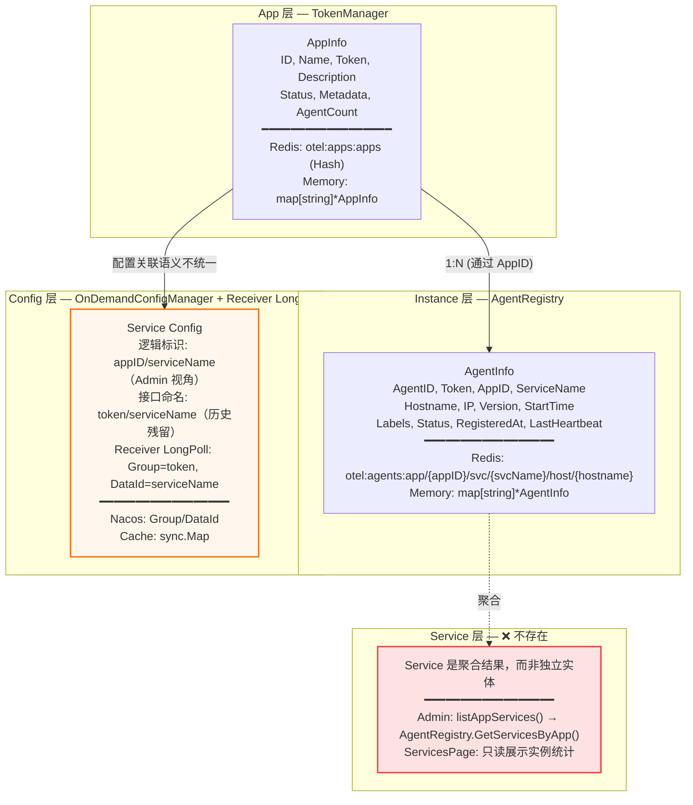
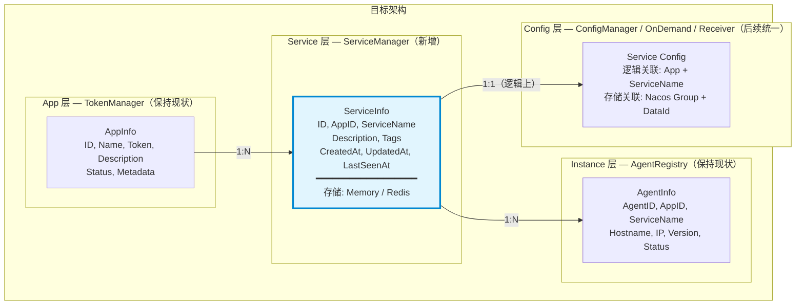
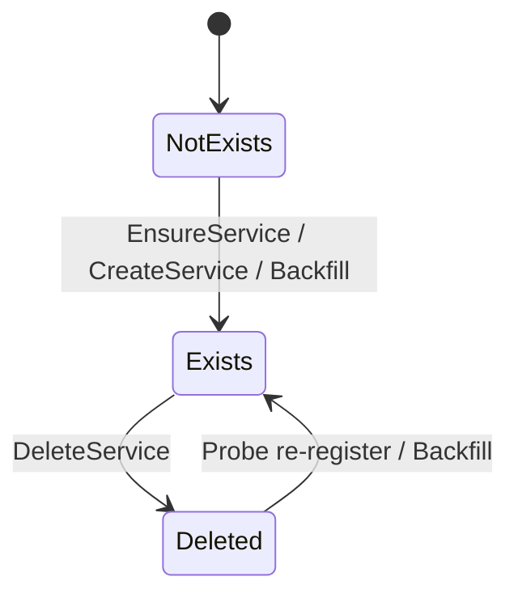
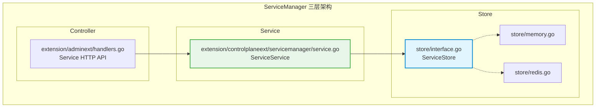
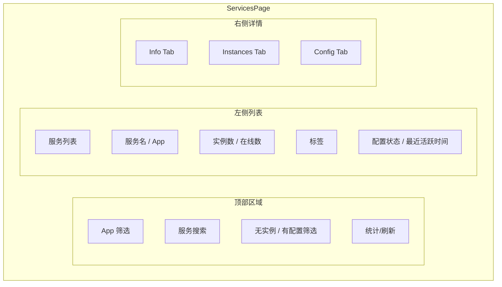
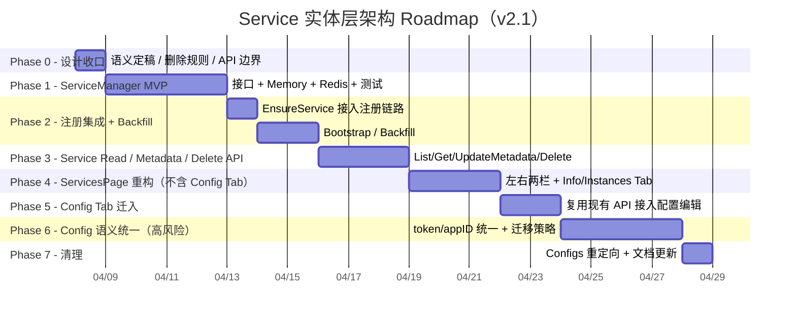

# Service 实体层架构设计 & Roadmap（评审后 v2.1）

> **文档状态**：评审后修订版（v2.1）
> **结论**：**有条件通过**，建议按 v2.1 Roadmap 分阶段推进
> **本次关键修订**：移除 `archive/restore` 方案，改为 **"清除无效服务 + 探针再次上报自动重建"** 模型

---

## 需求背景

当前系统的业务模型是三级结构：**App → Service → Instance**，但在存储层面，Service 并不是一个独立实体，而是从 Instance 数据中动态聚合出来的"幽灵实体"。这导致了以下问题：

1. Service 没有独立的元数据（描述、标签等）
2. Service 的生命周期完全依赖实例——实例全部下线后 Service 就"消失"了
3. 配置管理（`ConfigsPage`）和服务管理（`ServicesPage`）是独立页面，但逻辑上配置应该是服务的属性
4. 当前配置体系在接口命名、Admin 调用语义、Receiver long-poll 行为之间处于 **半迁移态**，存在 `token` / `appID` 双语义并存问题

本方案的目标不是仅仅"给 Service 加一个表"，而是将 Service 提升为 **一等实体**，形成稳定的三层管理能力：

- **静态元数据**：描述、标签
- **动态运行态**：实例数、在线数、配置状态、最近活跃时间
- **统一入口**：服务信息、服务配置、服务实例视图收敛到 `ServicesPage`
- **清理能力**：对无效 / 过时服务提供清除能力，后续再次上报时自动重建

> 说明：`负责人` 不单独建模为固定字段；如确有需要，统一通过标签表达，例如 `owner=xxx`、`team=yyy`、`oncall=zzz`。

---

## 一、评审后结论摘要

### 1.1 总体判断

这项改造 **值得做，而且应该做**。原因如下：

- 当前 `Service` 确实不是独立实体，而是通过 `AgentRegistry.GetServicesByApp()` 动态聚合出来的
- 当前 `ServicesPage` 只能展示只读统计，无法承载服务元数据管理
- 当前服务配置逻辑已经是"按 App + ServiceName 管理"的用户心智，但底层接口命名与 receiver 侧实现仍残留 `token` 语义
- 当前 `TaskManager` 已证明三层架构（Controller / Service / Store）在本项目中是可落地、可维护的模式

### 1.2 本次评审后的核心调整

本版 v2.1 相比之前版本，做了以下关键收敛：

1. **删除语义简化**：移除 `archive/restore`，改为 **DeleteService（清除服务记录）**
2. **自动恢复模型调整**：服务被清除后，若探针再次上报，则通过 `EnsureService()` **自动重建**
3. **并发幂等补强**：`EnsureService()` 不能用简单的 `Get -> Save` 实现，必须具备原子"只创建一次"语义
4. **补齐 backfill 方案**：必须考虑存量服务，不只考虑未来新注册探针
5. **重排 roadmap**：先完成实体化与页面整合，再单独推进配置 Group 统一
6. **API 边界收紧**：v1 外部 API 使用 `(appID, serviceName)` 作为标识；`serviceID` 仅做内部索引与未来扩展

### 1.3 关于"清除而不是归档"的设计判断

在当前项目上下文里，`archive/restore` 的收益并不高，原因是：

- 当前并没有真正围绕 Service 做权限、审计、审批流、历史视图等复杂管理能力
- `disabled` 也不会真正影响探针注册和实例运行，容易变成"有状态但无效果"的伪能力
- 实际业务诉求更接近：**把已经无效的服务清掉**，如果未来这个服务又回来，就**自动重新注册**

因此 v2.1 采用更直接的模型：

- **服务存在**：可被展示、可编辑元数据
- **服务被清除**：从 Service 实体存储中删除
- **服务再次上报**：重新自动创建一条 Service 记录

### 1.4 Go / No-Go 建议

- **Phase 0 ~ Phase 5**：建议推进
- **配置 Group 统一迁移**：必须单独作为高风险阶段推进
- **Service 物理清除能力**：可以做，但首版应限制为"清除无实例服务"

---

## 二、现状分析（与当前代码对齐）

### 2.1 当前存储架构



### 2.2 当前页面结构

| 页面 | 路由 | 当前定位 | 当前问题 |
|------|------|---------|---------|
| `Dashboard` | `/dashboard` | 全局统计概览 | 缺少 Service 实体级统计 |
| `Applications` | `/apps` | App CRUD + Token 管理 | 正常 |
| `Instances` | `/instances` | 实例全局视图 | 正常 |
| `Services` | `/services` | 服务只读列表 | 不能编辑元数据，不是主管理页 |
| `Configs` | `/configs` | 服务配置独立页 | 与用户心智割裂，入口偏"技术实现导向" |

### 2.3 当前 API 结构

```text
/api/v2/
├── apps/
│   ├── GET /                           # listApps
│   ├── POST /                          # createApp
│   └── {appID}/
│       ├── GET /                       # getApp
│       ├── PUT /                       # updateApp
│       ├── DELETE /                    # deleteApp
│       ├── POST /token                 # regenerateToken
│       ├── PUT /token                  # setToken
│       ├── config/
│       │   └── services/{svcName}      # GET/PUT/DELETE 服务配置
│       ├── services/                   # GET listAppServices（当前聚合结果）
│       │   └── {svcName}/instances     # GET listServiceInstances
│       └── instances/                  # GET/POST(kick)
├── services/                           # GET listAllServices（全局聚合结果）
├── instances/
├── tasks/
├── dashboard/overview
├── observability/
└── arthas/
```

### 2.4 当前代码层面的关键事实

#### 事实 A：Service 目前来源于 Instance 聚合

当前 `adminext/handlers.go` 中的 `listAppServices()` 逻辑是：

- 先根据 `appID` 找到 `App`
- 调 `AgentRegistry.GetServicesByApp()` 获取服务名列表
- 再对每个服务调 `GetInstancesByService()` 计算实例数

也就是说，当前系统里并没有独立的 `ServiceInfo` 来源。

#### 事实 B：Admin 配置读写已经按 `app.ID` 调用

当前 `getAppServiceConfigV2()` / `setAppServiceConfigV2()` / `deleteAppServiceConfigV2()` 已将 `app.ID` 传入 `OnDemandConfigManager`。

这意味着：

- **Admin 侧调用语义已经偏向 `appID`**
- 但 `OnDemandConfigManager` 接口参数名仍是 `token`
- Receiver long-poll 仍按 `Group=token` 监听 Nacos

因此系统当前处于 **"接口语义与调用语义不完全一致"** 的半迁移状态。

#### 事实 C：Agent 注册/心跳尚未接入 Service 实体化逻辑

当前 `extension/controlplaneext/extension.go` 中：

- `RegisterAgent()` 直接委托给 `agentReg.Register()`
- `RegisterOrHeartbeatAgent()` 直接委托给 `agentReg.RegisterOrHeartbeat()`

这意味着 Service 实体不会在注册链路中自动创建。

### 2.5 当前核心问题总结

1. **Service 无独立存储，生命周期依赖实例**
2. **Service 无元数据，无法承载管理属性**
3. **Service 页面不是主管理页，Config 页面是割裂入口**
4. **配置体系存在 `token` / `appID` 双语义并存问题**
5. **注册链路与管理链路未围绕同一个 Service 实体收口**
6. **缺少存量数据回填策略**

---

## 三、Blocking Issues（开工前必须定稿）

以下问题若不先定稿，开发阶段会出现明显返工风险。

### 3.1 删除语义：改为"清除服务记录"，不再引入 archive/restore

#### 问题

此前方案引入了：

- `ArchiveService`
- `RestoreService`
- `LifecycleStatus=archived/disabled`

但在当前项目里，这套语义的业务价值并不强，反而带来了：

- 额外状态机复杂度
- 页面过滤复杂度
- "disabled 但不生效"的概念歧义
- 和"服务再次上报自动可用"的流程重复

#### v2.1 定稿

- **v1 不做 archive/restore**
- 管理动作统一为 **DeleteService（清除服务记录）**
- **默认仅允许清除当前 `instance_count == 0` 的服务**
- 清除后，若后续有探针再次以同一 `(appID, serviceName)` 上报，则自动通过 `EnsureService()` 重新创建
- **不要求复用旧 `serviceID`**，允许重新生成新的内部 ID

#### 为什么这样更合适

- 更符合"清掉无效服务"的真实诉求
- 避免引入只在纸面存在、却没有强业务约束的状态
- 配合自动注册链路，心智更简单：**删掉了，回来就重建**

### 3.2 并发幂等：`EnsureService()` 必须具备原子"只创建一次"语义

#### 问题

原草案里 `EnsureService()` 是典型的：

```text
Get -> if nil -> Save
```

如果多个探针同时首次注册同一 `(appID, serviceName)`，会出现竞态：

- 重复创建不同 `serviceID`
- 覆盖写
- 索引不一致（尤其是 `serviceID -> appID:serviceName`）

#### v2.1 定稿

Store 层必须提供一种原子语义接口，二选一：

- `CreateIfAbsent(ctx, svc)`
- 或 `Ensure(ctx, key, factoryFn)`

推荐接口：

```go
type ServiceStore interface {
    CreateIfAbsent(ctx context.Context, svc *ServiceInfo) (created bool, existing *ServiceInfo, err error)
    Get(ctx context.Context, appID, serviceName string) (*ServiceInfo, error)
    GetByID(ctx context.Context, serviceID string) (*ServiceInfo, error)
    Update(ctx context.Context, svc *ServiceInfo) error
    Delete(ctx context.Context, appID, serviceName string) error
    ListByApp(ctx context.Context, appID string, filter ListServiceFilter) ([]*ServiceInfo, error)
    ListAll(ctx context.Context, filter ListServiceFilter) ([]*ServiceInfo, error)
    Start(ctx context.Context) error
    Close() error
}
```

### 3.3 存量 backfill：必须有补建策略

#### 问题

如果只在未来注册链路里接入 `EnsureService()`：

- 历史已存在的服务不会自动进入 `ServiceManager`
- 当前有配置但无在线实例的服务也不会出现
- 导致页面切换后出现"服务变少"甚至"配置丢失感知"问题

#### v2.1 定稿

必须补一个 **bootstrap/backfill** 过程，最少覆盖：

1. **从 `AgentRegistry` 补建当前可见服务**
2. **从现有配置数据补建有配置但当前无在线实例的服务**
3. 对同名服务采取幂等补建，不覆盖已有元数据

### 3.4 Config 迁移：不是简单"token 改 appID"，而是语义统一工程

#### 问题

原方案把这件事表述为"Config Group 从 token 迁移到 appID"，但实际现状更复杂：

- Admin handler 已按 `app.ID` 调 `OnDemandConfigManager`
- `OnDemandConfigManager` 接口参数名还是 `token`
- Receiver long-poll 仍用 `Group=token`

这意味着该阶段不是单纯的数据迁移，而是：

- **接口语义统一**
- **调用方统一**
- **Nacos Group 统一**
- **watch 行为统一**
- **兼容旧数据与新数据共存**

#### v2.1 定稿

该事项单独作为高风险阶段，**不前置，不和 Service 实体化并行硬绑**。

### 3.5 `serviceName` 是否允许修改：v1 明确不支持重命名

#### v2.1 定稿

- `serviceName` 是探针上报名，也是业务唯一键的一部分
- v1 **不支持修改 `serviceName`**
- 如需"服务更名"，走"新服务创建 + 配置迁移脚本 + 旧服务清除"的路径

### 3.6 注册失败策略：推荐宽松模式

#### 问题

若 `EnsureService()` 在注册链路中失败，是否阻断探针注册？原方案未定义。

#### v2.1 定稿

采用 **宽松模式（推荐）**：

- `EnsureService()` 失败时：
  - 记录错误日志
  - 上报监控指标
  - **不阻断探针注册 / 心跳主流程**
- 后续可通过 backfill 或人工修复恢复 Service 数据一致性

#### 原因

控制面上"服务元数据系统不可用"不应影响"探针存活与注册"这一核心能力。

### 3.7 删除与配置的关系：默认不级联删除配置

#### v2.1 定稿

`DeleteService()` 默认只清除 **Service 元数据实体**，不自动删除服务配置。

这样设计的好处：

- 配置通常比描述/标签更有保留价值
- 避免误操作导致配置真正丢失
- 当同名服务再次上报时，可重新挂接到已有配置

#### 后续扩展

如果未来确实需要"彻底清除"，可以新增危险操作：

- `DeleteServiceAndConfig()`
- 或 `DELETE ?cascade_config=true`

但不放在 v1 首版设计中。

---

## 四、目标架构（v2.1）

### 4.1 三层独立实体模型



### 4.2 设计目标

1. Service 成为独立持久化实体
2. Service 元数据与运行态统计解耦
3. 新注册探针能够自动确保 Service 存在
4. 历史服务可补建
5. 页面入口从"配置视角"回归"服务视角"
6. 配置体系与 Service 逐步收口，但不在首批阶段强耦合高风险迁移
7. 对"无效服务"提供清理能力，避免页面长期积累脏数据

### 4.3 非目标（v1 不做）

1. 不做 Service rename
2. 不做 archive / restore
3. 不做 Service 级权限系统
4. 不在实体化首期同步重构 TokenManager / AgentRegistry / ConfigManager 为三层架构
5. 不把 Nacos Group 统一迁移作为首期上线前置条件
6. 不做"删除服务时自动删配置"的默认能力

---

## 五、实体设计（v2.1）

### 5.1 `ServiceInfo` 实体设计

```go
type ServiceInfo struct {
    ID          string            `json:"id"`
    AppID       string            `json:"app_id"`
    ServiceName string            `json:"service_name"`
    Description string            `json:"description"`
    Tags        map[string]string `json:"tags"`
    CreatedAt   time.Time         `json:"created_at"`
    UpdatedAt   time.Time         `json:"updated_at"`
    LastSeenAt  *time.Time        `json:"last_seen_at,omitempty"`

    // 运行时聚合字段（不持久化）
    InstanceCount int    `json:"instance_count,omitempty"`
    OnlineCount   int    `json:"online_count,omitempty"`
    HasConfig     bool   `json:"has_config,omitempty"`
    ConfigSource  string `json:"config_source,omitempty"`
}
```

### 5.2 关键约束

| 约束 | v2.1 决策 |
|------|-----------|
| **业务唯一键** | `(appID, serviceName)` |
| **内部索引键** | `serviceID`（UUID） |
| **外部 API 标识** | v1 使用 `(appID, serviceName)` |
| **是否允许重命名** | 不允许 |
| **删除能力** | v1 允许清除 Service 记录 |
| **删除默认前提** | `instance_count == 0` |
| **配置是否跟随删除** | 默认否 |
| **运行态字段** | 不持久化，动态聚合 |

### 5.3 为什么 `serviceID` 先只做内部索引

虽然 `serviceID` 是合理的内部主键，但当前系统的自然外键和路径都围绕 `(appID, serviceName)` 展开：

- 探针上报用的是 `serviceName`
- 实例归属按 `(appID, serviceName)` 查询
- 配置也天然按 `serviceName` 定位
- 前端当前页面和接口都更自然地使用 `appID + serviceName`

因此 v1 不建议在对外路由上切换到 UUID，避免双轨复杂度。

### 5.4 "无效服务"的建议判定标准

建议把下面这类服务定义为 **可清理候选**：

- `instance_count == 0`
- 且 `last_seen_at` 为空或早于阈值（例如 7 天 / 30 天）

> 注意：这只是 UI/管理上的"清理建议"，不是系统自动删除条件。是否清除，仍由管理员显式操作决定。

---

## 六、状态机设计（v2.1 简化版）

### 6.1 Service 记录生命周期状态机

> 这里的状态机不再表示持久化字段，而表示 **Service 记录本身的存在状态**。



### 6.2 状态说明

| 状态 | 含义 | 是否持久化 | 是否可编辑元数据 |
|------|------|------------|------------------|
| `NotExists` | Service 实体记录不存在 | 否 | 否 |
| `Exists` | Service 实体记录存在 | 是 | 是 |
| `Deleted` | 逻辑上的"已被清除"结果态，本质上等价于不存在 | 否 | 否 |

### 6.3 "删除后再次上报"的行为规则

若某个 `(appID, serviceName)` 的 Service 记录已被清除，后续探针再次上报：

- `EnsureService()` **重新创建一条新的 Service 记录**
- 可重新生成新的 `serviceID`
- 默认字段重新初始化：
  - `description = ""`
  - `tags = {}`
- 若已有配置仍然存在，则该服务可以继续读到原配置

### 6.4 为什么不用 archive/restore

因为当前系统真正需要的是：

- 页面里不要长期堆积已经无效的服务
- 服务回来后自动可见、自动可用

而不是：

- 对 Service 维护复杂的中间状态
- 提供一个几乎只供管理台内部使用的 `restore` 按钮

因此"删除后自动重建"更贴近业务直觉。

---

## 七、三层架构设计（修订版）

### 7.1 分层原则

ServiceManager 必须采用与 `TaskManager` 一致的三层架构：

- **Controller 层**：只处理 HTTP/参数/响应
- **Service 层**：封装业务逻辑、幂等、删除规则、聚合逻辑
- **Store 层**：只处理持久化和查询，禁止写业务逻辑

### 7.2 架构分层图



### 7.3 各层职责划分

| 层 | 文件 | 职责 | 禁止事项 |
|---|------|------|---------|
| **Controller** | `extension/adminext/handlers.go` | 路由、参数绑定、错误码、响应格式 | 幂等逻辑、Store 直连 |
| **Service** | `extension/controlplaneext/servicemanager/service.go` | `EnsureService`、清除规则、元数据更新、动态聚合、backfill | 直接操作 Redis 细节、HTTP 逻辑 |
| **Store** | `extension/controlplaneext/servicemanager/store/*` | 原子创建、查询、删除、索引维护 | 业务校验、默认值、页面语义 |

### 7.4 建议的接口设计（v2.1）

#### `ServiceManager`

```go
type ServiceManager interface {
    CreateService(ctx context.Context, req *CreateServiceRequest) (*ServiceInfo, error)
    EnsureService(ctx context.Context, appID, serviceName string) (*ServiceInfo, error)
    GetService(ctx context.Context, appID, serviceName string) (*ServiceInfo, error)
    GetServiceByID(ctx context.Context, serviceID string) (*ServiceInfo, error)
    UpdateServiceMetadata(ctx context.Context, appID, serviceName string, req *UpdateServiceRequest) (*ServiceInfo, error)
    DeleteService(ctx context.Context, appID, serviceName string) error
    ListServicesByApp(ctx context.Context, appID string, q ListServicesQuery) ([]*ServiceInfo, error)
    ListAllServices(ctx context.Context, q ListServicesQuery) ([]*ServiceInfo, error)
    BackfillServices(ctx context.Context, opts BackfillOptions) (*BackfillResult, error)
    Start(ctx context.Context) error
    Close() error
}
```

#### `ServiceStore`

```go
type ServiceStore interface {
    CreateIfAbsent(ctx context.Context, svc *ServiceInfo) (created bool, existing *ServiceInfo, err error)
    Get(ctx context.Context, appID, serviceName string) (*ServiceInfo, error)
    GetByID(ctx context.Context, serviceID string) (*ServiceInfo, error)
    Update(ctx context.Context, svc *ServiceInfo) error
    Delete(ctx context.Context, appID, serviceName string) error
    ListByApp(ctx context.Context, appID string, filter ListServiceFilter) ([]*ServiceInfo, error)
    ListAll(ctx context.Context, filter ListServiceFilter) ([]*ServiceInfo, error)
    Start(ctx context.Context) error
    Close() error
}
```

### 7.5 Service 层必须承担的规则

1. **禁止修改 `serviceName`**
2. **删除前检查 `instance_count == 0`**（v1 默认策略）
3. **默认不级联删除配置**
4. **`EnsureService()` 失败不阻断注册主流程**
5. **backfill 不覆盖已有元数据**

### 7.6 Store 层必须满足的原子性要求

| 场景 | 要求 |
|------|------|
| 首次创建同一服务 | 最终只能创建一条记录 |
| 创建时建立 ID 索引 | 主记录和 ID 索引必须原子落地 |
| 删除服务 | 主记录和 ID 索引必须同时删除 |
| 重新上报后重建 | 允许新建新的 `serviceID` |
| 更新元数据 | 保留 `service_name` / `app_id` / `id` 不可变 |

---

## 八、Redis 存储设计（修订版）

### 8.1 Key 设计

```text
otel:services:{appID}         -> Hash (serviceName -> ServiceInfo JSON)
otel:services:_id_index       -> Hash (serviceID -> appID:serviceName)
```

### 8.2 为什么仍然以 `(appID, serviceName)` 为主存储键

原因：

1. 业务查询路径天然按 App → Service 访问
2. 实例归属查询就是 `(appID, serviceName)`
3. 前端页面也是按应用查看服务
4. `serviceID` 作为补充索引即可，不需要反客为主

### 8.3 Redis 实现要求

Redis 实现必须保证以下原子行为：

- 若 `serviceName` 已存在，则返回现有记录
- 若不存在，则一次性写入：
  - `otel:services:{appID}[serviceName] = json`
  - `otel:services:_id_index[serviceID] = appID:serviceName`
- 删除时一次性删除：
  - 主记录
  - ID 索引

推荐实现方式：

- Lua 脚本
- 或 MULTI/EXEC + 幂等检查

不建议仅靠客户端两次单独写入完成。

---

## 九、backfill / bootstrap 设计（新增）

### 9.1 为什么必须做

如果没有 backfill：

- 当前系统里已有的历史服务不会自动出现在 `ServiceManager`
- 只有等探针重新注册，服务才会"突然出现"
- 会造成服务列表不完整，影响用户信任

### 9.2 backfill 数据来源

#### 来源 A：`AgentRegistry`

从当前可见实例中提取唯一 `(appID, serviceName)` 集合，调用 `EnsureService()`。

#### 来源 B：配置系统

从当前已存在的服务配置中提取 `(appID, serviceName)`，对"无在线实例但有配置"的服务进行补建。

> 注意：这一步是否能完整实现，取决于当前 ConfigManager/Nacos 是否具备枚举能力；若无法直接枚举，可退化为导入脚本或运维脚本。

### 9.3 backfill 行为规则

- 已存在的 Service：跳过，不覆盖元数据
- 被删除过的 Service：正常重建一条新记录
- 补建出的 Service 默认：
  - `description = ""`
  - `tags = {}`
- 若来源仅为配置而无实例，可不填 `last_seen_at`

### 9.4 触发时机

建议两个入口：

1. **启动阶段自动执行一次轻量 backfill**
2. **提供一个显式管理命令 / 管理员 API 手动触发 backfill**

---

## 十、页面整合设计（修订版）

### 10.1 页面定位调整

`ServicesPage` 升级为 **Service 主管理页面**，统一承载：

- 服务基础信息
- 服务配置
- 服务实例概览
- 运行统计
- 无效服务清理

`ConfigsPage` 在后续阶段退化为重定向页。

### 10.2 页面布局



### 10.3 页面演进原则

- **先读后写**：先让页面可正确展示 Service 实体
- **先信息后配置**：先集成元数据编辑，再迁入复杂配置编辑器
- **Config Tab 最晚迁入**：因为它和配置体系统一问题耦合度最高
- **清除能力默认谨慎**：仅对无实例服务显示"清除"操作

---

## 十一、Roadmap（评审后 v2.1）

### 11.1 新版阶段划分

> 关键原则：**先把 Service 变成一等实体，再逐步把配置和页面收口；不要把高风险配置迁移绑到实体化首批交付里。**



### 11.2 为什么这样调整

相比早期路线，v2.1 的变化是：

- 新增 **Phase 0**：先把边界定死
- 把 **backfill** 从隐含工作提升为显式阶段
- 把 **删除语义** 收敛为 `DeleteService`
- 把 **Config Tab 迁入** 和 **Config 语义统一** 拆开
- 把高风险迁移后置，避免阻塞实体化主线收益

---

## 十二、各 Phase 设计与验收标准（强化版）

### Phase 0：设计收口

**目标**：把高风险决策在编码前定稿，避免实现阶段返工。

**必须定稿的事项**：

1. 删除语义 = 清除 Service 记录
2. 删除默认前提 = `instance_count == 0`
3. 删除默认不级联删除配置
4. `serviceName` 不允许重命名
5. `EnsureService()` 使用原子创建语义
6. 注册失败策略 = 宽松模式
7. v1 API 主标识 = `(appID, serviceName)`

**验收标准**：

- [x] 文档中所有相关章节不再出现 `archive/restore` 语义（13 处引用均为否定性说明）
- [x] 状态机、接口定义、roadmap 使用同一套术语（`EnsureService / CreateService / DeleteService / BackfillServices` 一致）
- [x] 评审意见中的 blocking issues 都已反映到正文（7 项 blocking issues 全部在正文各章节覆盖）

---

### Phase 1：后端 `ServiceManager` MVP

**目标**：建立可测试、可扩展的 Service 三层架构最小可用版本。

**涉及文件**：

| 文件 | 操作 | 说明 |
|------|------|------|
| `extension/controlplaneext/servicemanager/types.go` | 新建 | `ServiceInfo`、请求类型 |
| `extension/controlplaneext/servicemanager/interface.go` | 新建 | `ServiceManager` 业务接口 |
| `extension/controlplaneext/servicemanager/service.go` | 新建 | 业务逻辑实现 |
| `extension/controlplaneext/servicemanager/factory.go` | 新建 | 工厂与依赖注入 |
| `extension/controlplaneext/servicemanager/store/interface.go` | 新建 | `ServiceStore` 抽象 |
| `extension/controlplaneext/servicemanager/store/memory.go` | 新建 | Memory 实现 |
| `extension/controlplaneext/servicemanager/store/redis.go` | 新建 | Redis 实现 |
| `extension/controlplaneext/component_factory.go` | 修改 | 新增创建入口 |
| `extension/controlplaneext/config.go` | 修改 | 新增配置段 |

**关键实现要求**：

- Store 必须支持原子 `CreateIfAbsent`
- `Delete()` 要保证主记录与 ID 索引一起删除
- `serviceName` 不可变
- `UpdateMetadata` 仅允许更新 `description` / `tags`

**验收标准**：

- [x] `go test ./...` 中 `servicemanager` 相关测试通过（Memory 17/17 PASS，Redis 19/19 编译通过 + SKIP due to no redis-server）
- [x] Memory 实现可通过并发幂等测试（100 goroutine 竞争创建 → 仅 1 条记录）
- [x] Redis 实现可通过并发幂等测试（Lua 脚本原子创建，测试结构已就绪，需 redis-server 环境运行）
- [x] 同一 `(appID, serviceName)` 并发创建 100 次后只有 1 条记录
- [x] 删除后主记录与 ID 索引均消失（Memory + Redis 两套实现均覆盖）
- [x] `go build ./...` 通过

---

### Phase 2：注册集成 + Backfill

**目标**：让新服务自动进入 `ServiceManager`，并补齐存量服务。

**涉及文件**：

| 文件 | 操作 | 说明 |
|------|------|------|
| `extension/controlplaneext/extension.go` | 修改 | 注入 `serviceMgr` |
| `extension/controlplaneext/extension.go` | 修改 | `RegisterAgent` / `RegisterOrHeartbeatAgent` 中调用 `EnsureService` |
| `extension/controlplaneext/extension.go` | 修改 | 新增 `GetServiceManager()` |
| `extension/controlplaneext/servicemanager/service.go` | 修改 | 新增 `BackfillServices()` |

**行为要求**：

- 注册链路中先尝试 `EnsureService`
- 若 `EnsureService` 失败：记录日志 + 指标，不阻断注册
- 启动或运维命令可执行一次 backfill

**验收标准**：

- [x] 新探针首次注册后，对应 Service 自动可查询（`ensureServiceForAgent` 在 `RegisterAgent`/`RegisterOrHeartbeatAgent` 中宽松调用）
- [x] 同一服务后续心跳/重复注册不会创建重复记录（`EnsureService` → `CreateIfAbsent` 原子幂等）
- [x] `EnsureService` 失败不影响 `RegisterAgent` 主流程成功（宽松模式：Warn 日志 + 不返回错误）
- [x] backfill 对当前活跃服务执行后，结果幂等（`backfillFromRegistry` → `EnsureService` 幂等）
- [x] backfill 不覆盖已有元数据（`EnsureService` 使用 `CreateIfAbsent`，已存在则跳过）
- [x] 编译通过（`go build ./...` 全量通过，2026-04-08）

---

### Phase 3：Service Read / Metadata / Delete API

**目标**：先提供读、元数据编辑、清除无效服务能力。

**新增 API**：

```text
GET     /api/v2/apps/{appID}/services                  # 返回 ServiceInfo 列表
GET     /api/v2/apps/{appID}/services/{serviceName}    # 返回单个 ServiceInfo
PUT     /api/v2/apps/{appID}/services/{serviceName}    # 更新描述/标签
DELETE  /api/v2/apps/{appID}/services/{serviceName}    # 清除服务记录（默认要求无实例）
GET     /api/v2/services                               # 全局服务列表
```

**说明**：

- v1 不提供 `archive` / `restore`
- `listAppServices` 和 `listAllServices` 都应优先来自 `ServiceManager`
- 实例统计仍动态聚合自 `AgentRegistry`
- `DELETE` 默认只删 Service 实体，不删配置

**实施清单**：

- [x] `extension/adminext/extension.go`：添加 `serviceMgr servicemanager.ServiceManager` 字段 + `initFromControlPlane` 注入 `cpExt.GetServiceManager()`
- [x] `extension/adminext/request_helper.go`：添加 `errConflict` (409) 错误构造器
- [x] `extension/adminext/handlers.go`：重写 `listAppServices` 使用 `ServiceManager` + `enrichServicesRuntime` 运行时聚合
- [x] `extension/adminext/handlers.go`：重写 `listAllServices` 使用 `ServiceManager` + 运行时聚合 + `app_name` enrichment
- [x] `extension/adminext/handlers.go`：新增 `getService` handler（GET 单个 ServiceInfo + 运行时统计）
- [x] `extension/adminext/handlers.go`：新增 `updateServiceMetadata` handler（PUT 只允许修改 description/tags）
- [x] `extension/adminext/handlers.go`：新增 `deleteService` handler（DELETE + instance_count==0 前置检查 → 409）
- [x] `extension/adminext/handlers.go`：新增 `enrichServicesRuntime` 公共方法（从 AgentRegistry 聚合 InstanceCount + OnlineCount）
- [x] `extension/adminext/router.go`：注册新路由 `GET/PUT/DELETE /services/{serviceName}`

**验收标准**：

- [x] `GET /apps/{appID}/services` 返回 `ServiceInfo + 运行态统计`
- [x] `PUT` 只能修改允许字段，不能改 `app_id` / `service_name` / `id`
- [x] `DELETE` 在 `instance_count > 0` 时返回明确错误（如 409）
- [ ] 删除后服务从 Service 列表中消失
- [ ] 删除后的同名探针再次上报时会重新创建服务记录
- [x] Go + TypeScript 编译通过（Go 编译 + vet 通过，2026-04-08；TypeScript 待 Phase 4）

---

### Phase 4：`ServicesPage` 重构（不含 Config Tab）

**目标**：先把 `ServicesPage` 升级为真正的服务管理页。

**涉及文件**：

| 文件 | 操作 | 说明 |
|------|------|------|
| `extension/adminext/webui-react/src/pages/ServicesPage.tsx` | 重写 | 左右两栏布局 |
| `extension/adminext/webui-react/src/components/ServiceInfoTab.tsx` | 新建 | 基础信息编辑 |
| `extension/adminext/webui-react/src/components/ServiceInstancesTab.tsx` | 新建 | 实例概览 |
| `extension/adminext/webui-react/src/api/client.ts` | 修改 | 新增 Service 详情/编辑/删除方法 |
| `extension/adminext/webui-react/src/types/api.ts` | 修改 | 增加 `ServiceDetail` 类型 |

**页面范围**：

- 左侧：服务列表
- 右侧：详情面板
  - `Info Tab`
  - `Instances Tab`
- 先不迁入 `Config Tab`

**验收标准**：

- [x] 页面默认可查看所有 Service 实体
- [x] 支持按 App / 关键字 / 无实例状态筛选
- [x] `Info Tab` 可编辑描述、标签
- [x] `Instances Tab` 可查看服务实例列表
- [x] 对无实例服务可显示"清除"操作
- [x] TypeScript 编译通过（`tsc --noEmit` 零错误，2026-04-08）

---

### Phase 5：`Config Tab` 迁入 `ServicesPage`

**目标**：先复用现有 Admin 配置 API，把配置编辑入口整合进服务页面。

**原则**：

- 先复用现有 `/apps/{appID}/config/services/{serviceName}` API
- 不要求在该阶段解决 `token/appID` 语义统一问题
- 以"页面入口整合"为主，而不是"底层配置体系改造"为主

**验收标准**：

- [x] 在 `ServicesPage` 中可查看服务配置
- [x] 在 `ServicesPage` 中可编辑并保存配置
- [x] 现有配置模板/缺失字段提示能力可复用
- [ ] 删除 Service 后，若配置保留，重新上报的服务仍可读取对应配置
- [x] 旧 `ConfigsPage` 暂时仍可访问，不破坏既有链路

---

### Phase 6：Config 语义统一（高风险）

**目标**：统一 Admin、ConfigManager、Receiver long-poll 对配置 Group 语义的理解。

**这不是简单字段改名，而是完整迁移工程。**

**前置依赖项（来自 Phase 2）**：
- **FromConfig backfill**：当前 `OnDemandConfigManager`（`NacosOnDemandConfigManager`）的 `configCache` 是 `sync.Map`，仅缓存被主动访问的配置，不具备"枚举所有已配置的 app 下的 serviceName"能力。该阶段需新增 ConfigManager 枚举 API（可基于 Nacos `SearchConfig`/`ListGroup`），实现后即可补全 Phase 2 的 FromConfig backfill 能力。

**涉及范围**：

| 范围 | 说明 |
|------|------|
| `extension/controlplaneext/configmanager/interface.go` | 参数语义统一 |
| `extension/controlplaneext/configmanager/on_demand.go` | Group 读写统一 |
| `receiver/agentgatewayreceiver/longpoll/*` | 监听与拉取逻辑统一 |
| Nacos 数据 | 迁移策略 / 回滚策略 |
| Admin handlers | 与统一后的接口保持一致 |

**推荐策略**：

优先评估以下两种方案：

#### 方案 A：一次性迁移
- 优点：实现简单、长期状态干净
- 缺点：风险高、回滚成本高

#### 方案 B：双读 / 单写过渡（推荐）
- 新写入只写新语义
- 读取阶段同时支持旧 Group 和新 Group
- 长轮询逐步切换到新语义
- 完成验证后清理旧数据

**验收标准**：

- [ ] Admin、ConfigManager、Receiver 对 Group 语义使用一致
- [ ] 新写入路径只存在一套主语义
- [ ] 旧数据在迁移期间可读
- [ ] 提供迁移脚本与回滚脚本
- [ ] 集成测试覆盖配置读取、更新、删除、watch 回调场景

---

### Phase 7：清理与收尾

**目标**：移除重复入口，统一产品心智。

**涉及文件**：

| 文件 | 操作 | 说明 |
|------|------|------|
| `extension/adminext/webui-react/src/pages/ConfigsPage.tsx` | 修改 | 改为重定向/提示页 |
| `extension/adminext/webui-react/src/App.tsx` | 修改 | 路由调整 |
| `extension/adminext/webui-react/src/layouts/Sidebar.tsx` | 修改 | 侧边栏入口调整 |
| `README.md` / `docs/*` | 修改 | 文档同步 |

**验收标准**：

- [ ] 访问 `/configs` 自动跳转或明确提示去 `Services`
- [ ] Sidebar 不再暴露重复入口
- [ ] 无死链接、无 404
- [ ] 文档与实现一致

---

## 十三、关键设计决策（v2.1）

| 决策点 | v2.1 决策 | 理由 |
|--------|-----------|------|
| **Service 业务唯一键** | `(appID, serviceName)` | 与实例归属和配置心智一致 |
| **内部索引** | `serviceID`（UUID） | 便于内部索引与未来扩展 |
| **负责人建模** | 不单独设置固定字段，统一用标签表达 | 标签更通用，可承载 `owner/team/oncall` 等语义，避免模型膨胀 |
| **是否允许重命名** | 不允许 | 避免实例归属、配置 DataId、历史链接复杂化 |
| **创建方式** | 自动创建 + 手动管理 | 符合探针自动发现 + 管理员编辑的混合模式 |
| **删除策略** | 清除 Service 记录 | 更符合"清掉无效服务"的真实诉求 |
| **删除默认条件** | 仅允许删除无实例服务 | 降低误操作风险 |
| **删除后再次上报** | 自动重建新 Service 记录 | 心智简单、实现直接 |
| **删除是否默认级联配置** | 否 | 保护配置资产，避免误删 |
| **注册失败策略** | 宽松模式 | 避免影响探针注册主链路 |
| **配置体系迁移时机** | 后置单独推进 | 影响面大、风险高 |
| **外部 API 标识** | 先用 `(appID, serviceName)` | 减少首版复杂度 |

---

## 十四、风险评估（修订版）

| 风险 | 概率 | 影响 | 等级 | 缓解策略 |
|------|------|------|------|---------|
| `EnsureService` 并发实现不当导致重复创建 | 中 | 高 | 🔴 | Store 层原子接口 + 并发测试 |
| backfill 不完整导致服务列表缺失 | 中 | 高 | 🔴 | 明确数据来源；提供手动补建工具 |
| Config 语义统一范围被低估 | 高 | 高 | 🔴 | 单独阶段推进；先页面整合后底层统一 |
| 删除在线服务导致用户困惑 | 中 | 中 | 🟡 | v1 默认限制为无实例服务；在线服务删除返回 409 |
| 删除后配置仍保留引发理解偏差 | 中 | 中 | 🟡 | UI 明确提示"仅删除服务记录，不删除配置" |
| ServicesPage 重构过大影响前端稳定性 | 中 | 中 | 🟡 | 拆成不含 Config Tab 的中间阶段 |
| 历史服务元数据回填不足 | 中 | 中 | 🟡 | 允许人工补录；不要覆盖已有数据 |

---

## 十五、边缘情况清单（新增）

1. **同一服务被 100 个探针同时首次上报**
   - 期望行为：只创建一个 `ServiceInfo`
   - 处理方式：Store 原子 `CreateIfAbsent`
   - Phase：Phase 1

2. **服务被清除后，探针再次注册**
   - 期望行为：重新创建一条新的 Service 记录
   - 处理方式：`EnsureService()` 走正常创建逻辑
   - Phase：Phase 2 / 3

3. **配置存在，但当前无在线实例**
   - 期望行为：服务仍应在 Service 管理中可见或可被 backfill 补建
   - 处理方式：backfill 从配置源补建
   - Phase：Phase 2

4. **`EnsureService()` 失败**
   - 期望行为：不阻断探针注册
   - 处理方式：宽松模式 + 告警
   - Phase：Phase 2

5. **管理员试图修改 `serviceName`**
   - 期望行为：拒绝请求
   - 处理方式：API 校验层禁止
   - Phase：Phase 3

6. **管理员试图删除仍有在线实例的服务**
   - 期望行为：拒绝删除
   - 处理方式：返回 409 / 业务错误，提示先下线实例
   - Phase：Phase 3 / 4

7. **删除服务记录后配置仍存在**
   - 期望行为：配置保留，服务再次上报可继续复用
   - 处理方式：Delete 默认不级联配置
   - Phase：Phase 3 / 5

8. **Redis 主记录成功，ID 索引失败**
   - 期望行为：不能出现半成功
   - 处理方式：Redis 原子脚本
   - Phase：Phase 1

9. **backfill 重复执行多次**
   - 期望行为：幂等，不新增重复记录
   - 处理方式：统一走 `EnsureService()`
   - Phase：Phase 2

10. **旧 `ConfigsPage` 书签仍被用户访问**
   - 期望行为：可重定向到 `ServicesPage` 对应服务
   - 处理方式：Phase 7 做路由兼容
   - Phase：Phase 7

---

## 十六、实施进展（重置为 v2.1 待办）

### Phase 0：设计收口
- [x] 删除语义定稿为清除 Service 记录
- [x] 删除默认不级联配置
- [x] `serviceName` 不可修改
- [x] `EnsureService` 原子幂等要求明确
- [x] 状态机改为"存在 / 清除 / 自动重建"模型
- [x] roadmap 重排完成
- [x] **验收通过**：3 项验收标准全部达标（2026-04-08）

### Phase 1：后端 `ServiceManager` MVP
- [x] `servicemanager/types.go` — ServiceInfo 实体 + 请求/响应/查询类型
- [x] `servicemanager/interface.go` — ServiceManager 接口 + Config + DefaultConfig
- [x] `servicemanager/service.go` — ServiceService 业务层（EnsureService 幂等、Delete 规则、类型转换）
- [x] `servicemanager/factory.go` — NewServiceManager 工厂函数（Memory/Redis 分发）
- [x] `servicemanager/store/interface.go` — ServiceStore 接口 + Store 层类型 + 错误哨兵
- [x] `servicemanager/store/memory.go` — Memory 实现（sync.RWMutex 原子 CreateIfAbsent）
- [x] `servicemanager/store/redis.go` — Redis 实现（Lua 原子脚本 CreateIfAbsent + ID 索引）
- [x] 工厂集成（config.go / component_factory.go / extension.go）
- [x] 编译验证（`go build ./...` 全量通过，2026-04-08）
- [x] Memory 并发幂等测试（100 goroutine 同服务创建 → 仅 1 条记录，50 goroutine 不同服务创建 → 全部成功）
- [x] Memory 删除原子性测试（主记录 + ID 索引同步删除，20 goroutine 并发删除 → 仅 1 成功）
- [x] Redis 并发幂等测试（Lua 脚本原子 CreateIfAbsent，100 goroutine 并发验证，结构已就绪，需 redis-server 环境运行）
- [x] Redis 删除原子性测试（TxPipeline 原子删除，ID 索引一致性，陈旧索引自清理）
- [x] 深拷贝隔离测试（返回结果变更不影响内部存储）
- [x] 测试验证通过（Memory 17/17 PASS，Redis 19/19 SKIP due to no redis-server，`go vet` 无告警，2026-04-08）

### Phase 2：注册集成 + Backfill
- [x] `extension.go` 注入 `serviceMgr`（Phase 1 已完成结构集成）
- [x] `GetServiceManager()` 暴露（Phase 1 已完成 getter 方法）
- [x] `RegisterAgent()` 调用 `EnsureService`（宽松模式，失败不阻断注册）
- [x] `RegisterOrHeartbeatAgent()` 调用 `EnsureService`（宽松模式，失败不阻断心跳）
- [x] backfill 能力实现（BackfillDataSource 接口 + backfillDataSourceAdapter 适配器 + 启动时自动 backfill）
- [x] 编译验证（`go build ./...` 全量通过，2026-04-08）
- [ ] FromConfig backfill — **已确认为 Phase 6 前置依赖**（当前 `OnDemandConfigManager` 基于 Nacos 的 `sync.Map` 缓存实现，不具备"枚举所有已配置的服务名"能力；需要在 Phase 6 Config 语义统一阶段通过 Nacos `SearchConfig`/`ListGroup` 能力或新增枚举接口实现）

### Phase 3：Service Read / Metadata / Delete API
- [x] Service 列表接口改为读 `ServiceManager`
- [x] Service 详情接口
- [x] Service 元数据更新接口
- [x] Service 删除接口
- [x] Go + TypeScript 编译验证

### Phase 4：`ServicesPage` 重构（不含 Config Tab）
- [x] `types/api.ts`：添加 `ServiceDetail` / `UpdateServiceRequest` 类型，`AppService` 升级为 `ServiceDetail` 别名
- [x] `api/client.ts`：`getServices()` 返回 `ServiceDetail[]`；新增 `getService` / `updateService` / `deleteService` 方法
- [x] `components/ServiceInfoTab.tsx`：基础信息 + 可编辑描述/标签 + 生命周期
- [x] `components/ServiceInstancesTab.tsx`：实例列表 + 状态筛选 + 导航到 Instances 页
- [x] `pages/ServicesPage.tsx`：左右两栏布局（搜索 + App筛选 + 实例状态筛选 + 详情面板 + Info/Instances Tab）
- [x] 删除操作：`useConfirm` 弹窗确认，仅允许删除无实例服务（instance_count == 0）
- [x] TypeScript 编译验证（`tsc --noEmit` 零错误，2026-04-08）

### Phase 5：`Config Tab` 迁入
- [x] `components/ServiceConfigTab.tsx`：从 `ConfigsPage` 提取配置编辑核心逻辑（EditingState、JSON 校验、模板/缺失字段提示、Save/Reset/Delete）
- [x] `pages/ServicesPage.tsx`：`DetailTab` 扩展为 `info | instances | config`；添加 Config Tab 按钮 + `has_config` 指示器；全高 flex 容器渲染 `ServiceConfigTab`
- [x] 复用现有 Config API（`getAppServiceConfig` / `setAppServiceConfig` / `deleteAppServiceConfig`）
- [x] `ConfigsPage.tsx` 保持不变，旧 `/configs` 路由仍可访问
- [x] TypeScript 编译验证（`tsc --noEmit` 零错误，2026-04-08）
- [ ] 页面整合端到端验证（需运行时测试）

### Phase 6：Config 语义统一（高风险）
- [ ] `token` / `appID` 语义统一方案定稿
- [ ] ConfigManager 枚举 API（FromConfig backfill 前置，来源于 Phase 2 遗留项）
- [ ] 迁移脚本
- [ ] 回滚脚本
- [ ] Long-poll / watch 改造
- [ ] 集成测试

### Phase 7：清理
- [ ] `ConfigsPage` 重定向
- [ ] Sidebar 更新
- [ ] 文档同步

---

## 十七、后续演进建议（非当前阻塞项）

1. **TokenManager / AgentRegistry / ConfigManager 三层化**
   - 当前仍是"接口即实现"的两层混合模式
   - 可在 ServiceManager 落地稳定后逐步推广三层改造

2. **危险清除能力**
   - 如未来确实需要，可新增"删除服务并清除配置"能力
   - 建议作为显式危险操作，而不是默认行为

3. **Service 统计维度接入 Dashboard**
   - 待实体化后，可新增服务总数、无实例服务数、最近活跃服务数等指标

4. **Service 变更审计日志**
   - 包括创建、编辑元数据、删除、配置变更入口等

---

## 十八、最终建议

这次改造的核心不是"把 Service 单独存一下"，而是让系统的数据模型、页面入口、配置语义逐步围绕 **Service 作为一等实体** 收敛。

在这个前提下，`archive/restore` 并不是当前最有价值的设计；更合适的方案是：

1. **先做实体化与注册接入**
2. **提供清除无效服务能力**
3. **让服务在再次上报时自动重建**
4. **最后单独解决配置语义统一与数据迁移**

这样能在较低风险下先获得 80% 的产品和架构收益，同时把最复杂的配置迁移问题隔离到后续独立阶段处理。