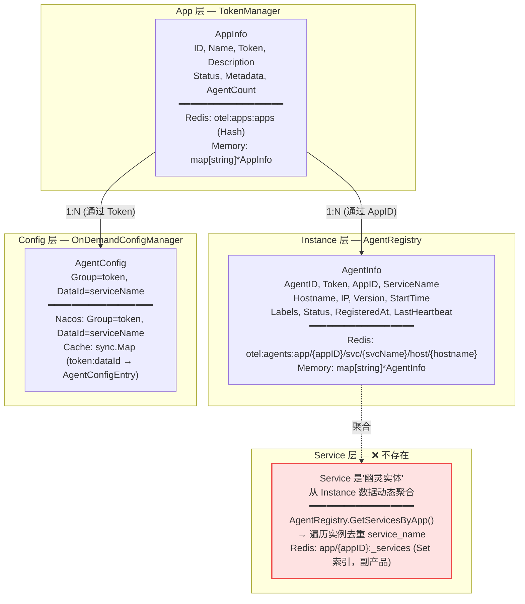
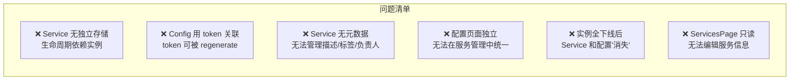
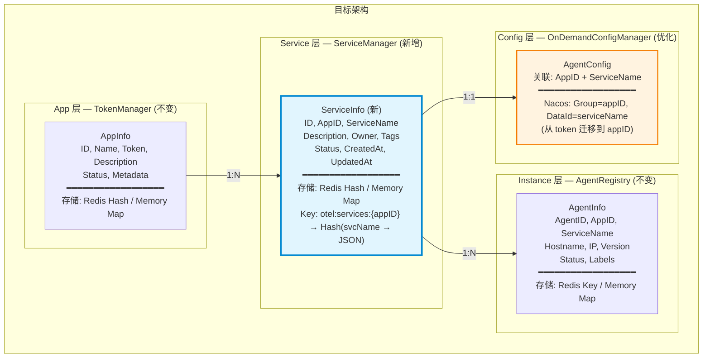
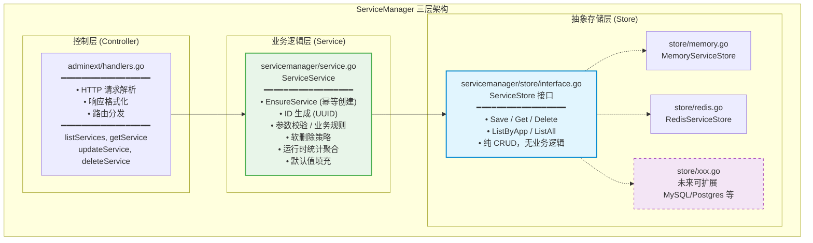
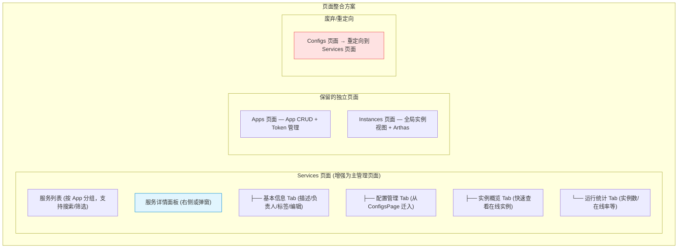
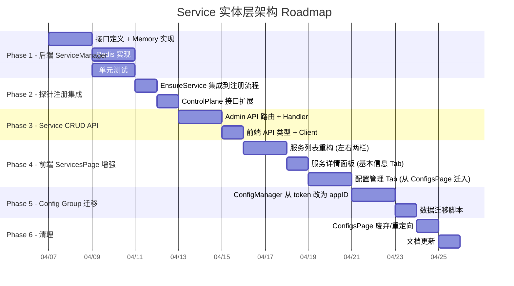
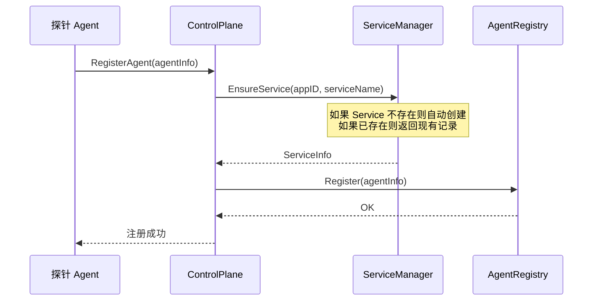
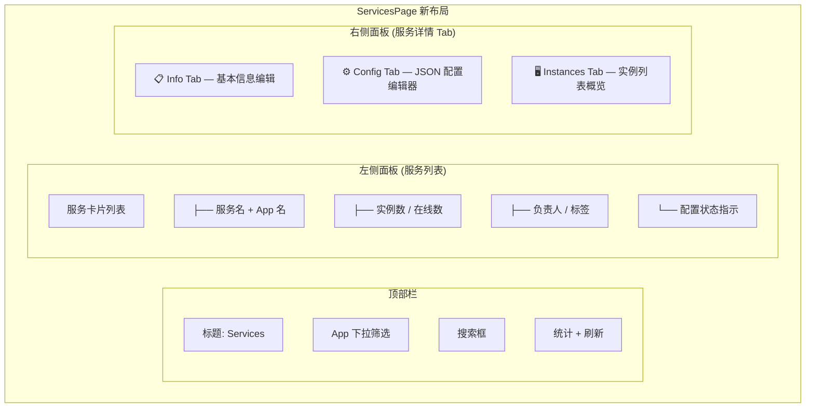
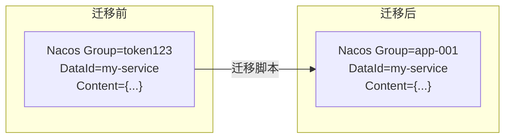

# Service 实体层架构设计 & Roadmap

## 需求背景

当前系统的业务模型是三级结构：**App → Service → Instance**，但在存储层面，Service 并不是一个独立实体，而是从 Instance 数据中动态聚合出来的"幽灵实体"。这导致了以下问题：

1. Service 没有独立的元数据（描述、负责人、标签等）
2. Service 的生命周期完全依赖实例——实例全部下线后 Service 就"消失"了
3. 配置管理（ConfigsPage）和服务管理（ServicesPage）是独立页面，但逻辑上配置应该是服务的属性
4. Config 层使用 `token` 作为 Nacos Group，与 App 层的关联是间接的（需要 `GetApp → app.Token` 转换）

## 一、现状分析

### 1.1 当前存储架构



### 1.2 当前页面结构

| 页面 | 路由 | 功能 | 数据来源 |
|------|------|------|----------|
| Dashboard | `/dashboard` | 统计概览 | `/api/v2/dashboard/overview` |
| Applications | `/apps` | App CRUD + Token 管理 | `/api/v2/apps` |
| Instances | `/instances` | 实例管理（左右两栏 + Arthas） | `/api/v2/instances` + 级联查询 |
| **Services** | `/services` | 服务卡片列表（只读） | `/api/v2/services` |
| **Configs** | `/configs` | 配置编辑器（树形导航 + JSON 编辑） | `/api/v2/apps/{id}/config/services/{name}` |
| Traces | `/traces` | 链路追踪查询 | `/api/v2/observability/traces` |
| Metrics | `/metrics` | 指标查询 | `/api/v2/observability/metrics` |

### 1.3 当前 API 结构

```
/api/v2/
├── apps/                           # App CRUD
│   ├── GET /                       # listApps (带 service_count, agent_count)
│   ├── POST /                      # createApp
│   └── {appID}/
│       ├── GET /                   # getApp
│       ├── PUT /                   # updateApp
│       ├── DELETE /                # deleteApp
│       ├── POST /token             # regenerateToken
│       ├── PUT /token              # setToken
│       ├── config/
│       │   └── services/{svcName}  # GET/PUT/DELETE 服务配置
│       ├── services/               # GET listAppServices (带 instance_count)
│       │   └── {svcName}/instances # GET listServiceInstances
│       └── instances/              # GET/POST(kick) 应用实例
├── services/                       # GET listAllServices (全局视图)
├── instances/                      # GET/POST(kick) 全局实例视图
├── tasks/                          # Task CRUD
├── dashboard/overview              # 统计概览
├── observability/                  # Trace + Metric 查询
└── arthas/                         # Arthas Tunnel
```

### 1.4 核心问题总结



## 二、目标架构

### 2.1 三层独立实体模型



### 2.2 ServiceInfo 实体设计

```go
// ServiceInfo 代表一个独立的服务实体
type ServiceInfo struct {
    ID          string            `json:"id"`           // 唯一标识 (auto-generated UUID)
    AppID       string            `json:"app_id"`       // 关联的 App ID
    ServiceName string            `json:"service_name"` // 服务名 (探针上报的)
    Description string            `json:"description"`  // 服务描述
    Owner       string            `json:"owner"`        // 负责人
    Tags        map[string]string `json:"tags"`         // 标签
    Status      string            `json:"status"`       // active / disabled / archived
    CreatedAt   time.Time         `json:"created_at"`
    UpdatedAt   time.Time         `json:"updated_at"`

    // 运行时统计 (computed, 不持久化)
    InstanceCount int  `json:"instance_count,omitempty"`
    OnlineCount   int  `json:"online_count,omitempty"`
    HasConfig     bool `json:"has_config,omitempty"`
}
```

### 2.3 三层架构设计（参照 TaskManager 最佳实践）

当前项目中 **TaskManager 是唯一已经实现三层架构的模块**，其设计模式为：

```
控制层 (Controller/Handler)  → adminext/handlers.go
业务逻辑层 (Service)         → taskmanager/service.go (TaskService)
抽象存储层 (Store)           → taskmanager/store/interface.go (TaskStore) + Memory/Redis 实现
```

而 TokenManager、AgentRegistry、ConfigManager 都是 **接口即实现** 的两层混合模式——接口定义了所有方法（包括业务逻辑），Memory 和 Redis 各自实现一遍完整的业务逻辑+存储逻辑，导致业务逻辑重复、新增存储类型需要重写业务逻辑。

**ServiceManager 必须采用 TaskManager 的三层模式**，确保存储层可灵活扩展。

#### 2.3.1 架构分层图



#### 2.3.2 各层职责划分

| 层 | 文件 | 职责 | 不应包含 |
|---|------|------|---------|
| **Controller 层** | `adminext/handlers.go` | HTTP 请求解析、参数绑定、响应格式化、路由 | 业务逻辑、直接操作存储 |
| **Service 层** | `servicemanager/service.go` | 业务逻辑：EnsureService 幂等、ID 生成、软删除、校验、统计聚合、默认值填充 | 直接操作 Redis/Memory、HTTP 相关逻辑 |
| **Store 层** | `servicemanager/store/interface.go` | 纯 CRUD 存储抽象：Save、Get、Delete、List | 业务规则、参数校验、ID 生成、状态机逻辑 |

#### 2.3.3 与现有模块的架构对比

```mermaid
graph TB
    subgraph "TaskManager ✅ 已符合三层架构"
        TH["Handler"] --> TS["TaskService<br/>(业务逻辑)"] --> TST["TaskStore 接口"]
        TST -.-> TM1["MemoryTaskStore"]
        TST -.-> TM2["RedisTaskStore"]
    end

    subgraph "ServiceManager ✅ 新增，采用三层架构"
        SH["Handler"] --> SS["ServiceService<br/>(业务逻辑)"] --> SST["ServiceStore 接口"]
        SST -.-> SM1["MemoryServiceStore"]
        SST -.-> SM2["RedisServiceStore"]
    end

    subgraph "TokenManager ❌ 两层混合 (待重构)"
        AH["Handler"] --> TI["TokenManager 接口<br/>(业务+存储混合)"]
        TI -.-> AM1["MemoryTokenManager"]
        TI -.-> AM2["RedisTokenManager"]
    end

    subgraph "AgentRegistry ❌ 两层混合 (待重构)"
        IH["Handler"] --> AI["AgentRegistry 接口<br/>(业务+存储混合)"]
        AI -.-> RM1["MemoryAgentRegistry"]
        AI -.-> RM2["RedisAgentRegistry"]
    end

    style TS fill:#e8f5e9,stroke:#4caf50,stroke-width:2px
    style TST fill:#e8f5e9,stroke:#4caf50,stroke-width:2px
    style SS fill:#e8f5e9,stroke:#4caf50,stroke-width:2px
    style SST fill:#e8f5e9,stroke:#4caf50,stroke-width:2px
    style TI fill:#fff3e0,stroke:#ff9800,stroke-width:2px
    style AI fill:#fff3e0,stroke:#ff9800,stroke-width:2px
```



#### 2.3.4 目录结构设计

```
controlplaneext/servicemanager/
├── interface.go              # ServiceManager 接口（业务层对外暴露的接口）
├── types.go                  # ServiceInfo, CreateServiceRequest, UpdateServiceRequest 等类型定义
├── service.go                # ServiceService（业务逻辑层实现，持有 store.ServiceStore 引用）
├── factory.go                # 工厂方法（根据 config 创建 Store → 注入 Service）
└── store/
    ├── interface.go          # ServiceStore 接口（纯存储抽象，只有 CRUD）
    ├── memory.go             # Memory 实现
    ├── memory_test.go        # Memory 实现单元测试
    ├── redis.go              # Redis 实现
    └── redis_test.go         # Redis 实现集成测试
```

#### 2.3.5 Store 层接口设计（纯存储抽象）

```go
// store/interface.go
package store

import "context"

// ServiceStore 定义 Service 的纯存储抽象。
// 实现只负责持久化和查询，不包含任何业务逻辑（如 ID 生成、幂等判断、校验等）。
// 新增存储后端（如 MySQL、Postgres）只需实现此接口即可。
type ServiceStore interface {
    // Save 持久化一个 ServiceInfo（新增或覆盖）
    Save(ctx context.Context, svc *ServiceInfo) error

    // Get 根据 (appID, serviceName) 获取单个 Service
    // 不存在时返回 (nil, nil)
    Get(ctx context.Context, appID, serviceName string) (*ServiceInfo, error)

    // GetByID 根据 serviceID (UUID) 获取单个 Service
    // 不存在时返回 (nil, nil)
    GetByID(ctx context.Context, serviceID string) (*ServiceInfo, error)

    // Delete 根据 (appID, serviceName) 删除一个 Service
    Delete(ctx context.Context, appID, serviceName string) error

    // ListByApp 列出指定 App 下的所有 Service
    ListByApp(ctx context.Context, appID string) ([]*ServiceInfo, error)

    // ListAll 列出所有 Service
    ListAll(ctx context.Context) ([]*ServiceInfo, error)

    // Start 初始化存储（如建立连接、创建索引等）
    Start(ctx context.Context) error

    // Close 释放资源
    Close() error
}

// ServiceInfo 是 Store 层的数据模型（与业务层共享，定义在 types.go 中）
// 此处仅为接口引用，实际定义在 servicemanager/types.go
```

#### 2.3.6 Service 层接口设计（业务逻辑）

```go
// interface.go
package servicemanager

import "context"

// ServiceManager 定义 Service 的业务层接口。
// 包含业务逻辑：幂等创建、ID 生成、参数校验、软删除策略等。
// 由 ServiceService 实现，内部持有 store.ServiceStore 引用。
type ServiceManager interface {
    // CRUD（包含业务逻辑：ID 生成、校验、默认值填充等）
    CreateService(ctx context.Context, req *CreateServiceRequest) (*ServiceInfo, error)
    GetService(ctx context.Context, appID, serviceName string) (*ServiceInfo, error)
    GetServiceByID(ctx context.Context, serviceID string) (*ServiceInfo, error)
    UpdateService(ctx context.Context, appID, serviceName string, req *UpdateServiceRequest) (*ServiceInfo, error)
    DeleteService(ctx context.Context, appID, serviceName string) error

    // 查询
    ListServicesByApp(ctx context.Context, appID string) ([]*ServiceInfo, error)
    ListAllServices(ctx context.Context) ([]*ServiceInfo, error)

    // 自动注册（业务逻辑：幂等创建，探针首次上报时自动创建）
    EnsureService(ctx context.Context, appID, serviceName string) (*ServiceInfo, error)

    // 生命周期
    Start(ctx context.Context) error
    Close() error
}
```

#### 2.3.7 Service 层实现设计（业务逻辑层）

```go
// service.go
package servicemanager

import (
    "context"
    "go.uber.org/zap"
    "go.opentelemetry.io/collector/custom/extension/controlplaneext/servicemanager/store"
)

// ServiceService 提供 Service 的业务逻辑操作。
// 封装了业务规则（幂等创建、ID 生成、校验等），通过 store.ServiceStore 进行持久化。
// 参照 TaskManager 的 TaskService 设计模式。
type ServiceService struct {
    logger *zap.Logger
    config Config
    store  store.ServiceStore  // 抽象存储层引用
}

// NewServiceService 创建 ServiceService，注入 Store 依赖。
func NewServiceService(logger *zap.Logger, config Config, serviceStore store.ServiceStore) *ServiceService {
    return &ServiceService{
        logger: logger,
        config: config,
        store:  serviceStore,
    }
}

// EnsureService 是核心业务逻辑：幂等创建 Service。
// 1. 先查询 Store 中是否存在
// 2. 不存在则生成 UUID、填充默认值（业务逻辑）
// 3. 调用 Store.Save 持久化
func (s *ServiceService) EnsureService(ctx context.Context, appID, serviceName string) (*ServiceInfo, error) {
    // 先查询是否已存在
    existing, err := s.store.Get(ctx, appID, serviceName)
    if err != nil {
        return nil, err
    }
    if existing != nil {
        return existing, nil // 幂等：已存在直接返回
    }

    // 不存在，创建新 Service（业务逻辑：ID 生成、默认值填充）
    svc := &ServiceInfo{
        ID:          generateUUID(),       // 业务逻辑：ID 生成
        AppID:       appID,
        ServiceName: serviceName,
        Status:      "active",             // 业务逻辑：默认状态
        CreatedAt:   time.Now(),
        UpdatedAt:   time.Now(),
    }

    if err := s.store.Save(ctx, svc); err != nil {
        return nil, err
    }
    return svc, nil
}
```

#### 2.3.8 工厂方法设计

```go
// factory.go
package servicemanager

import (
    "errors"
    "github.com/redis/go-redis/v9"
    "go.uber.org/zap"
    "go.opentelemetry.io/collector/custom/extension/controlplaneext/servicemanager/store"
)

// RedisClient 类型别名，避免外部直接依赖 go-redis
type RedisClient = redis.UniversalClient

// NewServiceManager 根据配置创建 ServiceManager。
// 参照 TaskManager 的工厂模式：根据 config.Type 创建对应 Store → 注入 ServiceService。
func NewServiceManager(logger *zap.Logger, config Config, redisClient RedisClient) (ServiceManager, error) {
    var serviceStore store.ServiceStore

    switch config.Type {
    case "memory", "":
        serviceStore = store.NewMemoryServiceStore(logger.Named("store"))

    case "redis":
        if redisClient == nil {
            return nil, errors.New("redis client is required for redis service manager")
        }
        serviceStore = store.NewRedisServiceStore(logger.Named("store"), redisClient, config.KeyPrefix)

    default:
        return nil, errors.New("unsupported service manager type: " + config.Type)
    }

    return NewServiceService(logger.Named("service"), config, serviceStore), nil
}
```

### 2.4 Redis 存储设计

```
# Service 存储 Key 结构
otel:services:{appID}                → Hash (serviceName → ServiceInfo JSON)
otel:services:_index                  → Hash (serviceID → "appID:serviceName")

# 示例
otel:services:app-001                → {
    "my-service": '{"id":"svc-001","app_id":"app-001","service_name":"my-service",...}',
    "another-svc": '{"id":"svc-002","app_id":"app-001","service_name":"another-svc",...}'
}
otel:services:_index                 → {
    "svc-001": "app-001:my-service",
    "svc-002": "app-001:another-svc"
}
```

### 2.5 页面整合设计



## 三、Roadmap

### 总览



---

### Phase 1：后端 ServiceManager 模块

**目标**：新增独立的 `ServiceManager` 接口及 Memory/Redis 实现，为 Service 提供独立的 CRUD 存储。

**涉及文件**：

| 文件 | 操作 | 层 | 说明 |
|------|------|---|------|
| `controlplaneext/servicemanager/types.go` | 新建 | 共享 | ServiceInfo, CreateServiceRequest, UpdateServiceRequest 等类型定义 |
| `controlplaneext/servicemanager/interface.go` | 新建 | 业务层 | ServiceManager 接口（对外暴露的业务接口） |
| `controlplaneext/servicemanager/service.go` | 新建 | 业务层 | ServiceService 实现（业务逻辑：幂等、ID 生成、校验等） |
| `controlplaneext/servicemanager/factory.go` | 新建 | 工厂 | 根据 config 创建 Store → 注入 ServiceService |
| `controlplaneext/servicemanager/store/interface.go` | 新建 | 存储层 | ServiceStore 接口（纯 CRUD 抽象） |
| `controlplaneext/servicemanager/store/memory.go` | 新建 | 存储层 | Memory 实现 |
| `controlplaneext/servicemanager/store/memory_test.go` | 新建 | 存储层 | Memory 实现单元测试 |
| `controlplaneext/servicemanager/store/redis.go` | 新建 | 存储层 | Redis 实现 |
| `controlplaneext/servicemanager/store/redis_test.go` | 新建 | 存储层 | Redis 实现集成测试 |
| `controlplaneext/servicemanager/service_test.go` | 新建 | 业务层 | ServiceService 业务逻辑单元测试 |
| `controlplaneext/component_factory.go` | 修改 | 工厂 | 新增 `CreateServiceManager` 方法 |
| `controlplaneext/config.go` | 修改 | 配置 | 新增 `ServiceManager` 配置段 |

**预期效果**：
- ✅ 三层架构清晰分离：Store 层纯 CRUD → Service 层业务逻辑 → Controller 层 HTTP 处理
- ✅ `ServiceStore` 接口定义完成，纯存储抽象，不包含任何业务逻辑
- ✅ `ServiceService` 实现完成，封装 EnsureService 幂等、ID 生成、校验等业务逻辑
- ✅ Memory 实现通过全部单元测试（Store 层 + Service 层）
- ✅ Redis 实现通过全部单元测试（Store 层 + Service 层）
- ✅ 工厂方法 `NewServiceManager()` 可根据配置创建对应 Store 并注入 ServiceService
- ✅ `ComponentFactory.CreateServiceManager()` 集成完成
- ✅ 新增存储后端只需实现 `ServiceStore` 接口，无需重写业务逻辑
- ✅ 编译通过 (`go build ./...`)

---

### Phase 2：探针注册集成

**目标**：在探针注册/心跳流程中自动调用 `EnsureService`，确保探针首次上报时自动创建 Service 实体。

**涉及文件**：

| 文件 | 操作 | 说明 |
|------|------|------|
| `controlplaneext/extension.go` | 修改 | 新增 `serviceMgr` 字段，Start 时初始化 |
| `controlplaneext/extension.go` | 修改 | `RegisterAgent` / `RegisterOrHeartbeatAgent` 中调用 `EnsureService` |
| `controlplaneext/extension.go` | 修改 | 新增 `GetServiceManager()` 访问方法 |

**流程变更**：



**预期效果**：
- ✅ 探针首次上报时，Service 实体自动创建并持久化
- ✅ 后续相同 `(appID, serviceName)` 的探针注册不会重复创建
- ✅ 实例全部下线后，Service 实体仍然存在（不再"消失"）
- ✅ `ControlPlane.GetServiceManager()` 可被 Admin 扩展访问
- ✅ 编译通过

---

### Phase 3：Service CRUD API

**目标**：在 Admin API 中新增 Service 的 CRUD 端点，前端 API 客户端同步更新。

**涉及文件**：

| 文件 | 操作 | 说明 |
|------|------|------|
| `adminext/handlers.go` | 修改 | 新增 Service handler 方法 |
| `adminext/router.go` | 修改 | 新增 Service 路由 |
| `adminext/extension.go` | 修改 | 新增 `serviceMgr` 字段引用 |
| `webui-react/src/types/api.ts` | 修改 | 新增 `ServiceDetail` 类型 |
| `webui-react/src/api/client.ts` | 修改 | 新增 Service CRUD API 方法 |

**新增 API 端点**：

```
/api/v2/apps/{appID}/
├── services/                       # GET listAppServices (增强：返回 ServiceInfo)
│   └── {serviceName}/
│       ├── GET /                   # getService (服务详情)
│       ├── PUT /                   # updateService (编辑元数据)
│       ├── DELETE /                # deleteService
│       └── instances/              # GET (已有)

/api/v2/services/                   # GET listAllServices (增强：返回 ServiceInfo)
```

**预期效果**：
- ✅ `GET /api/v2/apps/{appID}/services` 返回带元数据的 ServiceInfo 列表
- ✅ `GET /api/v2/apps/{appID}/services/{svcName}` 返回单个 ServiceInfo 详情
- ✅ `PUT /api/v2/apps/{appID}/services/{svcName}` 可编辑服务描述/负责人/标签
- ✅ `DELETE /api/v2/apps/{appID}/services/{svcName}` 可删除服务（级联删除配置？待定）
- ✅ `GET /api/v2/services` 全局服务列表返回增强数据
- ✅ 前端 `apiClient` 新增对应方法
- ✅ 编译通过（Go + TypeScript）

---

### Phase 4：前端 ServicesPage 增强

**目标**：将 ServicesPage 从只读卡片列表重构为功能完整的服务管理页面，整合配置管理功能。

**涉及文件**：

| 文件 | 操作 | 说明 |
|------|------|------|
| `webui-react/src/pages/ServicesPage.tsx` | 重写 | 左右两栏布局 + 多 Tab 详情面板 |
| `webui-react/src/components/ServiceConfigTab.tsx` | 新建 | 配置管理 Tab（从 ConfigsPage 提取） |
| `webui-react/src/components/ServiceInfoTab.tsx` | 新建 | 基本信息 Tab（编辑描述/负责人/标签） |
| `webui-react/src/components/ServiceInstancesTab.tsx` | 新建 | 实例概览 Tab |
| `webui-react/src/types/api.ts` | 修改 | 更新 Service 类型定义 |

**页面布局**：



**预期效果**：
- ✅ ServicesPage 重构为左右两栏布局，左侧服务列表 + 右侧详情面板
- ✅ Info Tab：可编辑服务描述、负责人、标签
- ✅ Config Tab：完整的 JSON 配置编辑器（从 ConfigsPage 迁入），支持模板推荐、缺失字段检测
- ✅ Instances Tab：快速查看该服务下的实例列表和状态
- ✅ 支持按 App 筛选服务
- ✅ TypeScript 编译通过

---

### Phase 5：Config Group 迁移（可选，高风险）

**目标**：将 Nacos 配置的 Group 从 `token` 迁移为 `appID`，使配置关联更稳定（token 可能被 regenerate）。

> ⚠️ **注意**：此阶段涉及数据迁移，需要谨慎评估。如果当前 token 不会频繁 regenerate，可以推迟此阶段。

**涉及文件**：

| 文件 | 操作 | 说明 |
|------|------|------|
| `configmanager/on_demand.go` | 修改 | Group 参数从 token 改为 appID |
| `configmanager/interface.go` | 修改 | 接口签名中 token 参数改为 appID |
| `adminext/handlers.go` | 修改 | Config handler 不再需要 token 转换 |
| 迁移脚本 | 新建 | 将 Nacos 中旧 Group(token) 的配置迁移到新 Group(appID) |

**迁移策略**：



**预期效果**：
- ✅ ConfigManager 接口使用 `appID` 替代 `token` 作为 Group
- ✅ 现有配置数据完整迁移到新 Group
- ✅ Token regenerate 不再影响配置关联
- ✅ 编译通过 + 集成测试通过

---

### Phase 6：清理

**目标**：废弃独立的 ConfigsPage，清理冗余代码。

**涉及文件**：

| 文件 | 操作 | 说明 |
|------|------|------|
| `webui-react/src/pages/ConfigsPage.tsx` | 修改 | 替换为重定向到 ServicesPage |
| `webui-react/src/App.tsx` | 修改 | Configs 路由重定向到 Services |
| `webui-react/src/layouts/Sidebar.tsx` | 修改 | 移除或标记 Configs 导航项 |

**预期效果**：
- ✅ 访问 `/configs` 自动重定向到 `/services`
- ✅ 侧边栏 Configs 入口移除（或显示为 "→ Services" 的重定向提示）
- ✅ 配置管理功能完全整合到 ServicesPage 的 Config Tab 中
- ✅ 无死链接，无 404 页面

---

## 四、关键设计决策

| 决策点 | 方案 | 理由 |
|--------|------|------|
| **Service 唯一键** | `(appID, serviceName)` 作为业务唯一键 + `serviceID` (UUID) 用于 API | 业务上 serviceName 在 App 内唯一，UUID 方便 API 路由 |
| **自动创建 vs 手动创建** | 自动创建 + 手动管理 | 探针首次上报时自动创建，管理员后续可编辑元数据 |
| **Service 删除策略** | 软删除 (status=archived) | 避免误删导致配置丢失，archived 的 Service 不在列表中显示 |
| **Config Group 迁移时机** | Phase 5 可选，推迟到有实际需求时 | 当前 token regenerate 不频繁，迁移有数据风险 |
| **ConfigsPage 处理** | 重定向到 ServicesPage | 保持 URL 兼容性，避免用户书签失效 |
| **AgentRegistry 兼容** | 保留现有 `GetServicesByApp()` 等方法 | 向后兼容，内部可改为查询 ServiceManager |

## 五、风险评估

| 风险 | 等级 | 缓解措施 |
|------|------|----------|
| Phase 5 数据迁移可能丢失配置 | 🔴 高 | 迁移前备份 Nacos 数据；提供回滚脚本；可推迟此阶段 |
| ServiceManager 与 AgentRegistry 数据不一致 | 🟡 中 | `EnsureService` 使用幂等设计；定期同步检查 |
| 前端 ServicesPage 重构影响面大 | 🟡 中 | 分步实施：先 Info Tab，再 Config Tab，最后 Instances Tab |
| Config 接口签名变更影响探针端 | 🟡 中 | Phase 5 需要同步更新探针端的 config 注册逻辑 |

## 六、实施进展

### Phase 1：后端 ServiceManager 模块（三层架构）
- [ ] 类型定义 (`servicemanager/types.go`)
- [ ] Store 层接口 (`servicemanager/store/interface.go`)
- [ ] Store 层 Memory 实现 (`servicemanager/store/memory.go`)
- [ ] Store 层 Memory 单元测试 (`servicemanager/store/memory_test.go`)
- [ ] Store 层 Redis 实现 (`servicemanager/store/redis.go`)
- [ ] Store 层 Redis 集成测试 (`servicemanager/store/redis_test.go`)
- [ ] Service 层接口 (`servicemanager/interface.go`)
- [ ] Service 层实现 (`servicemanager/service.go`)
- [ ] Service 层单元测试 (`servicemanager/service_test.go`)
- [ ] 工厂方法 (`servicemanager/factory.go`)
- [ ] ComponentFactory 集成
- [ ] 编译验证

### Phase 2：探针注册集成
- [ ] Extension 新增 serviceMgr 字段
- [ ] RegisterAgent 中调用 EnsureService
- [ ] RegisterOrHeartbeatAgent 中调用 EnsureService
- [ ] GetServiceManager() 访问方法
- [ ] 编译验证

### Phase 3：Service CRUD API
- [ ] Admin handler 新增 Service 方法
- [ ] Router 新增 Service 路由
- [ ] 前端 API 类型更新
- [ ] 前端 API Client 更新
- [ ] 编译验证 (Go + TypeScript)

### Phase 4：前端 ServicesPage 增强
- [ ] ServicesPage 左右两栏布局重构
- [ ] ServiceInfoTab 组件 (基本信息编辑)
- [ ] ServiceConfigTab 组件 (配置编辑器迁入)
- [ ] ServiceInstancesTab 组件 (实例概览)
- [ ] TypeScript 编译验证

### Phase 5：Config Group 迁移 (可选)
- [ ] ConfigManager 接口签名变更
- [ ] on_demand.go 实现变更
- [ ] 数据迁移脚本
- [ ] 集成测试

### Phase 6：清理
- [ ] ConfigsPage 重定向
- [ ] Sidebar 导航更新
- [ ] 文档更新

## 遗留问题

- [ ] Phase 5 是否在当前迭代实施，取决于 token regenerate 的频率评估
- [ ] Service 删除时是否级联删除 Nacos 中的配置，需要进一步讨论
- [ ] 是否需要 Service 级别的权限控制（不同用户管理不同 Service）
- [ ] Dashboard 页面是否需要新增 Service 维度的统计卡片
- [ ] **架构演进**：TokenManager、AgentRegistry、ConfigManager 目前是两层混合架构（接口即实现），后续可参照 ServiceManager/TaskManager 的三层模式逐步重构，使存储层可灵活扩展
