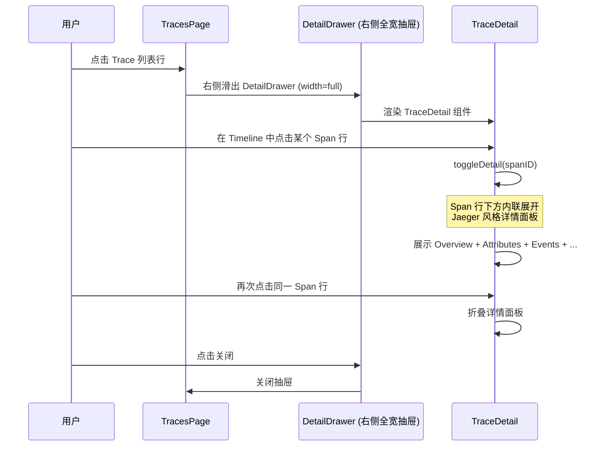
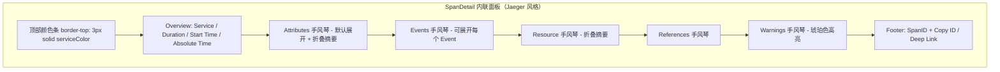

# Trace 页面优化

## 需求描述

优化 Trace 页面的详情展示方式，分两个层级：

### 第一层：Trace Detail 展示方式
- **原方案**：点击 Trace 列表行 → Modal 居中弹窗展示 TraceDetail
- **优化方案**：点击 Trace 列表行 → **右侧抽屉**（DetailDrawer）滑出展示 TraceDetail ✅

### 第二层：Span Detail 展示方式
- **方案**：和 Jaeger 保持一致，点击 Span 行后**内联展开/折叠**显示详情面板
- 详情面板采用 Jaeger 风格设计（颜色条 + Overview + Accordion 手风琴区域）

## 设计方案

### 交互流程

### Span 内联详情面板结构

### 设计亮点（参考 Jaeger）

- 顶部带服务颜色条（`border-top: 3px solid {color}`）
- Overview 使用 LabeledList 横排展示（Service / Duration / Start Time / Absolute Time）
- Attributes 折叠摘要（折叠时显示 `key=value` 摘要标签列表）
- KeyValueTable 带 hover 复制按钮
- Events 支持相对时间戳显示，每个 Event 可独立展开/折叠
- 长文本值支持 Show more / Show less 展开折叠
- 底部 Debug Info（SpanID + Copy ID / Copy Deep Link 按钮）

## 实施进展

- [x] 创建需求文档
- [x] 修改 TracesPage.tsx：Trace Detail 从 Modal 弹窗改为 DetailDrawer 右侧抽屉
- [x] 修改 TraceDetail.tsx：Span 点击采用 Jaeger 风格内联展开/折叠模式
- [x] 删除 SpanDetailDrawer.tsx（不再需要独立抽屉组件）
- [x] 编译验证通过（TypeScript 无错误）
- [x] 更新文档

## 变更文件清单

| 文件 | 变更类型 | 说明 |
|------|----------|------|
| `src/pages/TracesPage.tsx` | **修改** | 将 `<Modal>` 替换为 `<DetailDrawer width="full">`，Trace Detail 改为右侧抽屉展示 |
| `src/components/TraceDetail.tsx` | **修改** | Span 点击采用 Jaeger 风格内联展开/折叠；新增 SpanDetail/AccordionSection/TagsSummary/KeyValueTable/TagValue/LongValueDisplay/EventsList 等子组件 |
| `src/components/SpanDetailDrawer.tsx` | **删除** | 不再需要独立抽屉组件 |
| `docs/span-detail-drawer.md` | **新建** | 需求文档 |

## 遗留问题

（暂无）
