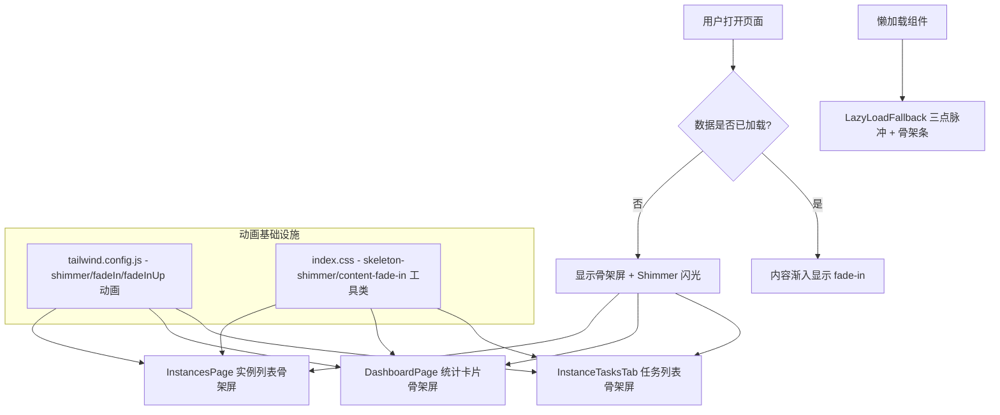
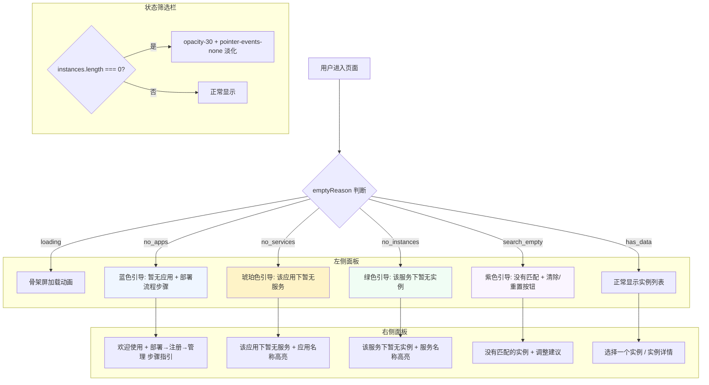
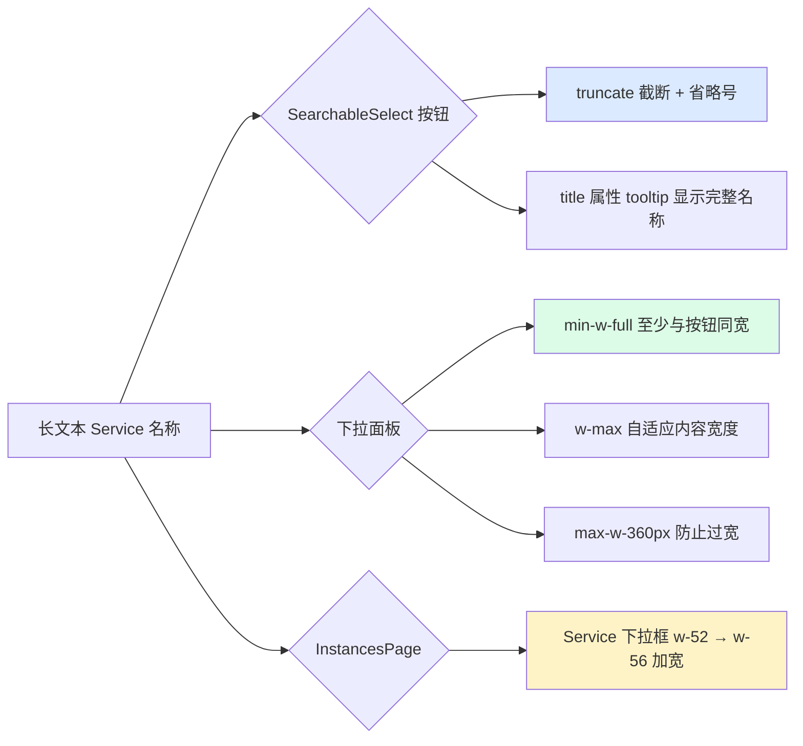

# 加载动画优化需求文档

## 需求描述

优化数据加载时页面的动画效果，提升美感和用户体验。

### 核心目标
- 用**骨架屏（Skeleton）**替代简单的 spinner 加载
- 数据加载完成后内容**渐入过渡**
- 升级 **LazyLoadFallback** 组件的加载动画
- 添加 **shimmer 闪光**效果提升骨架屏质感

## 架构设计

## 涉及文件

| 文件 | 改动说明 | 状态 |
|------|----------|------|
| `tailwind.config.js` | 添加 shimmer / fadeIn / fadeInUp 动画配置 | ✅ 已完成 |
| `src/index.css` | 添加 skeleton-shimmer / content-fade-in 工具类 | ✅ 已完成 |
| `src/pages/InstancesPage.tsx` | 实例列表骨架屏（6行占位）+ 内容渐入 | ✅ 已完成 |
| `src/components/InstanceTasksTab.tsx` | 任务列表骨架屏（4行占位）+ 内容渐入 | ✅ 已完成 |
| `src/pages/DashboardPage.tsx` | 统计卡片骨架屏（4卡占位）+ 内容渐入 | ✅ 已完成 |
| `src/components/LazyLoadFallback.tsx` | 三点脉冲动画 + 骨架占位条 | ✅ 已完成 |

## 实施进展

### 2026-04-04
- [x] 创建需求文档
- [x] 实施 tailwind.config.js 动画配置（shimmer / fadeIn / fadeInUp）
- [x] 实施 index.css shimmer keyframes + 工具类
- [x] 实施 InstancesPage 骨架屏（6行实例占位 + content-fade-in）
- [x] 实施 InstanceTasksTab 骨架屏（4行任务占位 + content-fade-in）
- [x] 实施 DashboardPage 骨架屏（4卡片占位 + content-fade-in）
- [x] 实施 LazyLoadFallback 升级（三点脉冲 + 骨架条）
- [x] 编译验证通过（tsc --noEmit 零错误）

---

# 实例管理页面级联查询空状态优化

## 需求描述

优化实例管理页面在级联查询（App → Service → Instance）过程中的空状态展示，根据不同的级联阶段显示差异化的引导提示，提升用户体验。

### 核心问题
- 空状态缺乏引导：只显示 "No instances found"，不区分原因
- 右侧大面积空白：未选中实例时只有小图标，空间浪费
- 级联状态不明确：用户不清楚是"无 App"还是"无 Service"还是"无实例"
- 状态筛选栏噪音：全是 0 的筛选栏没有实际意义

## 架构设计

## 涉及文件

| 文件 | 改动说明 | 状态 |
|------|----------|------|
| `src/pages/InstancesPage.tsx` | 新增 `emptyReason` 状态判断 + 左侧分层空状态 + 右侧上下文引导 + 筛选栏淡化 | ✅ 已完成 |

## 实施进展

### 2026-04-04
- [x] 新增 `EmptyReason` 类型和 `emptyReason` 计算属性（loading / no_apps / no_services / no_instances / search_empty / has_data）
- [x] 左侧面板：5 种空状态分层引导（骨架屏 / 无App / 无Service / 无实例 / 搜索无结果），各带独立图标和配色
- [x] 左侧面板：搜索无结果时提供"清除搜索"和"重置筛选"快捷按钮
- [x] 右侧面板：5 种上下文引导卡片（欢迎+步骤指引 / 无服务 / 无实例 / 搜索无结果 / 选择实例）
- [x] 右侧面板：无 App 时显示"部署应用 → 自动注册 → 开始管理"三步引导流程
- [x] 状态筛选栏：实例为空时 opacity-30 + pointer-events-none 淡化处理
- [x] 编译验证通过（tsc --noEmit 零错误）

## 遗留问题

暂无

---

# SearchableSelect 下拉框长文本溢出优化

## 需求描述

优化 SearchableSelect 组件在 Service 名称较长时（如 `test-java-delivery-service`）的显示问题，避免文本换行撑高按钮，破坏顶部栏对齐。

### 核心问题
- 选择器按钮文本无截断：长名称导致文本换行，按钮高度被撑大
- 下拉面板宽度受限：面板与按钮同宽，长选项显示不完整
- Service 下拉框宽度偏窄：`w-52`（208px）不够容纳常见的长服务名

## 架构设计

## 涉及文件

| 文件 | 改动说明 | 状态 |
|------|----------|------|
| `src/components/SearchableSelect.tsx` | 按钮文本 truncate + title tooltip + 下拉面板 min-w-full/w-max/max-w | ✅ 已完成 |
| `src/pages/InstancesPage.tsx` | Service 下拉框 `w-52` → `w-56` | ✅ 已完成 |

## 实施进展

### 2026-04-04
- [x] 按钮 `` 添加 `truncate` 类，超长文本显示省略号
- [x] 按钮添加 `title={selectedLabel}` 属性，鼠标悬停显示完整名称
- [x] 下拉面板从 `w-full` 改为 `min-w-full w-max max-w-[360px]`，自适应内容宽度
- [x] Service 下拉框从 `w-52`（208px）加宽到 `w-56`（224px）
- [x] 编译验证通过（tsc --noEmit 零错误）

## 遗留问题

暂无
