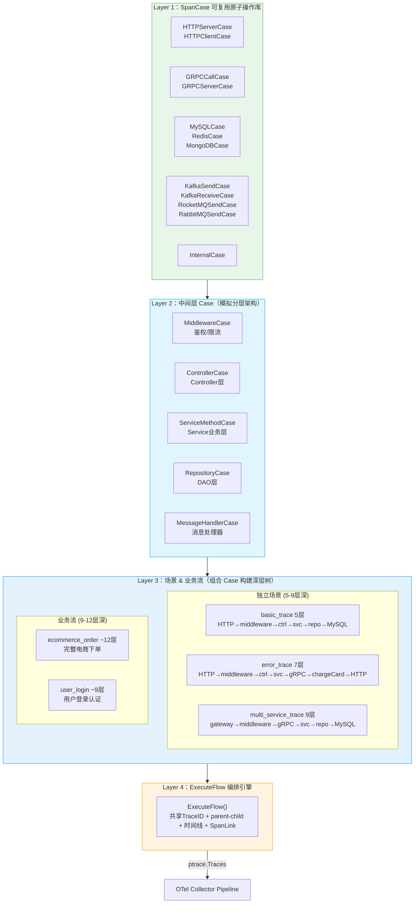
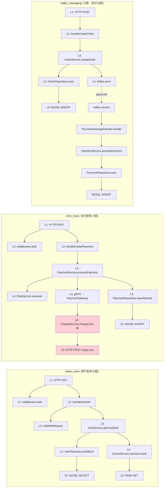
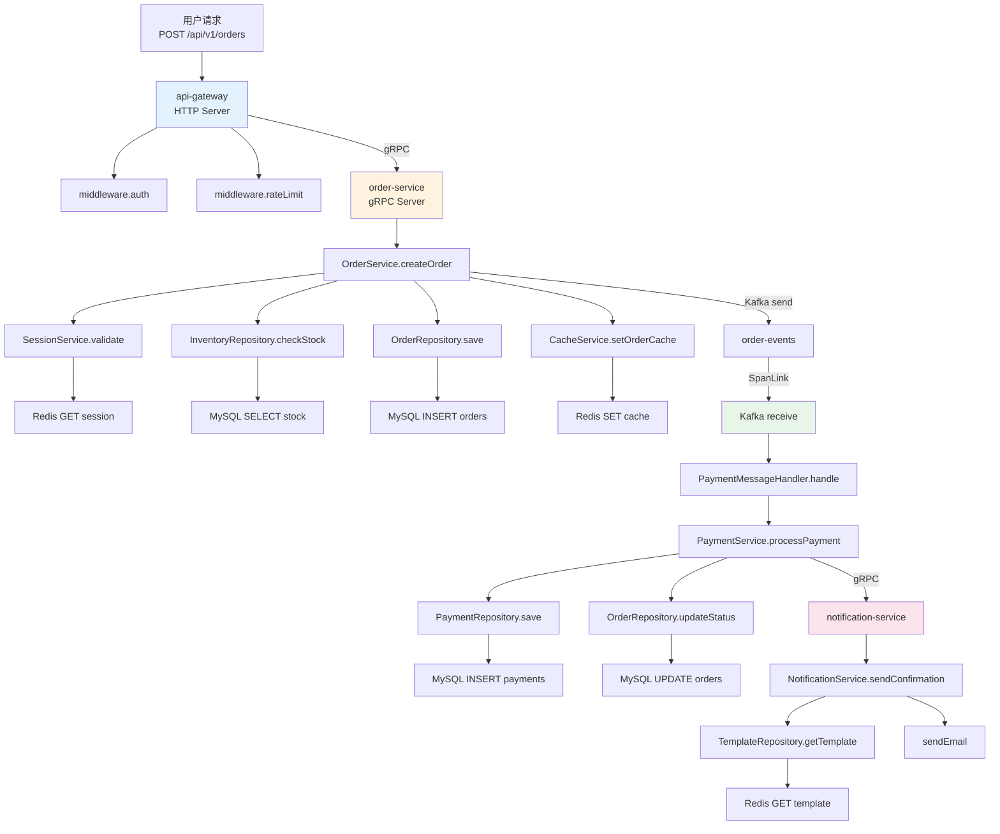
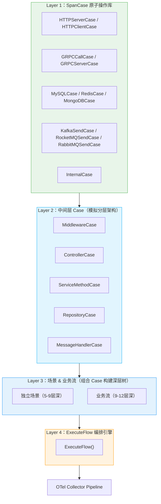
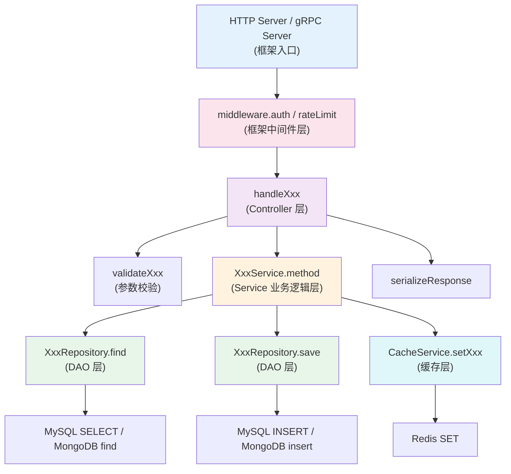

# TestDataGen Receiver 需求与实施进展

## 需求概述

构建一个专门用于**生成测试数据**的 Receiver，核心诉求：
- **数据类型**：支持 Trace 和 Metric
- **数据目标**：通过 Exporter 上报到多个不同后端
- **场景支持**：多种测试场景（正常链路、异常链路、消息队列、数据库调用等）
- **业务流支持**：模拟真实微服务调用链，一条 Trace 跨越多个服务
- **可复用 Case**：通过 SpanCase 原子操作用例，灵活组合业务调用场景
- **灵活性**：可灵活搭配、启停（YAML 配置中每个场景有 `enabled` 开关）
- **代码质量**：高内聚低耦合、健壮性、可扩展性

## 设计原则

- **SRP** (单一职责): Receiver 只负责调度，场景只负责定义数据逻辑
- **OCP** (开闭原则): 新增场景/业务流只需实现接口并注册，无需修改核心代码
- **DIP** (依赖倒置): 核心代码依赖 Scenario / BusinessFlow 接口，不依赖具体实现
- **策略模式 + 注册表模式**: 实现灵活扩展

## 架构设计

### 四层架构：SpanCase → 中间层 Case → Scenario/Flow → ExecuteFlow



### 各独立场景模拟的业务流程（Phase 4 加深后）



### Business Flow 调用链示例（电商下单，Phase 4 加深后）



**关键特性：**
- ✅ **共享 TraceID**：整条链路所有 span 共享同一个 TraceID
- ✅ **parent-child 关系**：自动编排，如 MySQL span 的 parent 是 order-service 的 internal span
- ✅ **消息队列 SpanLink**：Kafka consumer span 通过 SpanLink 关联 producer span（异步场景）
- ✅ **因果时间线**：child span 的时间严格在 parent 内部
- ✅ **丰富的 Resource 属性**：host.name, k8s.pod.name, deployment.environment 等
- ✅ **真实 Scope Name**：`io.opentelemetry.grpc-1.28`, `io.opentelemetry.jdbc-1.28` 等
- ✅ **动态业务数据**：每次生成不同的 orderID, userID, paymentID 等
- ✅ **可复用 SpanCase**：所有场景和业务流共用同一套原子操作 Case

## 目录结构

```
receiver/testdatagenreceiver/
├── PROGRESS.md                        # 本文档
├── config.go                          # 配置定义（支持 scenarios + flows）
├── factory.go                         # Factory
├── receiver.go                        # Receiver 主体 + 调度器（支持双模式）
├── scenario.go                        # Scenario 接口 + BaseScenario
├── scenario_registry.go               # 场景 + 业务流注册中心
├── business_flow.go                   # BusinessFlow 接口 + ExecuteFlow 编排引擎
├── span_cases.go                      # ★ SpanCase 可复用原子操作库
├── flow_ecommerce_order.go            # 电商下单业务流（使用 Case）
├── flow_user_login.go                 # 用户登录业务流（使用 Case）
├── helpers.go                         # 工具函数
├── testdata/
│   └── config-example.yaml            # 完整配置示例
├── scenarios/
│   ├── basic_trace.go                 # 基础链路：HTTP→MySQL→Redis
│   ├── error_trace.go                 # 异常链路：HTTP→gRPC(error)→MySQL
│   ├── multi_service_trace.go         # 多服务调用链：gateway→order→(inventory+payment+notification)
│   ├── basic_metric.go               # 基础指标（Gauge/Sum/Histogram）
│   ├── kafka_messaging.go            # Kafka：order→Kafka→payment
│   ├── rocketmq_messaging.go         # RocketMQ：payment→RocketMQ→account
│   ├── rabbitmq_messaging.go         # RabbitMQ：order→RabbitMQ→notification
│   ├── mysql_database.go             # MySQL CRUD：user-service
│   ├── redis_database.go             # Redis Cache-Aside：product-service
│   └── mongodb_database.go           # MongoDB：content-service 文章管理
```

## 实施进展

### Phase 1：基础框架（已完成）

| 序号 | 任务 | 状态 |
|------|------|------|
| 1 | 创建需求文档 | ✅ 完成 |
| 2 | config.go - 配置定义 | ✅ 完成 |
| 3 | scenario.go - Scenario 接口 + BaseScenario | ✅ 完成 |
| 4 | scenario_registry.go - 场景注册中心 | ✅ 完成 |
| 5 | helpers.go - 工具函数 | ✅ 完成 |
| 6 | receiver.go - Receiver 主体 + 调度器 | ✅ 完成 |
| 7 | factory.go - Factory | ✅ 完成 |

### Phase 2：Business Flow 编排引擎（已完成）

| 序号 | 任务 | 状态 |
|------|------|------|
| 8 | business_flow.go - BusinessFlow 接口 + ExecuteFlow 编排引擎 | ✅ 完成 |
| 9 | flow_ecommerce_order.go - 电商下单业务流 | ✅ 完成 |
| 10 | flow_user_login.go - 用户登录业务流 | ✅ 完成 |

### Phase 3：SpanCase + 全场景改造（已完成）

| 序号 | 任务 | 状态 |
|------|------|------|
| 11 | span_cases.go - 可复用 SpanCase 原子操作库 | ✅ 完成 |
| 12 | basic_trace.go 改造 - HTTP→MySQL→Redis | ✅ 完成 |
| 13 | error_trace.go 改造 - HTTP→gRPC(error)→MySQL | ✅ 完成 |
| 14 | multi_service_trace.go 改造 - 多服务扇出调用 | ✅ 完成 |
| 15 | kafka_messaging.go 改造 - order→Kafka→payment | ✅ 完成 |
| 16 | rocketmq_messaging.go 改造 - payment→RocketMQ→account | ✅ 完成 |
| 17 | rabbitmq_messaging.go 改造 - order→RabbitMQ→notification | ✅ 完成 |
| 18 | mysql_database.go 改造 - user CRUD 流程 | ✅ 完成 |
| 19 | redis_database.go 改造 - cache-aside 模式 | ✅ 完成 |
| 20 | mongodb_database.go 改造 - 文章管理流程 | ✅ 完成 |
| 21 | flow_ecommerce_order.go 简化 - 用 Case 替代手写 | ✅ 完成 |
| 22 | flow_user_login.go 简化 - 用 Case 替代手写 | ✅ 完成 |
| 23 | 删除旧基类 (messaging_base + database_base) | ✅ 完成 |
| 24 | 更新 config-test.yaml | ✅ 完成 |
| 25 | 编译验证 | ✅ 完成 |
| 26 | 更新 PROGRESS.md | ✅ 完成 |

### Phase 4：深层 Span 层级改造（已完成）

**目标**：将所有场景的 span 层级加深，模拟真实微服务的 Controller → Service → Repository 分层结构。

| 序号 | 任务 | 改造前深度 | 改造后深度 | 状态 |
|------|------|-----------|-----------|------|
| 27 | span_cases.go - 新增 MiddlewareCase / ControllerCase / ServiceMethodCase / RepositoryCase / MessageHandlerCase | - | - | ✅ 完成 |
| 28 | basic_trace.go - 加入 middleware → controller → service → repository 层 | 2层 | **5层** | ✅ 完成 |
| 29 | error_trace.go - 加入 middleware → controller → service → gateway(chargeCard → HTTP) | 4层 | **7层** | ✅ 完成 |
| 30 | mysql_database.go - 加入 middleware → controller → service → repository 层 | 2层 | **5层** | ✅ 完成 |
| 31 | redis_database.go - 加入 controller → service(cache-aside) → repository 层 | 2层 | **5层** | ✅ 完成 |
| 32 | mongodb_database.go - 加入 controller → service → repository 层 | 2层 | **5层** | ✅ 完成 |
| 33 | kafka_messaging.go - 发送侧增加 controller → service → repo；消费侧增加 handler → service → repo | 4层 | **8层** | ✅ 完成 |
| 34 | rocketmq_messaging.go - 同上模式 | 4层 | **7层** | ✅ 完成 |
| 35 | rabbitmq_messaging.go - 同上模式 | 4层 | **8层** | ✅ 完成 |
| 36 | multi_service_trace.go - 每个服务加入 service → repository 层 + gateway 加中间件 | 6层 | **9层** | ✅ 完成 |
| 37 | flow_ecommerce_order.go - 所有服务加入中间层 | ~9层 | **~12层** | ✅ 完成 |
| 38 | flow_user_login.go - 所有服务加入中间层 | ~6层 | **~9层** | ✅ 完成 |
| 39 | 编译验证 | - | - | ✅ 完成 |
| 40 | 更新 PROGRESS.md | - | - | ✅ 完成 |

## SpanCase 可复用原子操作库

### 可用的 Case 工厂函数

| Case | 说明 | SpanKind | Scope |
|------|------|----------|-------|
| `HTTPServerCase` | HTTP 入口 | Server | io.opentelemetry.http-1.28 |
| `HTTPClientCase` | HTTP 出站调用 | Client | io.opentelemetry.http-1.28 |
| `GRPCCallCase` | gRPC 调用对（自动 client+server） | Client→Server | io.opentelemetry.grpc-1.28 |
| `GRPCServerCase` | 单独 gRPC 入口 | Server | io.opentelemetry.grpc-1.28 |
| `MySQLCase` | MySQL 操作 | Client | io.opentelemetry.jdbc-1.28 |
| `RedisCase` | Redis 操作 | Client | io.opentelemetry.redis-1.28 |
| `MongoDBCase` | MongoDB 操作 | Client | io.opentelemetry.mongodb-1.28 |
| `KafkaSendCase` | Kafka 发送 (IsAsync) | Producer | io.opentelemetry.kafka-1.28 |
| `KafkaReceiveCase` | Kafka 消费 | Consumer | io.opentelemetry.kafka-1.28 |
| `RocketMQSendCase` | RocketMQ 发送 (IsAsync) | Producer | io.opentelemetry.rocketmq-1.28 |
| `RocketMQReceiveCase` | RocketMQ 消费 | Consumer | io.opentelemetry.rocketmq-1.28 |
| `RabbitMQSendCase` | RabbitMQ 发送 (IsAsync) | Producer | io.opentelemetry.rabbitmq-1.28 |
| `RabbitMQReceiveCase` | RabbitMQ 消费 | Consumer | io.opentelemetry.rabbitmq-1.28 |
| `InternalCase` | 内部处理步骤 | Internal | io.opentelemetry.auto |
| `MiddlewareCase` | 框架中间件（鉴权/限流/日志） | Internal | io.opentelemetry.auto |
| `ControllerCase` | Controller 层方法 | Internal | io.opentelemetry.auto |
| `ServiceMethodCase` | Service 层业务方法 | Internal | io.opentelemetry.auto |
| `RepositoryCase` | Repository/DAO 层方法 | Internal | io.opentelemetry.auto |
| `MessageHandlerCase` | 消息消费处理器方法 | Internal | io.opentelemetry.auto |

### Helper 函数

| Helper | 说明 |
|--------|------|
| `WithAttributes` | 追加字符串属性 |
| `WithIntAttributes` | 追加整数属性 |
| `WithResourceAttributes` | 追加 Resource 属性 |
| `WithDuration` | 设置耗时范围 |
| `WithErrorRate` | 设置错误概率 |
| `WithErrorMessage` | 设置错误消息 |
| `WithChildren` | 设置子步骤 |

### 使用示例

```go
// 构建一个简单的用户查询链路
root := tdg.HTTPServerCase("user-service", "GET", "/api/v1/users", 8080)
root.Children = []*tdg.FlowStep{
    tdg.InternalCase("user-service", "validateRequest", nil),
    tdg.MySQLCase("user-service", "user_db", "SELECT", "users",
        "SELECT * FROM users WHERE id = ?"),
    tdg.RedisCase("user-service", "SET",
        "SET user:cache:123 {json} EX 300"),
}
td := tdg.ExecuteFlow([]*tdg.FlowStep{root}, 0.05)

// 构建一个带消息队列的跨服务链路
kafkaSend := tdg.KafkaSendCase("order-service", "order-events", "producer-1")
kafkaReceive := tdg.KafkaReceiveCase("payment-service", "order-events", "consumer-group", "consumer-1")
kafkaReceive.Children = []*tdg.FlowStep{
    tdg.MySQLCase("payment-service", "payment_db", "INSERT", "payments", "INSERT INTO payments ..."),
}
kafkaSend.Children = []*tdg.FlowStep{kafkaReceive}
```

## 配置示例

```yaml
receivers:
  testdatagen:
    interval: 10s
    # 独立场景（每个场景模拟一种业务操作）
    scenarios:
      - name: "basic_trace"
        enabled: true
        config:
          service_name: "user-service"
          error_rate: 0.0

      - name: "kafka_messaging"
        enabled: true
        config:
          topic: "order-events"
          consumer_group: "payment-processor-group"
          error_rate: 0.05

      - name: "mysql_database"
        enabled: true
        config:
          service_name: "user-service"
          db_name: "user_db"
          table: "users"
          error_rate: 0.05

    # 业务流（模拟真实微服务调用链）
    flows:
      - name: "ecommerce_order"
        enabled: true
        config:
          error_rate: 0.05
      - name: "user_login"
        enabled: true
        config:
          error_rate: 0.03
```

## 如何扩展

### 新增 SpanCase（最底层复用）

在 `span_cases.go` 中添加新的工厂函数，如：
```go
func PostgreSQLCase(service, db, operation, table, statement string) *FlowStep { ... }
```

### 新增独立场景（组合 Case）

1. 创建 `scenarios/xxx.go`
2. 在 `GenerateTraces()` 中组合 Case 构建 FlowStep 树
3. 调用 `tdg.ExecuteFlow()` 生成 Trace
4. 在 `init()` 中注册

### 新增业务流（组合 Case）

1. 创建 `flow_xxx.go`，实现 `BusinessFlow` 接口
2. 在 `GenerateTraces()` 中组合 Case 构建完整调用链
3. 调用 `ExecuteFlow()` 生成 Trace
4. 在 `init()` 中注册

## 语义约定参考

- [OTel HTTP Semantic Conventions](https://opentelemetry.io/docs/specs/semconv/http/http-spans/)
- [OTel gRPC Semantic Conventions](https://opentelemetry.io/docs/specs/semconv/rpc/grpc/)
- [OTel Messaging Semantic Conventions](https://opentelemetry.io/docs/specs/semconv/messaging/messaging-spans/)
- [OTel Database Semantic Conventions](https://opentelemetry.io/docs/specs/semconv/db/database-spans/)

## 四层架构（Phase 4 演进后）



### 真实微服务分层模型

每个服务内部的 span 层级遵循真实微服务分层架构：



## 遗留问题

1. **单元测试**：待后续补充各场景和业务流的单元测试
2. **更多业务流**：可按需扩展（如用户注册、商品搜索、购物车等）
3. **更多 Case**：可按需扩展 PostgreSQL、Elasticsearch、gRPC Streaming 等
4. **basic_metric 场景**：目前仍为独立实现，未改造为 Case + ExecuteFlow（Metric 暂不适用 Trace 编排引擎）
